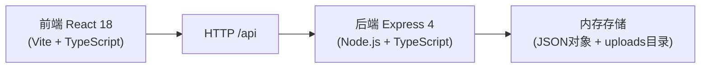
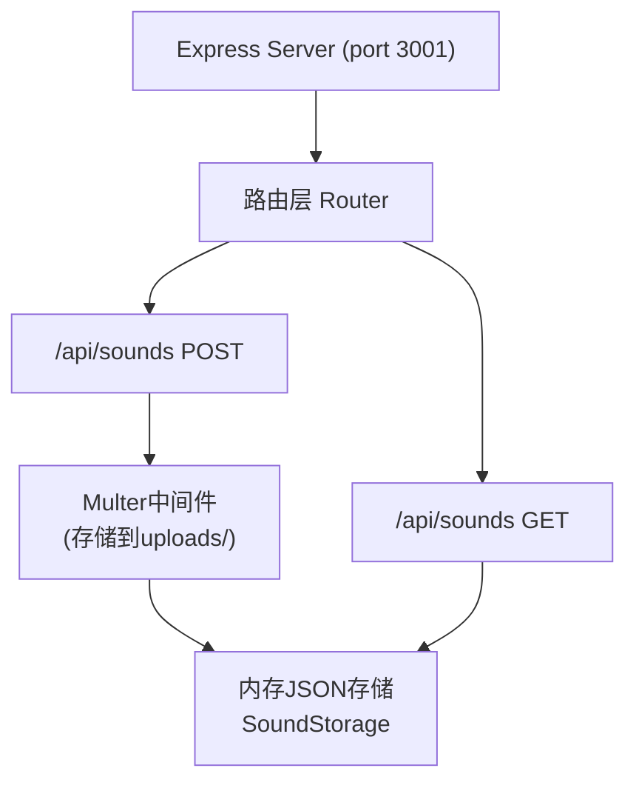
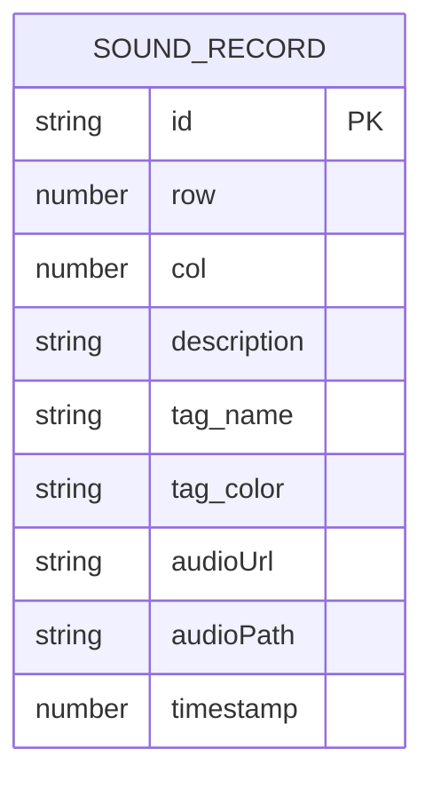

## 1. 架构设计



## 2. 技术栈说明

- **前端框架**：React 18 + TypeScript
- **构建工具**：Vite 5 + @vitejs/plugin-react
- **后端框架**：Express 4 + TypeScript
- **文件上传**：Multer（保存到uploads目录）
- **跨域处理**：cors
- **ID生成**：uuid
- **开发模式**：Vite HMR + 代理/api到后端3001端口

## 3. 路由定义

| 路由 | 用途 |
|-------|---------|
| / | 前端单页应用入口 |
| GET /api/sounds | 获取所有声音数据 |
| POST /api/sounds | 上传新的声音记录（含音频文件） |

## 4. API 定义

### 类型定义

```typescript
interface SoundTag {
  name: string;
  color: string;
}

interface SoundRecord {
  id: string;
  row: number;
  col: number;
  description: string;
  tag: SoundTag;
  audioUrl: string;      // base64编码的音频数据URL
  audioPath?: string;    // 服务端文件路径
  timestamp: number;
}

// 内存存储结构：以 "row_col" 为键
type SoundStorage = Record<string, SoundRecord[]>;
```

### GET /api/sounds

请求：无参数

响应：
```typescript
{
  success: boolean;
  data: SoundStorage;
}
```

### POST /api/sounds

请求（multipart/form-data）：
```
audio: File          // 音频文件（最长15秒）
row: number          // 六边形行坐标
col: number          // 六边形列坐标
description: string  // 文字描述
tag: string          // JSON序列化的SoundTag对象
```

响应：
```typescript
{
  success: boolean;
  data: SoundRecord;
}
```

## 5. 服务端架构



## 6. 数据模型

### 6.1 数据模型定义



### 6.2 数据组织

- 使用内存对象 `SoundStorage` 存储，键为 `${row}_${col}`
- 值为该格子的 `SoundRecord[]` 数组
- 音频文件存储在 `uploads/` 目录，文件名包含uuid
- 同时返回base64编码的audioUrl供前端即时使用

## 7. 文件结构

```
auto298/
├── package.json
├── index.html
├── vite.config.js
├── tsconfig.json
├── uploads/                // Multer上传目录
└── src/
    ├── server.ts           // Express后端
    ├── App.tsx             // React根组件
    ├── main.tsx            // React入口
    ├── index.css           // 全局样式
    ├── types.ts            // 共享类型定义
    └── components/
        ├── MapCanvas.tsx       // 六边形地图Canvas组件
        ├── SoundCardList.tsx   // 声音卡片列表组件
        ├── RecordModal.tsx     // 录音浮动窗口
        ├── SoundCard.tsx       // 单个声音卡片
        ├── ControlPanel.tsx    // 右下角控制面板
        └── TagFilter.tsx       // 标签筛选面板
```

## 8. 性能优化策略

- **Canvas地图**：requestAnimationFrame控制动画，离屏缓存静态网格
- **卡片列表**：IntersectionObserver实现懒加载，仅渲染可视区域卡片
- **录音/播放动画**：CSS动画 + requestAnimationFrame混合，保证30fps+
- **响应式**：CSS媒体查询 + React状态监听，移动端适配布局
