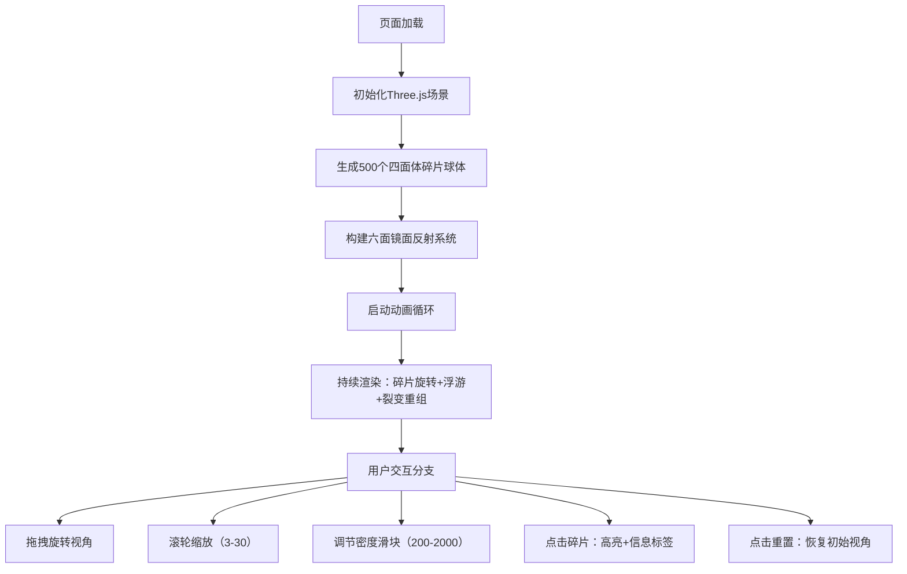

## 1. 产品概述

「棱镜断层」是一款基于Web的3D交互式万花筒生成器，面向数字艺术家和视觉爱好者，通过沉浸式的动态多面体碎片与镜面反射系统，提供独特的视觉探索体验。

- 核心价值：让用户通过简单的交互（拖拽、缩放、调节参数），实时观察数千个彩色碎片在无限反射镜面空间中的裂变与重组，获得艺术创作灵感与视觉愉悦。
- 目标用户：数字艺术家、视觉设计师、3D爱好者、普通审美用户。

## 2. 核心功能

### 2.1 用户角色

| 角色 | 注册方式 | 核心权限 |
|------|----------|----------|
| 普通用户 | 无需注册，直接访问 | 浏览场景、交互操控、调节参数 |

### 2.2 功能模块

1. **3D场景渲染**：全屏Three.js渲染、深空黑背景、动态碎片球体
2. **碎片管理系统**：随机四面体生成、密度实时调整、飞入/飞散动画
3. **六面镜面反射系统**：立方体镜面空间、递归反射效果、发光边框
4. **碎片裂变与重组**：周期性分裂、相邻合并、颜色变换
5. **交互控制系统**：OrbitControls视角操控、碎片点击高亮、信息标签显示
6. **用户界面**：标题显示、重置视角按钮、密度滑块、后处理发光效果

### 2.3 页面详情

| 页面名称 | 模块名称 | 功能描述 |
|----------|----------|----------|
| 主页面 | 3D渲染区域 | 全屏Three.js场景，显示碎片球体与镜面反射空间 |
| 主页面 | 标题栏 | 左上角显示「棱镜断层」标题 |
| 主页面 | 控制面板 | 右下角：重置视角按钮、碎片密度滑块 |
| 主页面 | 交互反馈 | 点击碎片显示高亮发光与浮动信息标签 |

## 3. 核心流程

## 4. 用户界面设计

### 4.1 设计风格

- **主色调**：深空黑 #050510 作为背景
- **强调色**：青色 #00DDFF（镜面边框、UI控件）
- **碎片色调**：基于位置正弦函数的彩虹渐变，高饱和度
- **按钮风格**：半透明磨砂玻璃，圆角8px，青色高亮
- **字体**：现代无衬线字体，清晰可读
- **整体风格**：赛博朋克未来感，沉浸式暗色调视觉

### 4.2 页面设计概览

| 页面名称 | 模块名称 | UI元素 |
|----------|----------|--------|
| 主页面 | 3D场景 | 深空黑背景，彩色碎片球体，六面青色发光镜面边框，Bloom后处理发光 |
| 主页面 | 标题 | 左上角白色半透明文字「棱镜断层」，大号字体，轻微发光 |
| 主页面 | 控制面板 | 右下角磨砂玻璃容器，包含重置按钮与密度滑块，滑块把手为青色圆形 |
| 主页面 | 信息标签 | 点击碎片时弹出，白色文字，半透明深色背景，显示RGB/坐标/角度 |

### 4.3 响应式设计

- **桌面优先**，自适应窗口大小
- 浏览器窗口变化时自动调整相机宽高比
- UI控件固定定位，不随场景缩放而溢出
- 触控设备支持双指缩放与单指拖拽

### 4.4 3D场景指引

- **环境**：纯深空黑背景，无HDRI，突出碎片自发光
- **光照**：环境光 + 方向光，确保碎片色彩鲜艳可见
- **相机**：初始位置(0, 6, 12)，看向原点，透视相机，阻尼0.1
- **构图**：碎片球体居中，镜面立方体包裹外围形成空间感
- **交互动画**：碎片自转0.01rad/帧，浮游幅度0.05，分裂合并平滑过渡
- **后处理**：UnrealBloomPass（强度0.5，半径0.4，阈值0.1），仅点击碎片时触发光照高亮
- **性能预算**：2000碎片稳定45+ FPS，递归反射固定3层
