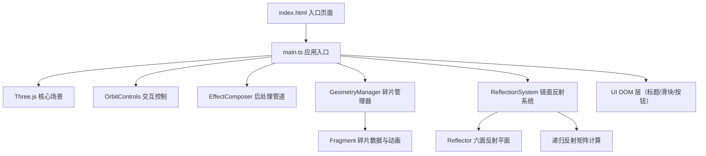

## 1. 架构设计



## 2. 技术描述

- **前端框架**：原生 Three.js r160+（非React/Vue）
- **构建工具**：Vite 5.x
- **语言**：TypeScript 5.x（严格模式，目标ES2020）
- **核心依赖**：
  - `three`：3D渲染引擎
  - `three/addons/controls/OrbitControls.js`：视角控制
  - `three/addons/objects/Reflector.js`：镜面反射
  - `three/addons/postprocessing/EffectComposer.js`：后处理
  - `three/addons/postprocessing/UnrealBloomPass.js`：Bloom发光
  - `three/addons/postprocessing/RenderPass.js`：渲染通道
- **后端**：无后端，纯前端单页应用
- **数据库**：无需

## 3. 文件结构与职责

| 文件路径 | 职责 | 调用方向 |
|----------|------|----------|
| `package.json` | 依赖声明与脚本 | — |
| `vite.config.js` | Vite构建配置（HMR+TS） | — |
| `tsconfig.json` | TypeScript编译配置（严格+ES2020） | — |
| `index.html` | 入口HTML，全屏canvas，UI容器 | 加载 main.ts |
| `src/main.ts` | 场景初始化、相机、渲染器、控件、动画循环、UI事件绑定 | 调用 GeometryManager、ReflectionSystem |
| `src/geometryManager.ts` | 碎片生成/销毁/密度调整/分裂合并/颜色计算/浮游动画 | 被 main.ts 调用 |
| `src/reflectionSystem.ts` | 六面反射平面创建、递归虚像生成、发光边框 | 被 main.ts 调用 |

### 数据流

1. **main.ts → GeometryManager**
   - 传入：`density: number`（碎片密度）、`deltaTime: number`（帧时间）
   - 传出：`Group`（包含所有碎片的Three.js组对象）

2. **main.ts → ReflectionSystem**
   - 传入：`fragmentGroup: Group`（碎片组）、`scene: Scene`
   - 传出：`Group`（包含6个反射镜与边框），同时向scene添加递归虚像

3. **用户事件 → main.ts**
   - 滑块input → 更新density → 调用GeometryManager.setDensity()
   - 重置按钮click → 恢复相机初始位置
   - 窗口resize → 更新相机与渲染器尺寸
   - 射线点击 → 高亮碎片 + 显示信息标签

## 4. 核心数据模型

```typescript
// geometryManager.ts 内部数据结构
interface Fragment {
  mesh: THREE.Mesh;
  basePosition: THREE.Vector3;   // 球面锚定位置
  currentPosition: THREE.Vector3;
  floatOffset: THREE.Vector3;    // 浮游偏移
  floatFrequency: number;        // 0.5-2Hz
  floatPhase: number;            // 随机相位
  rotationSpeed: THREE.Vector3;  // 各轴自转速度
  size: number;                  // 碎片边长（用于分裂合并）
  isAnimating: boolean;          // 是否在飞入/飞出/分裂/合并动画中
  animationType?: 'spawn' | 'remove' | 'split' | 'merge';
  animationStart?: number;
  animationDuration?: number;
  animationStartPos?: THREE.Vector3;
  animationEndPos?: THREE.Vector3;
}
```

## 5. 性能优化策略

| 优化点 | 方案 |
|--------|------|
| 渲染性能 | 使用BufferGeometry共享顶点；材质实例复用；Frustum Culling保持开启 |
| 碎片密度调整 | 增量增删而非全量重建；飞入/飞散使用requestAnimationFrame分步计算 |
| 分裂合并计算 | 每5秒执行，限制为10%碎片，使用空间哈希快速查找相邻碎片 |
| 反射递归 | 固定3层深度，每帧仅计算反射矩阵，不重新生成反射纹理 |
| 后处理 | UnrealBloomPass仅对高亮碎片生效，通过layers选择性渲染 |
| 帧率监控 | 内置简单FPS计数器，在低于45时自动降级（可选减少浮游运动计算） |

## 6. 关键算法

1. **碎片颜色计算**：`r = sin(x*2)*0.5+0.5`, `g = sin(y*2)*0.5+0.5`, `b = sin(z*2)*0.5+0.5`
2. **球面随机分布**：使用球坐标系随机生成 `(r, θ, φ)`，转换为笛卡尔坐标
3. **缓动函数**：`easeOutCubic(t) = 1 - (1-t)³`
4. **反射矩阵**：对每个反射平面，使用镜像变换矩阵 `M = I - 2*n*n^T` 生成虚像位置
5. **色相偏移**：将RGB转换为HSL，偏移±30°，再转回RGB
6. **空间哈希邻接查询**：将三维空间按0.2单位分桶，合并时仅查询同桶与相邻桶碎片
