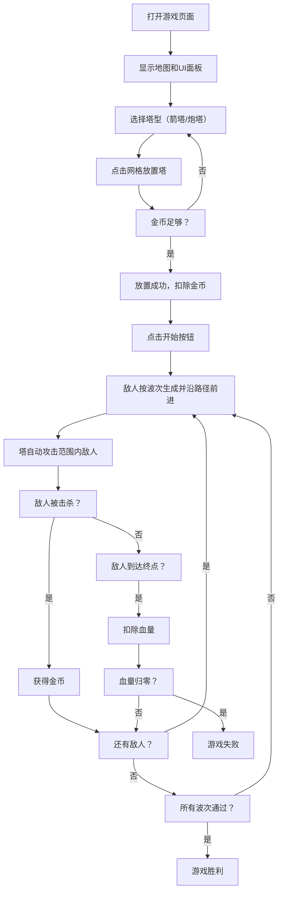

## 1. 产品概述

基于网格的塔防游戏Web应用，玩家通过布置防御塔抵御一波波敌人进攻。
- 主要用途：休闲策略类塔防游戏，让玩家在有限资源下合理布局防御塔阻止敌人到达终点
- 目标用户：喜欢策略类小游戏的玩家
- 产品价值：轻量级、即开即玩的浏览器塔防游戏，提供经典的塔防游戏体验

## 2. 核心功能

### 2.1 功能模块
1. **游戏主界面**：20x15网格地图、蜿蜒路径、右侧控制面板
2. **敌人波次系统**：按波次生成敌人，血量、速度递增
3. **防御塔系统**：两种塔型（箭塔、炮塔），自动攻击、射程显示
4. **资源系统**：金币、血量，击杀敌人获得金币
5. **游戏状态控制**：开始、暂停、胜利、失败判定

### 2.2 页面详情
| 页面名称 | 模块名称 | 功能描述 |
|---------|---------|---------|
| 游戏主界面 | 网格地图 | 20x15浅绿色网格，可放置防御塔，深棕色蜿蜒路径 |
| 游戏主界面 | 敌人系统 | 沿路径移动，血量条，被击中闪烁，击杀获金币 |
| 游戏主界面 | 防御塔系统 | 箭塔（射速快、伤害低、射程中）、炮塔（射速慢、伤害高、射程远），圆形射程指示器 |
| 游戏主界面 | 子弹系统 | 塔攻击时发射快速移动的小圆点 |
| 游戏主界面 | UI面板 | 右侧200px宽浅灰面板，塔选择、血量显示、金币显示、状态按钮 |
| 游戏主界面 | 状态控制 | 开始/暂停按钮，胜利/失败结果显示 |

## 3. 核心流程

玩家打开页面 → 查看游戏地图和路径 → 点击右侧塔选择按钮选择塔型 → 在非路径网格上点击放置塔（消耗金币）→ 点击开始按钮 → 敌人按波次沿路径前进 → 塔自动攻击射程内敌人 → 击杀敌人获得金币 → 继续放置更多塔 → 敌人到达终点扣血 → 血量归零游戏失败，或通过所有波次胜利

## 4. 用户界面设计

### 4.1 设计风格
- 主色调：深绿色背景（#1a3d2e）、浅绿色网格（#4a7c59）、深棕色路径（#5d4037）
- 强调色：黄色金币（#ffd700）、红色血量（#e74c3c）、白色射程圈
- UI风格：复古像素风格，简洁几何图形
- 塔颜色：箭塔蓝色（#3498db）、炮塔橙色（#e67e22）
- 面板：浅灰色背景（#ecf0f1），200px固定宽度

### 4.2 页面设计概览
| 页面名称 | 模块名称 | UI元素 |
|---------|---------|---------|
| 游戏主界面 | Canvas画布 | 全屏左侧区域，绘制地图、塔、敌人、子弹 |
| 游戏主界面 | 右侧面板 | 200px宽，垂直布局，浅灰背景 |
| 游戏主界面 | 塔选择区 | 面板上方，两个带图标的按钮，点击高亮 |
| 游戏主界面 | 状态显示区 | 面板下方，心形图标+血量数字，金币图标+金币数字 |
| 游戏主界面 | 控制按钮 | 开始/暂停按钮，游戏结果弹窗 |

### 4.3 响应式
- 桌面端优先设计，Canvas自适应左侧剩余区域
- 右侧面板固定200px宽度

## 5. 性能要求
- 帧率维持在30fps以上
- 最多同时存在30个敌人时帧率不低于30fps
- 敌人移动和攻击判定每帧更新，无肉眼可见卡顿
