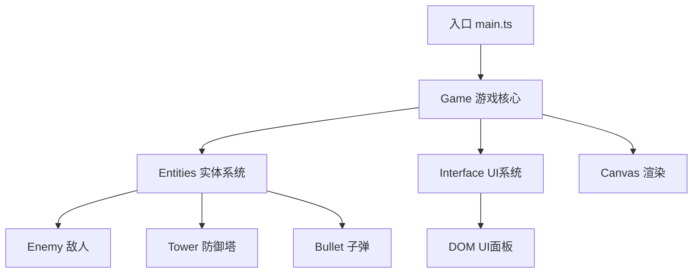

## 1. 架构设计



## 2. 技术描述

- 前端框架：纯 TypeScript + HTML Canvas（无React/Vue，按用户要求）
- 构建工具：Vite 5.x
- 编程语言：TypeScript 5.x（严格模式）
- 模块系统：ESNext
- 后端：无（纯前端游戏）
- 数据库：无

## 3. 文件结构

```
/
├── package.json          # 项目配置，含 vite、typescript 依赖
├── index.html            # 入口页面，含 canvas 和 UI 容器
├── tsconfig.json         # TypeScript 配置（严格模式、ESNext）
├── vite.config.js        # Vite 配置
└── src/
    ├── main.ts           # 游戏入口，初始化、游戏循环、启动渲染
    ├── game.ts           # 核心游戏逻辑：网格、路径、波次、塔管理
    ├── entities.ts       # 敌人类、塔类、子弹类
    └── interface.ts      # UI控制：血量、金币、塔选择、按钮
```

## 4. 核心数据结构

### 4.1 网格与路径
- 网格尺寸：20列 × 15行
- 预设路径坐标数组定义蜿蜒路径
- 每个网格单元尺寸根据Canvas动态计算

### 4.2 防御塔类型
| 塔型 | 射速(ms) | 伤害 | 射程(格) | 价格(金币) | 颜色 |
|------|---------|------|---------|----------|------|
| 箭塔 | 500 | 10 | 3 | 50 | #3498db |
| 炮塔 | 1500 | 40 | 4 | 100 | #e67e22 |

### 4.3 敌人属性
- 基础血量：50
- 基础速度：1.5 格/秒
- 每波递增：血量+20，速度+0.1
- 击杀奖励：10金币

### 4.4 玩家状态
- 初始血量：20
- 初始金币：150
- 总波次：10波

## 5. 游戏循环
- 使用 requestAnimationFrame 实现游戏主循环
- 每帧更新：敌人位置、塔攻击判定、子弹移动、碰撞检测
- DeltaTime 计算确保不同帧率下移动速度一致
- 目标帧率：60fps，最低保障30fps
