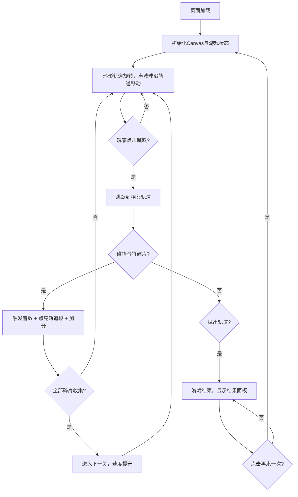

## 1. 产品概述

「回音径迹」是一款深空霓虹风格的休闲音乐节奏游戏。玩家在旋转的环形轨道上操控发光声波球，通过跳跃收集音符碎片，触发音符合成与光效反馈。

- 核心玩法：轨道跳跃 + 节奏收集，简单上手但难度递增
- 目标用户：喜欢休闲音游、追求视觉与听觉双重体验的玩家
- 产品价值：提供碎片化时间的沉浸式放松体验，视觉美学与音乐节奏的有机结合

## 2. 核心功能

### 2.1 功能模块

1. **游戏主界面**：环形轨道、声波球、音符碎片、光效渲染
2. **交互控制系统**：键盘/触摸事件监听，跳跃判定
3. **分数与关卡系统**：分数累加、节奏连击、关卡难度递增
4. **音频系统**：Web Audio API 动态生成音符合成音效
5. **游戏结束面板**：结果展示、数据统计、重新开始

### 2.2 页面详情

| 页面名称 | 模块名称 | 功能描述 |
|-----------|-------------|---------------------|
| 游戏主界面 | 环形轨道渲染 | 6段等弧扇形轨道，可单独点亮，渐变填充，波纹扩散光效 |
| 游戏主界面 | 声波球控制 | 沿轨道边缘移动，点击跳跃到相邻轨道，发光效果 |
| 游戏主界面 | 音符碎片系统 | 12个随机分布碎片，呼吸脉动动画，收集判定 |
| 游戏主界面 | 左侧UI | 关卡编号显示（亮度渐变）、节奏连击条（5圆点） |
| 游戏主界面 | 右侧UI | 分数显示（数字跳动动画） |
| 游戏结束面板 | 结果展示 | 毛玻璃效果面板，总分、碎片数数字滚动动画 |
| 游戏结束面板 | 重新开始 | "再来一次"按钮，悬停渐变，点击重置游戏 |

## 3. 核心流程

玩家进入游戏 → 声波球在旋转轨道上自动移动 → 点击屏幕跳跃到相邻轨道 → 收集音符碎片触发音效与光效 → 连续收集点亮节奏条获得额外分数 → 收集全部碎片进入下一关（速度提升）→ 声波球掉出轨道 → 显示结果面板 → 点击重新开始

## 4. 用户界面设计

### 4.1 设计风格

- **主色调**：深空紫黑径向渐变背景（#120C1E → #1A1028）
- **轨道色**：半透明浅蓝 #6B8FC4，边缘辉光 #A0C8FF
- **碎片色**：中心发光 #FFD700，外围光晕 #FF9A00
- **声波球**：主色 #00FFCC，外发光半径20px透明度0.5
- **轨道点亮渐变**：#4A7BB5 → #8B5CF6
- **关卡编号渐变**：#6B8FC4 → #FFD700
- **整体风格**：深色霓虹，所有元素带微光晕效果
- **按钮风格**：圆角设计，悬停透明到全白渐变
- **动效**：呼吸脉动（1.2秒）、波纹扩散（0.6秒）、数字滚动（1.5秒）、屏幕晃动（0.1秒）

### 4.2 页面设计概览

| 页面名称 | 模块名称 | UI 元素 |
|-----------|-------------|-------------|
| 游戏主界面 | 中央轨道区 | 外径280px内径240px环形轨道，6段扇形，12个碎片呼吸动画，声波球发光效果 |
| 游戏主界面 | 左侧UI栏 | 关卡编号（大号字体，渐变亮度）、节奏连击条（5个圆点垂直排列） |
| 游戏主界面 | 右侧UI栏 | 分数显示（24px加粗白色，数字跳动缩放动画） |
| 游戏结束面板 | 结果面板 | 毛玻璃背景rgba(20,15,30,0.8)，圆角16px，1px白色边框，总分+碎片数滚动动画，"再来一次"按钮 |

### 4.3 响应式设计

- 采用桌面优先设计，最小宽420px高650px
- 所有元素根据视口等比缩放（轨道、字体、碎片大小）
- 支持键盘（空格/方向键）和触摸（点击）双操作模式

### 4.4 性能指标

- 游戏循环帧率稳定60FPS
- Canvas渲染无卡顿
- Web Audio API音频生成延迟小于50ms
