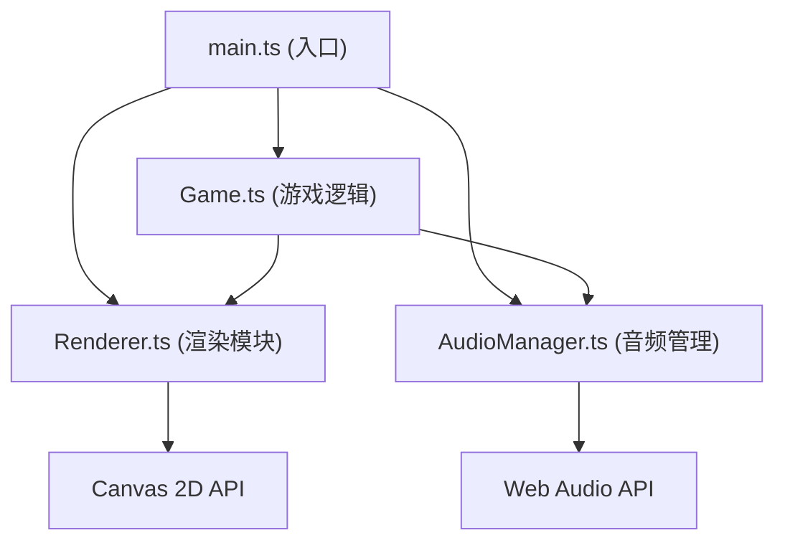

## 1. 架构设计



## 2. 技术说明

- **前端框架**：原生 TypeScript + HTML5 Canvas（无UI框架，纯Canvas渲染）
- **构建工具**：Vite 5.x
- **语言**：TypeScript 5.x（严格模式，目标 ES2020）
- **音频**：Web Audio API 动态合成正弦波音效
- **后端**：无（纯前端项目）

## 3. 文件结构

| 文件路径 | 用途 |
|-------|---------|
| `/package.json` | 项目依赖配置，typescript、vite，dev启动脚本 |
| `/vite.config.js` | Vite基础构建配置，支持HMR和TS |
| `/tsconfig.json` | TypeScript严格模式配置，目标ES2020 |
| `/index.html` | 入口页面，全屏Canvas容器，title"回音径迹" |
| `/src/main.ts` | 应用入口，初始化Canvas，绑定事件，启动游戏循环 |
| `/src/Game.ts` | 游戏核心逻辑：轨道旋转、球体位置、跳跃、碰撞、关卡、分数 |
| `/src/Renderer.ts` | 独立渲染模块：绘制轨道、碎片、球体、光效、UI文字 |
| `/src/AudioManager.ts` | Web Audio API封装：音效生成、上下文管理 |

## 4. 核心数据模型

### 4.1 游戏状态 (GameState)

```typescript
interface GameState {
  level: number;              // 当前关卡
  score: number;              // 当前分数
  collectedCount: number;     // 已收集碎片数
  totalFragments: number;     // 总碎片数（12）
  combo: number;              // 连续收集计数（0-5）
  isPlaying: boolean;         // 是否游戏中
  isGameOver: boolean;        // 是否游戏结束
  rotationSpeed: number;      // 轨道旋转速度（度/秒）
}
```

### 4.2 声波球 (SoundOrb)

```typescript
interface SoundOrb {
  radius: number;             // 半径 10px
  trackIndex: number;         // 当前轨道索引（0=外环, 1=内环）
  angle: number;              // 当前角度（弧度）
  isJumping: boolean;         // 是否跳跃中
  jumpProgress: number;       // 跳跃进度 0-1
  jumpTarget: number;         // 跳跃目标轨道索引
}
```

### 4.3 音符碎片 (NoteFragment)

```typescript
interface NoteFragment {
  id: number;
  angle: number;              // 位置角度
  trackIndex: number;         // 所属轨道
  collected: boolean;         // 是否已收集
  pulsePhase: number;         // 呼吸动画相位
}
```

### 4.4 轨道段 (TrackSegment)

```typescript
interface TrackSegment {
  index: number;              // 0-5
  fillProgress: number;       // 点亮进度 0-1
  hasRipple: boolean;         // 是否显示波纹
  rippleProgress: number;     // 波纹扩散进度 0-1
}
```

## 5. 游戏循环设计

采用 requestAnimationFrame 实现固定步长游戏循环：
- 逻辑更新频率：60Hz（每帧约16.67ms）
- 渲染频率：与显示器刷新率同步（V-Sync）
- 状态传递：Game → Renderer（纯数据驱动，Renderer无状态）

```
每一帧:
  1. 计算 deltaTime
  2. Game.update(deltaTime) — 更新所有游戏逻辑
  3. Renderer.render(gameState) — 绘制当前帧
  4. AudioManager 按需触发音效（事件驱动）
```

## 6. 性能优化策略

1. **Canvas 离屏缓冲**：静态背景预渲染到离屏Canvas
2. **对象池**：音符碎片、光效对象复用，避免频繁GC
3. **批量绘制**：同类元素一次beginPath/closePath批量绘制
4. **脏区域渲染**：仅重绘变化区域（进阶优化）
5. **音频预计算**：AudioContext 预先创建，音效节点复用
