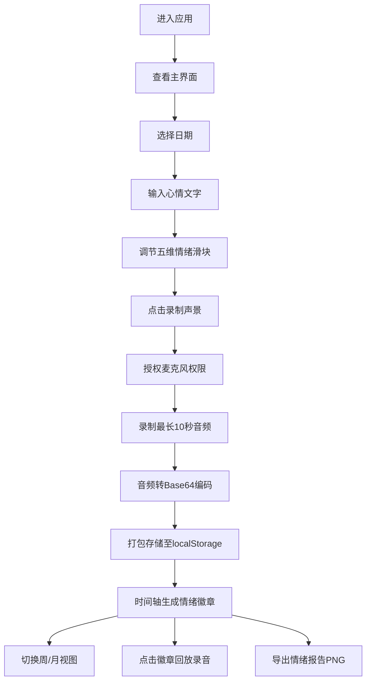

## 1. 产品概述

「情绪回声室」是一款帮助用户在浏览器中创建和管理个人情绪记录的全栈Web应用。它通过将每日情绪波动与特定的音乐片段或环境声音关联起来，让用户能够通过听觉回溯和重温过往的情感体验。

- 目标用户：希望记录和管理日常情绪、通过声音唤起情感记忆的用户
- 核心价值：建立情绪与声音的联结，提供可视化的情绪回顾体验

## 2. 核心功能

### 2.1 功能模块

1. **主界面**：日记输入区、声景可视化区、时间轴区域
2. **情绪记录模块**：日期选择、文字日记、五维情绪滑块
3. **声景录制模块**：麦克风录音、实时波形可视化、Base64音频编码
4. **时间轴浏览模块**：周/月视图切换、情绪徽章展示、录音回放
5. **情绪报告导出模块**：Canvas绘制折线图、html2canvas截图导出PNG

### 2.2 页面详情

| 页面名称 | 模块名称 | 功能描述 |
|---------|---------|---------|
| 主页面 | 日记输入区 | 日期选择器、文本域记录心情、五维情绪滑块（快乐/忧伤/愤怒/平静/焦虑）带实时数值显示和弹簧动画 |
| 主页面 | 声景可视化区 | 粒子系统抽象波形图（300粒子，#A78BFA→#60A5FA过渡）、录音时显示实时波形（#FDE68A）、录音回放时生成情绪动画背景 |
| 主页面 | 时间轴区域 | 圆形情绪徽章（直径24px，间距6px，颜色由五维情绪混合生成）、悬停放大显示摘要、点击回放录音和情绪动画 |
| 主页面 | 视图切换 | 周视图（7个徽章横向）、月视图（28-31个徽章4行排列）、400ms平滑滑动过渡 |
| 主页面 | 导出功能 | 一键生成1200×800px PNG情绪报告，包含时间轴全貌、平均情绪曲线折线图、录音总时长 |

## 3. 核心流程

用户进入应用后，可选择日期并记录当日心情文字，通过拖动五维情绪滑块量化情绪强度，点击「录制声景」按钮录制最长10秒的环境音。系统将文字、情绪数值和Base64音频打包存储至localStorage。用户可通过底部时间轴浏览历史记录，切换周/月视图，点击徽章回放对应录音并查看情绪动画，或一键导出包含完整数据的情绪报告PNG图片。

## 4. 用户界面设计

### 4.1 设计风格

- **主色调**：深色背景（深蓝紫#19162B → 暗墨绿#1B2A20径向渐变）
- **文字色**：暖白色#F0EDE6
- **强调色**：淡紫色#A78BFA
- **辅助色**：情绪渐变色（快乐金黄、忧伤灰蓝、愤怒红橙、平静青绿、焦虑紫褐）
- **主卡片**：880×640px，圆角20px，半透明磨砂玻璃效果rgba(30,28,45,0.75)，边框1px rgba(220,210,200,0.12)
- **按钮风格**：圆角、悬停1.05倍缩放、0-4px发光阴影
- **字体**：无衬线字体，清晰易读
- **布局**：左侧日记区(320px) + 右侧可视化区(480px) + 底部时间轴(160px)

### 4.2 页面设计概览

| 页面名称 | 模块名称 | UI元素 |
|---------|---------|--------|
| 主页面 | 日记输入区 | 日期选择器、多行文本域、5个渐变色滑块（冷色→暖色）、实时百分比显示、弹簧动画 |
| 主页面 | 声景可视化区 | Canvas画布、300粒子系统、#A78BFA→#60A5FA渐变色、录音时显示#FDE68A波形线（1.5px宽）、背景加深至rgba(20,18,35,0.85) |
| 主页面 | 时间轴区域 | 圆形徽章(24px→36px悬停放大)、6px间距、情绪混合色、悬停显示日期和情绪摘要 |
| 主页面 | 视图切换 | 周/月切换按钮、400ms ease-in-out滑动过渡动画 |
| 主页面 | 导出功能 | 导出按钮、1200×800px PNG、#1A182D背景、#F0EDE6文字图形 |

### 4.3 响应式设计

- 采用桌面优先设计
- 主卡片固定尺寸880×640px居中展示
- 全屏径向渐变背景自适应浏览器窗口

### 4.4 动画与性能

- 粒子流动、波形更新、时间轴滚动稳定60fps
- 交互响应时间小于100ms
- Base64转换和Canvas截图1秒内完成，不阻塞UI线程
