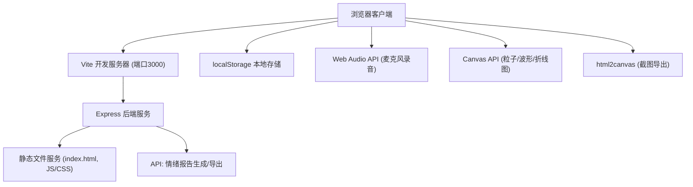
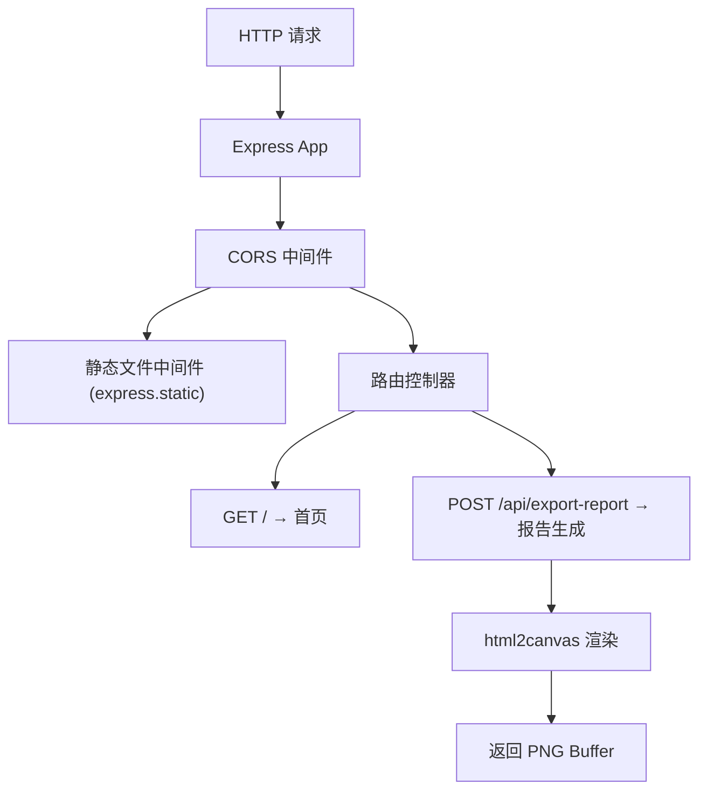
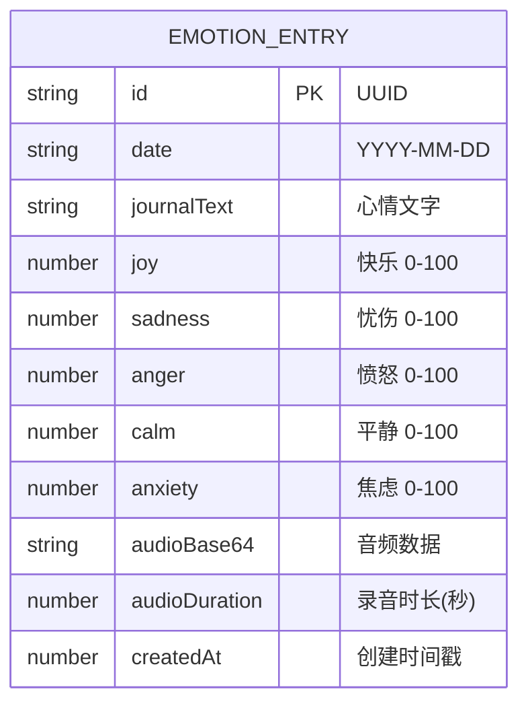

## 1. 架构设计



## 2. 技术描述

- **前端**：原生 TypeScript + Vite 构建，无需前端框架
  - Vite：HMR 热更新、TypeScript 编译、开发服务器
  - html2canvas：DOM 转 Canvas 截图导出
- **后端**：Node.js + Express@4
  - express：静态文件服务、CORS 处理、API 路由
  - cors：跨域资源共享
  - uuid：唯一 ID 生成
- **数据存储**：浏览器 localStorage（情绪条目持久化）
- **浏览器 API**：Web Audio API（麦克风录音）、Canvas API（可视化绘制）、MediaRecorder API

## 3. 路由定义

| 路由 | 用途 |
|------|------|
| GET / | 提供首页 index.html |
| GET /static/* | 提供静态资源 (JS, CSS) |
| POST /api/export-report | 生成并返回情绪报告 PNG |

## 4. API 定义

### 4.1 POST /api/export-report

请求体：
```typescript
interface ExportReportRequest {
  htmlContent: string;
  width: number;
  height: number;
}
```

响应体：
```typescript
interface ExportReportResponse {
  success: boolean;
  imageUrl?: string;
  error?: string;
}
```

## 5. 服务器架构图



## 6. 数据模型

### 6.1 数据模型定义



### 6.2 数据定义语言

localStorage 存储结构：
```json
{
  "emotion_entries": [
    {
      "id": "uuid-string",
      "date": "2026-06-09",
      "journalText": "今天心情很好...",
      "joy": 75,
      "sadness": 10,
      "anger": 5,
      "calm": 60,
      "anxiety": 20,
      "audioBase64": "data:audio/webm;base64,...",
      "audioDuration": 8.5,
      "createdAt": 1717900000000
    }
  ]
}
```

## 7. 项目文件结构

```
├── package.json
├── tsconfig.json
├── vite.config.js
├── index.html
├── server/
│   └── index.ts
└── src/
    ├── main.ts
    ├── renderer.ts
    └── styles/
        └── main.css
```

## 8. 核心模块职责

| 文件 | 职责 |
|------|------|
| server/index.ts | Express 服务器、静态文件服务、CORS、报告导出 API |
| src/main.ts | 应用入口：Canvas 初始化、事件绑定、localStorage 管理、情绪条目创建、录音处理、波形生成、时间轴渲染、视图切换 |
| src/renderer.ts | Canvas 绘制：声景可视化波形图、情绪曲线折线图、粒子动画，接收数据对象返回渲染上下文 |
