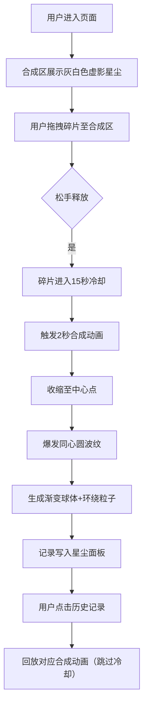

## 1. 产品概述

「星铸工坊」是一款面向数字藏品爱好者的浏览器端交互式NFT合成器，用户通过拖拽光晕碎片合成独特的星尘核心，每种组合产生专属色彩渐变和粒子特效。

- 核心价值：提供沉浸式、可探索的数字艺术创作体验，让用户直观感受碎片组合带来的视觉惊喜
- 目标用户：数字藏品爱好者、NFT创作者、视觉艺术探索者

## 2. 核心特性

### 2.1 用户角色

| 角色 | 注册方式 | 核心权限 |
|------|----------|----------|
| 普通用户 | 无需注册，直接使用 | 拖拽合成、查看记录、回放动画 |

### 2.2 功能模块

1. **合成区**：中央圆形合成画布，展示虚影占位、合成动画、最终星尘核心
2. **碎片托盘**：5种光晕碎片徽章，支持拖拽交互与冷却状态
3. **星尘记录面板**：最近5次合成记录，支持回放
4. **粒子渲染引擎**：动态渐变球体与旋转粒子流特效

### 2.3 页面详情

| 页面名称 | 模块名称 | 功能描述 |
|----------|----------|----------|
| 主界面 | 合成区 | 直径400px圆形画布，径向渐变背景，闪烁金边动画，展示虚影/合成动画/星尘核心 |
| 主界面 | 碎片托盘 | 横向排列5种光晕碎片（赤红、琥珀、翡翠、海蓝、紫晶），直径52px，支持拖拽 |
| 主界面 | 星尘记录 | 左下角磨砂玻璃面板，展示最近5条记录（时间、碎片组合、颜色值），点击可回放 |
| 主界面 | 重置按钮 | 清空当前合成状态，恢复所有碎片 |

## 3. 核心流程

用户从碎片托盘拖拽任意碎片至合成区松手，触发2秒合成动画（收缩→波纹爆发→球体生成+粒子环绕），被使用的碎片进入15秒冷却，合成结果记录至星尘面板，点击记录可回放对应动画。

## 4. 用户界面设计

### 4.1 设计风格

- **主色调**：深空背景 `#0B0712` → `#161222` 径向渐变，合成区内部 `#0F0A1A` → `#1B1230` 径向渐变
- **点缀色**：5种碎片色（赤红 `#FF4D4D`、琥珀 `#FFB347`、翡翠 `#2ECC71`、海蓝 `#3498DB`、紫晶 `#9B59B6`），淡金色边框 `rgba(212,175,55,x)`
- **按钮样式**：磨砂玻璃卡片（`rgba(30,25,45,0.7)` 背景、12px圆角、1px `rgba(200,180,220,0.15)` 边框），按压0.15秒缩放过渡
- **字体**：主标题使用Cinzel Decorative或类似装饰衬线字体，正文使用优雅无衬线字体
- **布局**：居中合成区，下方横向碎片托盘，左下角记录面板，左右留白等比缩放

### 4.2 页面设计概览

| 页面名称 | 模块名称 | UI元素 |
|----------|----------|--------|
| 主界面 | 合成区 | 400px圆形、径向渐变、3秒周期金边闪烁（透明度0.2-0.6）、虚影/球体渲染 |
| 主界面 | 碎片徽章 | 52px圆形、悬停放大1.1倍+8px同色光晕、冷却态0.3透明度 |
| 主界面 | 星尘记录 | 磨砂玻璃卡片、列表布局、悬停高亮、点击回放 |
| 主界面 | 重置按钮 | 磨砂玻璃风格、按压缩放过渡 |

### 4.3 响应式

桌面端优先设计，最小适配宽度1024px，左右两侧留白随窗口等比例缩放，不做移动端适配。

### 4.4 性能约束

- 粒子数峰值 ≤ 200颗
- 合成动画与粒子渲染保持60FPS，使用 `requestAnimationFrame` 驱动
- 拖拽与记录操作响应延迟 < 50ms
