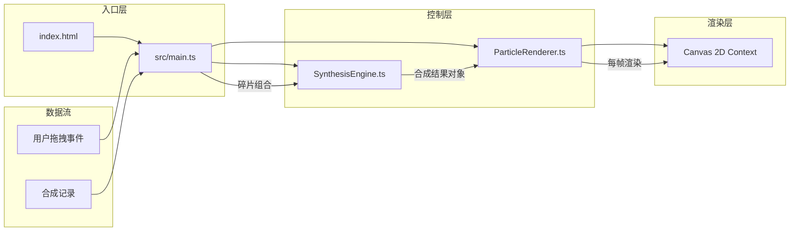

## 1. 架构设计



## 2. 技术说明

- **前端框架**：原生 TypeScript（无React/Vue框架，用户指定Canvas方案）
- **构建工具**：Vite 5.x，支持 HMR 热更新
- **语言**：TypeScript 5.x，严格模式，目标 ES2020
- **渲染方式**：Canvas 2D API，`requestAnimationFrame` 驱动动画循环
- **数据持久化**：内存存储（合成记录仅保存在当前会话中，最多5条）

## 3. 文件结构与职责

| 文件路径 | 职责说明 | 依赖/调用关系 |
|----------|----------|--------------|
| `package.json` | 项目依赖与脚本配置（typescript、vite） | - |
| `vite.config.js` | Vite基础构建配置，启用HMR | - |
| `tsconfig.json` | TypeScript严格模式配置，目标ES2020 | - |
| `index.html` | 入口页面，全屏深空背景，Canvas容器，控制面板UI | - |
| `src/main.ts` | 应用入口：初始化Canvas、绑定拖拽事件、控制面板UI逻辑 | 调用 `SynthesisEngine.synthesize()`，调用 `ParticleRenderer` 各渲染方法 |
| `src/SynthesisEngine.ts` | 合成引擎：接收碎片ID组合，计算最终颜色（混合算法）、尺寸（随机50-150px）、粒子参数（8-16颗） | 无外部依赖，纯函数计算 |
| `src/ParticleRenderer.ts` | 粒子渲染器：管理粒子系统，每帧更新位置，渲染虚影/合成动画/渐变球体/粒子流 | 接收 `SynthesisResult` 对象，输出到 Canvas 2D |

## 4. 数据模型

### 4.1 核心类型定义

```typescript
// 碎片类型枚举
type ShardType = 'crimson' | 'amber' | 'emerald' | 'ocean' | 'amethyst';

// 碎片定义
interface Shard {
  id: ShardType;
  name: string;
  color: string;          // 十六进制颜色值
  cooldownUntil: number;  // 冷却结束时间戳（ms），0表示可用
}

// 合成结果
interface SynthesisResult {
  shards: ShardType[];          // 使用的碎片组合
  primaryColor: string;         // 主色（十六进制）
  secondaryColor: string;       // 渐变色（十六进制）
  glowColor: string;            // 光晕色（带透明度rgba）
  coreSize: number;             // 球体直径（50-150px）
  particleCount: number;        // 粒子数（8-16颗）
  particleColors: string[];     // 粒子颜色池
  timestamp: number;            // 合成时间戳
}

// 合成记录
interface SynthesisRecord {
  id: string;
  timestamp: number;
  shardNames: string[];
  primaryColor: string;
  result: SynthesisResult;      // 完整结果用于回放
}

// 动画阶段
type AnimationPhase = 
  | 'idle'           // 空闲：显示虚影
  | 'contracting'    // 收缩阶段（0-0.5s）
  | 'rippling'       // 波纹爆发（0.5-1.2s）
  | 'forming'        // 球体形成（1.2-2.0s）
  | 'stable';        // 稳定显示
```

### 4.2 数据流向

1. **拖拽流程**：`main.ts` 监听碎片 `mousedown` → 记录拖拽起始 → 监听 `mousemove` 更新位置 → `mouseup` 时检测是否落在合成区（命中检测）→ 是则触发合成
2. **合成流程**：`main.ts` 收集碎片ID → 调用 `SynthesisEngine.synthesize(shardIds)` → 返回 `SynthesisResult` → 传给 `ParticleRenderer.playSynthesisAnimation(result)`
3. **渲染流程**：`ParticleRenderer` 内部维护粒子池与动画状态 → `requestAnimationFrame` 每帧调用 `update()` 更新粒子物理 → 调用 `render(ctx)` 绘制到Canvas
4. **记录流程**：合成完成后 `main.ts` 将结果包装为 `SynthesisRecord` 推入记录数组（FIFO，最多5条）→ 更新DOM面板

## 5. 合成算法说明（SynthesisEngine）

- **颜色混合**：将各碎片RGB值取加权平均（最近拖入的碎片权重略高），生成 `primaryColor`；`secondaryColor` 为主色旋转色相 ±30° 后的互补色
- **光晕色**：`primaryColor` 转换为 rgba，alpha=0.35
- **尺寸计算**：基础值 100px + 随机偏移 ±50px，clamp 至 [50, 150]
- **粒子数**：碎片数 × 3 + 随机 [0, 4]，clamp 至 [8, 16]
- **粒子颜色池**：取所有参与碎片颜色 + primaryColor + secondaryColor

## 6. 渲染引擎说明（ParticleRenderer）

- **粒子池**：预分配对象池，最大200颗，合成动画期间临时增加波纹粒子，动画结束后回收
- **虚影状态**：球体直径80px，`rgba(200,200,210,0.15)` 径向渐变，慢速呼吸缩放（±8%，周期4s）
- **收缩阶段**：球体从当前尺寸线性缩小至0，碎片残像向中心汇聚并淡出
- **波纹阶段**：3层同心圆从中心向外扩张，每层使用不同碎片混合色，透明度从0.8衰减至0
- **形成阶段**：球体从0放大到目标尺寸（easeOutBack缓动），同时粒子从中心向外发散进入轨道
- **稳定阶段**：球体保持径向渐变 + 动态光晕（轻微脉动），粒子按极坐标绕球旋转（角速度每颗±5%随机偏移，半径±10%浮动）

## 7. 性能保障措施

- 粒子对象复用（对象池模式），避免频繁GC
- Canvas每帧仅重绘必要区域（合成区内400×400像素）
- 使用 `performance.now()` 计算动画时间步长，保证不同帧率下动画速度一致
- DOM操作最小化：记录面板仅在新增记录时重渲染，粒子完全走Canvas
