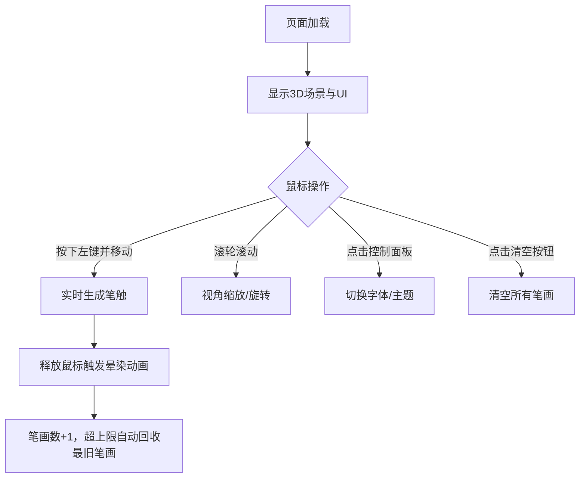

## 1. 产品概述

「墨痕涟漪」是一款3D交互式水墨书法可视化应用，通过Three.js在三维空间中模拟毛笔在宣纸上书写的沉浸式体验。用户可拖拽鼠标生成带有水墨扩散、干湿变化、飞白晕染效果的逼真笔画，并支持多字体风格与色墨主题切换。

- 核心价值：将传统书法艺术与现代3D技术结合，提供高拟真度的数字书法创作体验
- 目标用户：书法爱好者、设计师、艺术教育工作者

## 2. 核心功能

### 2.1 功能模块

1. **3D书法画布**：悬浮弧形宣纸平面，含Canvas生成纤维噪点纹理，顶部柔光照明
2. **毛笔笔触系统**：实时笔画生成，宽窄/透明度随压力（按压力时长+移动速度）变化，飞白、晕染效果
3. **控制面板**：字体风格（楷书/行书/草书）切换、色墨主题（浓墨/淡墨/朱砂）切换
4. **笔画管理**：笔画计数显示、一键清空、笔画数量上限与自动回收机制
5. **视角控制**：鼠标滚轮缩放视角、围绕纸面旋转360度，阴影跟随视角动态更新

### 2.2 页面详情

| 页面名称 | 模块名称 | 功能描述 |
|-----------|-------------|---------------------|
| 主页面 | 3D场景 | 浅米色渐变背景、悬浮宣纸、鼠标拖拽书写 |
| 主页面 | 控制面板 | 字体风格切换按钮×3、色墨主题切换按钮×3 |
| 主页面 | 状态栏 | 实时笔画计数、圆形清空按钮（扫帚图标+悬停旋转动画） |
| 主页面 | 视角系统 | 滚轮缩放（1.2x~2x）、360度视角旋转、动态阴影 |

## 3. 核心流程

用户进入页面 → 看到浅米色背景与中央悬浮宣纸 → 按住鼠标左键在纸面上拖动 → 实时生成墨色笔触（含飞白、扩散效果）→ 释放鼠标后墨迹缓慢晕染2秒 → 可切换字体风格/色墨主题 → 通过滚轮旋转缩放视角欣赏3D效果 → 点击清空按钮重置纸面

## 4. 用户界面设计

### 4.1 设计风格

- **主色调**：浅米色渐变背景（#F5F0E1 → #EAE0CA），深墨色笔触（#1A1A1A）
- **辅助色**：淡金色按钮激活态（#D4A574），文字色（#3E2C1F、#6B5B4D）
- **主题色**：浓墨纯黑、淡墨灰蓝（#6B7B8D）、朱砂暗红（#A64B4B）
- **按钮风格**：圆角矩形字体按钮，圆形清空按钮，悬停0.3秒平滑过渡
- **字体**：标题楷体28px，笔画计数18px
- **布局**：中央悬浮700×500px宣纸平面，右下角180×220px磨砂玻璃控制面板，左上角笔画计数与清空按钮
- **质感**：磨砂玻璃（rgba(255,250,240,0.7) + backdrop-filter），宣纸边缘0.5px虚线框，微观纤维噪点纹理

### 4.2 页面设计概览

| 页面名称 | 模块名称 | UI元素 |
|-----------|-------------|-------------|
| 主页面 | 标题区 | 顶部居中"墨痕涟漪"楷体28px #3E2C1F |
| 主页面 | 宣纸画布 | 700×500px弧形平面，纤维噪点纹理（透明度0.3），0.5px虚线边框 |
| 主页面 | 控制面板 | 右下角180×220px磨砂玻璃面板，圆角12px，边框rgba(200,180,150,0.3) |
| 主页面 | 笔画管理区 | 左上角笔画计数（18px #6B5B4D淡入动画）+ 36px圆形清空按钮（扫帚图标，悬停旋转180度变色#8B4513） |

### 4.3 响应式设计

桌面端优先设计，核心画布与UI基于固定像素尺寸。支持窗口resize时自动调整Three.js渲染器尺寸。

### 4.4 3D场景设计

- **环境**：浅米色渐变背景，左上角方向光模拟日光（含柔和阴影）
- **光照设置**：DirectionalLight（位置偏左上，强度0.8）+ AmbientLight（强度0.4）
- **相机**：PerspectiveCamera，初始距离约纸面1.5倍，fov 50°
- **材质**：宣纸使用MeshStandardMaterial + Canvas生成的纤维噪点纹理，笔触使用Points + 自定义ShaderMaterial
- **后处理**：笔触添加半透明扩散边缘效果，飞白使用断续透明度变化
- **性能**：笔画使用BufferGeometry + Points渲染，上限200条，超出自动回收最早笔画，目标60FPS
