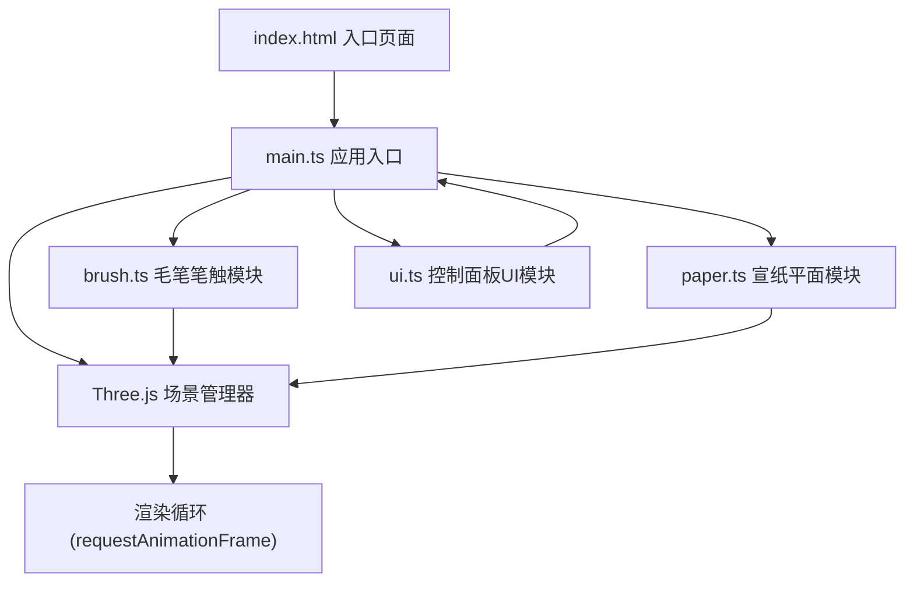

## 1. 架构设计



## 2. 技术栈说明

- **前端框架**: 原生 TypeScript (无额外UI框架)
- **3D引擎**: Three.js @latest + three/addons (OrbitControls)
- **构建工具**: Vite @latest
- **语言**: TypeScript @latest (严格模式, 目标ES2020)
- **类型定义**: @types/three @latest
- **启动脚本**: `npm run dev`

## 3. 文件结构与职责

| 文件路径 | 职责 |
|-------|---------|
| `package.json` | 项目依赖与脚本配置 (three, three/addons, typescript, vite, @types/three) |
| `index.html` | 入口页面，全屏渲染容器div#app，顶部居中标题"墨痕涟漪"，楷体28px #3E2C1F |
| `tsconfig.json` | TypeScript严格模式配置，target ES2020 |
| `vite.config.js` | Vite基础构建配置 |
| `src/main.ts` | 应用入口：初始化Three.js场景/相机/渲染器/OrbitControls，组合所有模块，渲染循环，窗口resize处理 |
| `src/brush.ts` | 毛笔笔触逻辑：管理mousedown/move/up事件生成笔画BufferGeometry，计算墨点分布、飞白效果、晕染动画，接收主题和字体参数，输出Points数组 |
| `src/paper.ts` | 宣纸平面：使用Canvas生成纤维噪点纹理，创建弧形曲面平面，虚线边框，暴露updateShadow方法根据视角更新阴影方向 |
| `src/ui.ts` | 控制面板DOM管理：创建右下角磨砂玻璃面板（180×220px，圆角12px），字体风格切换按钮（楷书/行书/草书，点击激活#D4A574），色墨主题切换（浓墨/淡墨/朱砂），左上角笔画计数（18px #6B5B4D），圆形清空按钮（36px，扫帚图标，悬停旋转180度变色#8B4513），通过回调与main.ts通信 |

## 4. 核心数据结构

### 4.1 笔画数据

```typescript
interface StrokePoint {
  x: number;           // 世界坐标X
  y: number;           // 世界坐标Y
  z: number;           // 世界坐标Z (纸面上略微抬起)
  pressure: number;    // 模拟压力值 0~1
  width: number;       // 笔触宽度
  alpha: number;       // 透明度
  velocity: number;    // 移动速度
  timestamp: number;   // 时间戳
}

interface Stroke {
  id: number;
  points: StrokePoint[];
  geometry: BufferGeometry;
  pointsMesh: Points;
  color: THREE.Color;
  fontStyle: FontStyle;
  createdAt: number;
  isDrying: boolean;   // 是否在晕染扩散中
}

type FontStyle = 'kaishu' | 'xingshu' | 'caoshu';
type InkTheme = 'dark' | 'light' | 'cinnabar';
```

### 4.2 主题颜色常量

```typescript
const INK_THEMES: Record<InkTheme, THREE.Color> = {
  dark: new THREE.Color(0x1A1A1A),      // 浓墨纯黑
  light: new THREE.Color(0x6B7B8D),     // 淡墨灰蓝
  cinnabar: new THREE.Color(0xA64B4B),  // 朱砂暗红
};
```

## 5. 核心算法

### 5.1 笔触生成算法

1. **mousedown**：记录起点，初始化笔画，标记正在书写
2. **mousemove**：
   - 通过 `Raycaster` 将屏幕坐标投射到宣纸平面获取3D位置
   - 计算移动速度 `velocity = distance / deltaTime`
   - 模拟压力 `pressure = clamp(holdTimeFactor * (1 - velocityFactor), 0.2, 1)`
     - holdTimeFactor：按下时长越长压力越大（最大1秒达到1）
     - velocityFactor：移动越快压力越小
   - 计算笔触宽度 `width = baseWidth * pressure * fontWidthFactor`
   - 根据字体风格调整点密度和飞白概率：
     - 楷书：点密集、宽度稳定、飞白少
     - 行书：点适中、宽度变化、偶尔飞白
     - 草书：点稀疏、宽度变化大、飞白频繁
   - 在当前点周围随机散布边缘墨点（半透明）
3. **mouseup**：标记书写结束，启动2秒晕染动画（半径扩大20%，透明度渐变至0.4）

### 5.2 飞白效果

- 草书：飞白概率40%，透明度随机降低至0.3~0.5，点间距增大
- 行书：飞白概率15%，透明度降低至0.4~0.6
- 楷书：飞白概率5%，轻微透明度降低
- 笔画起止点额外增加飞白：细线条断续，透明度0.5

### 5.3 晕染扩散动画

- 释放鼠标后，为每个笔画点创建半径扩展动画（2秒内扩大1.2倍）
- 透明度从1渐变至0.4
- 使用 THREE.Clock + requestAnimationFrame 驱动动画

### 5.4 笔画回收机制

- 维护笔画队列，上限200条
- 超出时从场景移除最早笔画，释放BufferGeometry和材质
- 当笔画总数超过150条时，最早的笔画开始缓慢淡化（透明度线性衰减至0后移除）

### 5.5 宣纸纹理生成

- 创建512×512 Canvas
- 使用随机算法生成纤维状噪点：
  - 绘制数千条随机短线段（方向随机、长度2~10px、透明度0.05~0.2）
  - 添加均匀分布的噪点颗粒（透明度0.02~0.08）
- 生成 THREE.CanvasTexture 作为宣纸 albedoMap

### 5.6 弧形宣纸平面

- 使用 THREE.PlaneGeometry + 自定义顶点修改创建轻微弧形
- 顶点Y轴偏移：`y = amplitude * sin(x * frequency)`，振幅约5px
- 尺寸：700px × 500px（世界坐标单位）

### 5.7 阴影跟随视角

- 调用 `paper.updateShadow(cameraPosition)` 时：
  - 根据相机相对位置计算方向光方向
  - 更新 DirectionalLight.position 和 shadow.camera 配置
  - 保持纸面始终水平（不随相机旋转）

## 6. UI交互回调

```typescript
interface UICallbacks {
  onFontStyleChange: (style: FontStyle) => void;
  onInkThemeChange: (theme: InkTheme) => void;
  onClear: () => void;
  onStrokeCountChange: (count: number) => void;
}
```

## 7. 性能优化策略

- 所有笔画使用 BufferGeometry + Points 渲染（而非Mesh），避免大量draw call
- PointsMaterial 或自定义 ShaderMaterial，使用 pointSize 属性控制笔触大小
- 复用材质实例，仅更新uniform变量
- 晕染动画只在isDrying为true的笔画上执行
- 超过150笔画时启用自动淡化回收机制
- Raycaster 仅在mousedown/mousemove且在宣纸平面上时进行投射检测
