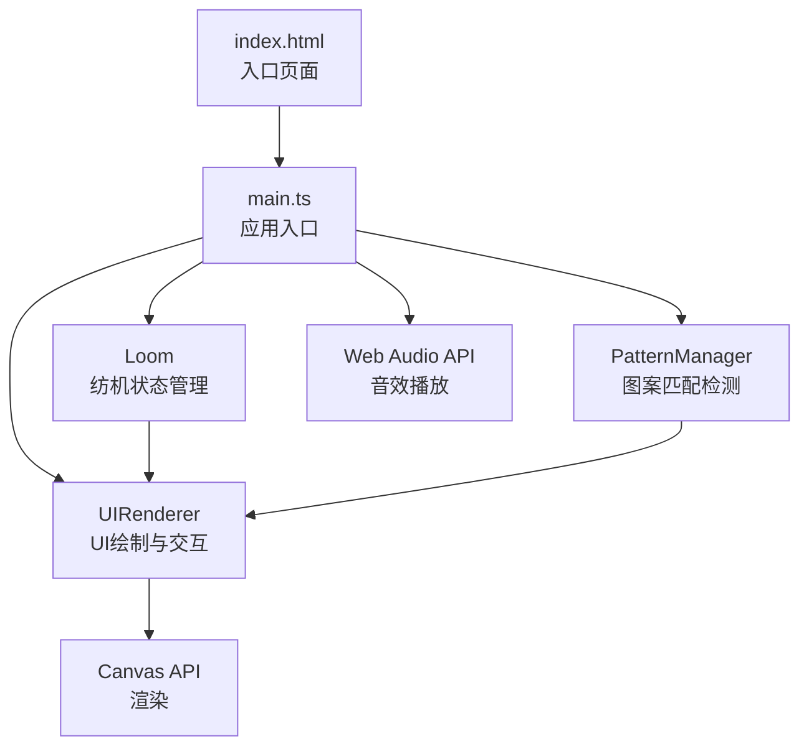

## 1. 架构设计



## 2. 技术描述

- **前端**：TypeScript + Vite（纯原生Canvas渲染，无UI框架）
- **初始化工具**：Vite vanilla-ts 模板
- **构建配置**：Vite 基础配置，支持HMR热更新
- **TypeScript**：严格模式，目标ES2020
- **渲染引擎**：HTML5 Canvas 2D API + requestAnimationFrame主循环
- **音频**：Web Audio API生成正弦波音效

## 3. 项目结构

```
auto305/
├── package.json           # 项目依赖与脚本
├── vite.config.js         # Vite构建配置
├── tsconfig.json          # TypeScript配置
├── index.html             # 入口HTML
└── src/
    ├── main.ts            # 应用入口：初始化、事件、主循环
    ├── loom.ts            # Loom类：纺机状态、丝线槽、格子矩阵、撤销栈
    ├── pattern.ts         # PatternManager类：图案定义、进度计算、完成检测
    └── ui.ts              # UIRenderer类：Canvas绘制、鼠标事件、特效
```

## 4. 核心类与数据模型

### 4.1 Loom 类（纺机状态管理）
```typescript
interface Cell {
  row: number;           // 行索引 0-11
  col: number;           // 列索引 0-11
  color: string | null;  // 当前染色（丝线颜色），null为未染色
  targetColor: string | null;  // 目标颜色（用于渐变动画）
  animationStart: number | null;  // 动画开始时间戳
}

interface DrawnStep {
  cells: { row: number; col: number; prevColor: string | null }[];
}

class Loom {
  public threadSlots: ThreadSlot[];   // 三个丝线槽
  public grid: Cell[][];              // 12x12格子矩阵
  public undoStack: DrawnStep[];      // 撤销栈（最多5步）
  public currentDrag: { slotIndex: number; path: {row:number;col:number}[] } | null;

  constructor() {}
  public startDrag(slotIndex: number, row: number, col: number): void;
  public dragTo(row: number, col: number): void;  // 沿对角线移动
  public endDrag(): DrawnStep | null;
  public undo(): boolean;
  public reset(): void;
}
```

### 4.2 PatternManager 类（图案管理）
```typescript
interface PatternTarget {
  id: string;
  name: string;
  cells: { row: number; col: number }[];  // 需要染色的目标格子坐标
  completed: boolean;
  completionTime: number | null;
}

class PatternManager {
  public patterns: PatternTarget[];  // 5个预设图案

  constructor() {}
  public randomizePatterns(): void;  // 随机选择/排列5种图案
  public calculateProgress(patternIndex: number, loom: Loom): number;  // 0-1
  public checkCompletion(patternIndex: number, loom: Loom): boolean;  // ≥80%
  public allCompleted(): boolean;
}
```

### 4.3 UIRenderer 类（渲染与交互）
```typescript
interface Particle {
  x: number; y: number;
  vx: number; vy: number;
  size: number; color: string;
  angle: number; radius: number;
}

class UIRenderer {
  private canvas: HTMLCanvasElement;
  private ctx: CanvasRenderingContext2D;
  private loom: Loom;
  private patternManager: PatternManager;
  private particles: Particle[];       // 胜利特效粒子
  private nebulaLayers: { opacity: number; startTime: number }[];

  constructor(canvas: HTMLCanvasElement, loom: Loom, patternManager: PatternManager) {}
  public render(timestamp: number): void;
  public handleMouseDown(e: MouseEvent): void;
  public handleMouseMove(e: MouseEvent): void;
  public handleMouseUp(e: MouseEvent): void;
  public playCompletionSound(): void;
  private drawLoomPanel(timestamp: number): void;
  private drawThreadSlots(timestamp: number): void;
  private drawGrid(timestamp: number): void;
  private drawPatternCards(timestamp: number): void;
  private drawButtons(timestamp: number): void;
  private drawVictoryRune(timestamp: number): void;
  private drawNebula(timestamp: number): void;
}
```

## 5. 关键坐标与几何换算

### 5.1 菱形格子坐标系统
- 编织区域：400x400px，位于纺机面板中央
- 菱形边长：20px，12x12格
- 菱形顶点坐标换算（以编织区域左上角为原点）：
  - 格子中心：`x = col * 20 + 10, y = row * 20 + 10`
  - 菱形四顶点：上(x, y-10)、右(x+10, y)、下(x, y+10)、左(x-10, y)

### 5.2 丝线槽位置（相对于纺机面板700x600）
- 槽1（月光银）：中心(230, 80)，半径30
- 槽2（暮光金）：中心(350, 80)，半径30
- 槽3（星尘蓝）：中心(470, 80)，半径30
- 槽底部拖拽起点：各槽中心 + y方向偏移30px

### 5.3 响应式缩放
- 基础缩放因子：1.0
- 窗口宽度 < 800px：缩放 0.85
- 窗口宽度 < 600px：缩放 0.65
- Canvas实际尺寸 = 设计尺寸 × 缩放因子，Canvas内部坐标系不变（通过context.scale处理）

## 6. 性能优化策略

- **主循环**：使用 requestAnimationFrame，目标60fps
- **分层渲染**：静态元素（面板边框、格子线）可考虑离屏Canvas缓存
- **动画优化**：格子渐变仅在animationStart非空时计算插值
- **拖拽性能**：鼠标move事件节流（实际每帧处理一次即可，因为RAF每16ms触发）
- **粒子系统**：固定80个粒子，对象池复用，不频繁GC
