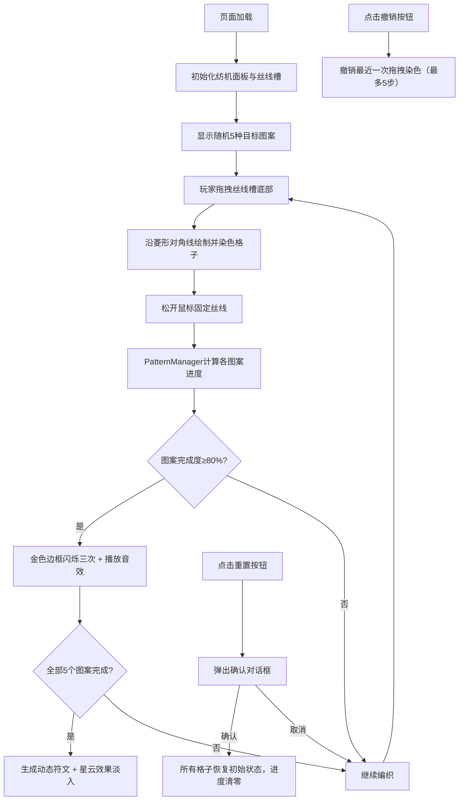

## 1. 产品概述

灵魂纺机是一款在浏览器中运行的轻量级解谜与资源管理游戏，玩家通过拖拽不同颜色的灵魂丝线，在菱形格子编织区域内绘制指定图案，完成所有图案后触发隐藏剧情光效。游戏以深紫色调的神秘风格呈现，提供细腻的交互反馈和流畅的动画效果。

- 核心问题：解决玩家在缺乏直观反馈和动态交互的情况下，无法体验将不同颜色和质感的灵魂丝线编织成指定图案并触发隐藏剧情的问题
- 目标用户：喜欢休闲解谜游戏、追求精美视觉体验的玩家

## 2. 核心功能

### 2.1 功能模块
1. **纺机主界面**：磨砂金属纹理面板、三个丝线槽、12x12菱形编织区域
2. **丝线拖拽编织**：从丝线槽拖拽丝线沿45°对角线绘制、染色格子渐变动画
3. **图案进度系统**：5种预设图案目标、进度条显示、完成80%触发金色闪烁与音效
4. **撤销与重置**：最多5步撤销、重置确认对话框
5. **胜利特效**：完成全部图案后显示动态旋转符文、多层星云效果淡入

### 2.2 页面详情
| 页面名称 | 模块名称 | 功能描述 |
|---------|---------|---------|
| 游戏主页面 | 纺机面板 | 700x600px磨砂金属纹理面板，承载所有游戏元素 |
| 游戏主页面 | 丝线槽 | 三个圆形丝线槽（月光银、暮光金、星尘蓝），边缘2秒周期脉动光晕 |
| 游戏主页面 | 编织区域 | 400x400px的12x12菱形格子矩阵，支持沿对角线拖拽染色 |
| 游戏主页面 | 图案卡片区 | 右侧180x400px卡片，展示5种预设图案缩略图和进度条 |
| 游戏主页面 | 控制按钮 | 左下角撤销按钮、右下角重置按钮 |
| 游戏主页面 | 胜利特效 | 中央动态旋转符文、背景多层星云淡入 |

## 3. 核心流程

## 4. 用户界面设计

### 4.1 设计风格
- **主色调**：深紫色渐变背景（#1A0F2E到#0D0820），磨砂金属面板（#2B2340）
- **点缀色**：月光银#C0C0C0、暮光金#D4AF37、星尘蓝#4A90D9、胜利金#FFD700
- **文字色**：#D4C8A0（米金色）
- **按钮风格**：圆形按钮，直径36px，悬停变色，点击0.1s缩放动画
- **字体**：Georgia衬线字体
- **整体氛围**：黑暗神秘，高光集中在丝线颜色和区域边界

### 4.2 页面设计概览
| 页面名称 | 模块名称 | UI元素 |
|---------|---------|--------|
| 游戏主页面 | 背景 | 深紫色径向渐变，胜利时叠加5层半透明星云圆 |
| 游戏主页面 | 纺机面板 | 700x600px，磨砂金属纹理，竖向拉丝线条 |
| 游戏主页面 | 丝线槽 | 圆形（r=30px），间隔40px，脉动光晕（2s周期） |
| 游戏主页面 | 编织区域 | 400x400px，12x12菱形格（边长20px），背景#2E2440，边框#3A2F50 |
| 游戏主页面 | 图案卡片 | 180x400px，圆角8px，边框2px，60x60px缩略图 |
| 游戏主页面 | 控制按钮 | 圆形，背景#4A3060，悬停#5B3B75，点击缩小至0.95 |
| 游戏主页面 | 胜利符文 | 半径160px圆形，彩色菱形碎片拼接，80个旋转粒子 |

### 4.3 响应式适配
- 桌面端优先（≥800px）：100%原始尺寸
- 窗口宽度<800px：缩放至85%
- 窗口宽度<600px：缩放至65%
- 所有元素在缩放下保持可点击和可见

### 4.4 动画与交互
- 丝线槽光晕：2秒周期脉动
- 格子染色：0.5秒平滑渐变动画
- 图案完成：金色边框闪烁3次 + 440Hz正弦波音效0.2秒
- 符文旋转：0.5度/帧，缩放1.0~1.1正弦变化（3s周期）
- 星云淡入：5层按1.5秒间隔依次出现
- 鼠标样式：拖拽时十字准星
- 按钮点击：0.1s缩放动画
