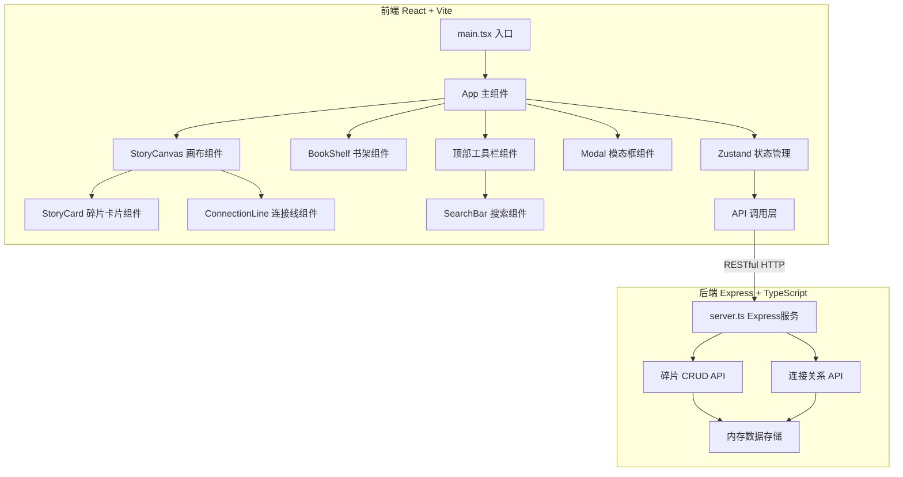
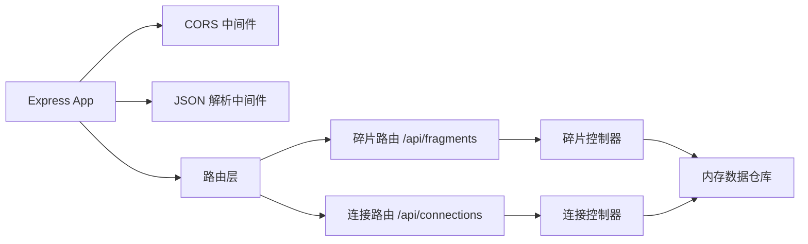
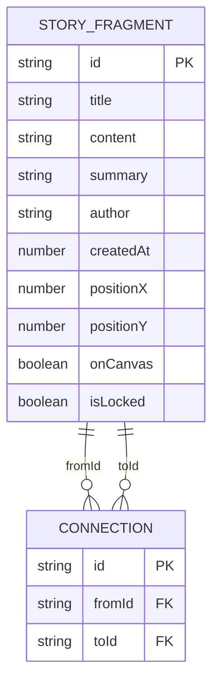

## 1. 架构设计



## 2. 技术说明

- **前端**：React@18 + TypeScript + Vite + Zustand（状态管理）
- **构建工具**：Vite（支持 React、HMR）
- **后端**：Express@4 + TypeScript + Node.js
- **数据库**：内存存储（开发阶段）
- **跨域**：cors 中间件处理前后端跨域
- **唯一标识**：uuid 生成碎片ID

## 3. 路由定义

| 路由 | 用途 |
|------|------|
| / | 前端主页面（Vite dev server 提供） |
| /api/fragments | 获取所有碎片列表 / 创建新碎片 |
| /api/fragments/:id | 获取/更新/删除单个碎片 |
| /api/connections | 获取所有连接关系 / 创建新连接 |
| /api/connections/:id | 删除连接关系 |

## 4. API 定义

### TypeScript 类型定义

```typescript
interface StoryFragment {
  id: string;
  title: string;
  content: string;
  summary: string;
  author: string;
  createdAt: number;
  position: { x: number; y: number } | null;
  onCanvas: boolean;
  isLocked: boolean;
}

interface Connection {
  id: string;
  fromId: string;
  toId: string;
}

interface FragmentCreateInput {
  title: string;
  content: string;
  author?: string;
}

interface FragmentPositionInput {
  x: number;
  y: number;
  onCanvas: boolean;
}
```

### API 接口

**GET /api/fragments**
- 请求：无
- 响应：`StoryFragment[]` - 所有碎片列表

**POST /api/fragments**
- 请求：`FragmentCreateInput`
- 响应：`StoryFragment` - 新创建的碎片

**GET /api/fragments/:id**
- 请求：无
- 响应：`StoryFragment` - 指定碎片

**PUT /api/fragments/:id**
- 请求：`Partial<StoryFragment>`
- 响应：`StoryFragment` - 更新后的碎片

**DELETE /api/fragments/:id**
- 请求：无
- 响应：`{ success: boolean }`

**PUT /api/fragments/:id/position**
- 请求：`FragmentPositionInput`
- 响应：`StoryFragment` - 更新位置后的碎片

**GET /api/connections**
- 请求：无
- 响应：`Connection[]` - 所有连接关系

**POST /api/connections**
- 请求：`{ fromId: string; toId: string }`
- 响应：`Connection` - 新创建的连接

**DELETE /api/connections/:id**
- 请求：无
- 响应：`{ success: boolean }`

## 5. 服务器架构图



## 6. 数据模型

### 6.1 数据模型定义



### 6.2 初始数据

应用启动时预置以下示例碎片数据：

```typescript
const seedFragments: Omit<StoryFragment, 'id' | 'createdAt'>[] = [
  {
    title: '序章·迷雾森林',
    content: '当第一缕晨光驱散林间的薄雾，她终于停下了奔跑的脚步...',
    summary: '神秘森林中的逃亡者',
    author: '匿名',
    position: null,
    onCanvas: false,
    isLocked: false,
  },
  {
    title: '第一章·古老图书馆',
    content: '青铜门把手在烛光中闪烁着幽光，门后是沉睡千年的秘密...',
    summary: '被遗忘的知识殿堂',
    author: '佚名',
    position: null,
    onCanvas: false,
    isLocked: false,
  },
  {
    title: '第二章·时间之书',
    content: '书页翻动的声音像是遥远的钟声，每一个字都在诉说着被遗忘的年代...',
    summary: '记录一切的神秘典籍',
    author: '时光守望者',
    position: null,
    onCanvas: false,
    isLocked: false,
  },
  // ... 更多示例碎片
];
```

## 7. 文件结构与调用关系

```
碎片叙语/
├── package.json              # 项目配置与依赖
├── vite.config.js            # Vite 构建配置
├── tsconfig.json             # TypeScript 配置
├── index.html                # HTML 入口
└── src/
    ├── server.ts             # Express 后端服务（提供 REST API）
    │   └── 内存数据存储 + 路由处理
    └── client/
        ├── main.tsx          # React 前端入口（→ 渲染 App）
        ├── App.tsx           # 主应用组件（→ 组合所有子组件）
        ├── store/
        │   └── useStore.ts   # Zustand 状态管理（→ API 调用，管理碎片/连接状态）
        ├── types/
        │   └── index.ts      # TypeScript 类型定义
        ├── api/
        │   └── client.ts     # API 客户端封装（→ 调用后端 REST API）
        ├── styles/
        │   └── global.css    # 全局样式
        └── components/
            ├── BookShelf.tsx       # 虚拟书架（← 接收碎片列表，→ onDrag 回调）
            ├── StoryCanvas.tsx     # 拼图画布（← 接收已连接碎片，→ 发送更新请求）
            ├── StoryCard.tsx       # 碎片卡片组件（可拖拽，→ 连接点拖拽事件）
            ├── ConnectionLine.tsx  # SVG 连接线（← 接收连接数据）
            ├── SearchBar.tsx       # 搜索输入框（→ onSearch 回调）
            ├── CreateModal.tsx     # 创建碎片模态框（→ 提交创建）
            └── DetailModal.tsx     # 详情模态框（→ 编辑/锁定操作）
```

### 数据流向说明

1. **初始化数据流**：
   - `main.tsx` → `App.tsx` → `useStore.loadFragments()` → `api.client.ts` → `GET /api/fragments`
   - 后端 `server.ts` 返回碎片数据 → 前端 Zustand store 更新 → 组件重新渲染

2. **搜索过滤数据流**：
   - `SearchBar.tsx` 输入变化 → `onSearch` 回调 → `useStore.setSearchQuery()`
   - `BookShelf.tsx` 从 store 读取过滤后的碎片列表 → 渲染高亮匹配卡片

3. **拖拽碎片数据流**：
   - `BookShelf.tsx` / `StoryCanvas.tsx` 中 `StoryCard` 拖拽事件
   → `onDragStart` / `onDrop` → `useStore.updateFragmentPosition()`
   → `api.client.ts` → `PUT /api/fragments/:id/position`
   → 后端内存更新 → 返回更新后碎片 → store 更新

4. **连接碎片数据流**：
   - `StoryCard.tsx` 右侧连接点拖拽 → `StoryCanvas.tsx` 目标卡片左侧连接点释放
   → `useStore.createConnection(fromId, toId)` → `api.client.ts` → `POST /api/connections`
   → 后端创建连接 → store 更新连接列表 → `ConnectionLine.tsx` 渲染新连接线

5. **创建碎片数据流**：
   - `CreateModal.tsx` 表单提交 → `useStore.createFragment(data)`
   → `api.client.ts` → `POST /api/fragments`
   → 后端创建碎片 → store 添加新碎片 → `BookShelf.tsx` 渲染新卡片
