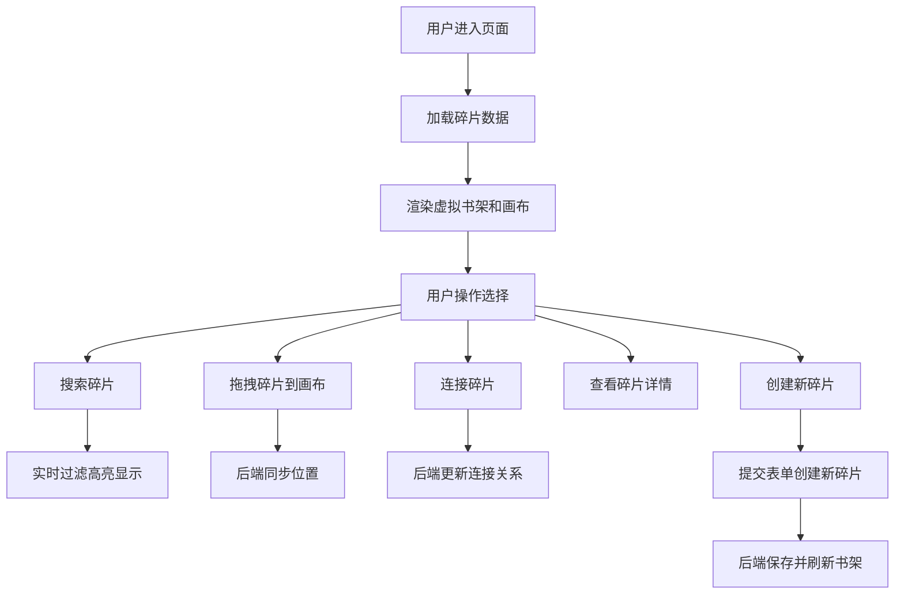

## 1. 产品概述

「碎片叙语」是一个非线性叙事小说共同创作平台，读者可以通过拼图式的方式协作构建故事。平台将故事章节以碎片卡片的形式散落在虚拟书架上，用户通过拖动、连接碎片来决定故事走向，形成独特的叙事网络。

- 核心目的：为读者提供协作式非线性小说创作体验，打破传统线性叙事的限制
- 目标用户：图书管理员、文学爱好者、创意写作者、故事探索者
- 产品价值：提供沉浸式的拼图书写体验，让多人共同构建出丰富多变的故事世界

## 2. 核心功能

### 2.1 用户角色
| 角色 | 注册方式 | 核心权限 |
|------|----------|----------|
| 普通用户 | 无需注册（访客模式） | 浏览碎片、拖拽碎片、连接碎片、查看详情、搜索碎片、创建新碎片 |

### 2.2 功能模块
1. **主界面**：顶部搜索栏、虚拟书架区域、拼图画布区域
2. **虚拟书架**：5×5网格展示所有故事碎片卡片，支持拖拽
3. **拼图画布**：拖放区域，支持碎片连接、缩放平移
4. **碎片详情**：点击展开模态框，显示完整章节内容
5. **搜索过滤**：实时搜索碎片标题和关键词
6. **创建碎片**：添加新故事碎片到书架

### 2.3 页面详情
| 页面名称 | 模块名称 | 功能描述 |
|----------|----------|----------|
| 主界面 | 顶部搜索栏 | 实时搜索过滤碎片，匹配高亮动画 |
| 主界面 | 虚拟书架 | 5×5网格布局，展示羊皮纸风格卡片，支持拖拽 |
| 主界面 | 拼图画布 | 深色网格背景，碎片拖放定位，连接线绘制 |
| 主界面 | 添加按钮 | 右上角创建新碎片入口 |
| 创建模态框 | 表单输入 | 标题（≤30字符）、正文（≤2000字符）输入 |
| 详情模态框 | 内容展示 | 完整章节文本、作者信息、编辑/锁定按钮 |

## 3. 核心流程

用户打开页面后，首先看到虚拟书架上展示的所有故事碎片。用户可以：
1. 使用顶部搜索框实时搜索过滤碎片
2. 从书架拖拽碎片到右侧画布区域
3. 在画布上通过拖拽连接点来建立碎片间的叙事关联
4. 点击画布上的碎片查看完整章节内容
5. 点击右上角「添加碎片」创建新的故事碎片

## 4. 用户界面设计

### 4.1 设计风格
- **主色调**：深木色渐变背景（#2B1D14 → #3C2A1F），营造旧书卷图书馆氛围
- **辅助色**：旧羊皮纸色卡片（#F5E6C8），金色连接线高亮（#D4AF37）
- **按钮风格**：深棕色圆角按钮（#6B4226），悬停变亮（#8B5A2B）
- **字体**：衬线字体营造古典书卷气息，标题使用优雅的显示字体
- **布局风格**：横向双栏布局（书架+画布），窄屏纵向堆叠
- **动效**：所有交互均有0.3s平滑过渡，搜索高亮有跳动动画

### 4.2 页面设计概述
| 页面名称 | 模块名称 | UI元素 |
|----------|----------|--------|
| 主界面 | 顶部区域 | 搜索输入框（宽300px，圆角8px，半透明白色背景）、添加碎片按钮 |
| 主界面 | 虚拟书架 | 900×650px容器，5×5网格，160×120px羊皮纸卡片，1px深棕边框 |
| 主界面 | 拼图画布 | 600×600px深色容器（#1E1E1E），细微网格线，浅灰虚线连接，发光金色实线 |
| 模态框 | 详情弹窗 | 半透明暗色遮罩，500×400px圆角卡片，#FDF5E6背景，编辑/锁定按钮 |
| 模态框 | 创建弹窗 | 标题输入框、正文文本域、提交/取消按钮 |

### 4.3 响应式
- Desktop-first 设计，优先适配 1024px~1920px 屏幕宽度
- 屏幕宽度小于1280px时，书架和画布纵向堆叠
- 画布和书架容器宽度自适应百分比
- 触摸设备优化拖拽交互

## 5. 性能要求
- 拖拽响应延迟 ≤ 50ms
- 画布同时承载50张卡片和100条连接线时 FPS ≥ 30
- 搜索过滤实时响应，无明显卡顿
