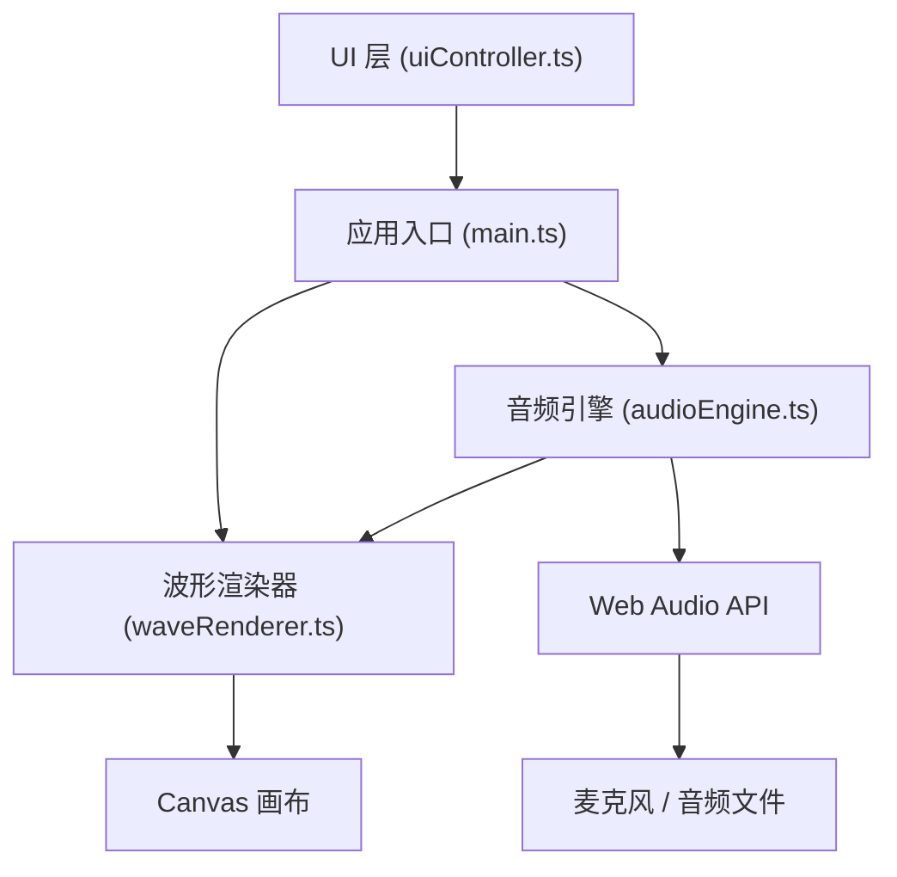

## 1. 架构设计
纯前端单页应用，基于 Web Audio API 进行音频采集与分析，使用 Canvas 2D 进行波形绘制，采用模块化分层设计。



## 2. 技术描述
- **前端框架**：TypeScript + Vite（原生 TS，无 UI 框架）
- **音频处理**：Web Audio API（AudioContext、AnalyserNode、MediaRecorder、MediaStreamSource）
- **图形绘制**：HTML5 Canvas 2D API
- **初始化工具**：Vite vanilla-ts 模板

## 3. 模块定义

### 3.1 文件结构
| 文件 | 职责 |
|------|------|
| package.json | 依赖与脚本（typescript、vite） |
| vite.config.js | Vite 构建配置，启用 HMR |
| tsconfig.json | TypeScript 严格模式，目标 ES2020 |
| index.html | 入口页面，包含 DOM 结构与样式 |
| src/main.ts | 应用入口：初始化 AudioContext、Canvas、绑定事件 |
| src/audioEngine.ts | 录音、播放、频谱分析，输出频率/音量数据 |
| src/waveRenderer.ts | Canvas 波形绘制、粒子系统、多风格渲染 |
| src/uiController.ts | 按钮/滑块状态、浮动标签、样式动画管理 |

### 3.2 核心类型
```typescript
// 音频帧数据
interface AudioFrame {
  time: number;
  volume: number;        // 0-1
  frequency: number;     // Hz
  spectrum: Uint8Array;  // 频率域数据
  dominantBand: 'low' | 'mid' | 'high';
}

// 粒子对象
interface Particle {
  x: number;
  y: number;
  vx: number;
  vy: number;
  color: string;
  size: number;
  life: number;
}

// 波形渲染模式
type WaveStyle = 'smooth' | 'sharp' | 'bars';
```

### 3.3 关键技术点
1. **低延迟响应**：使用 requestAnimationFrame 驱动渲染循环，AnalyserNode.fftSize=2048 获取频域数据
2. **波形录制**：MediaRecorder 录制音频 Blob，同时同步缓存 AudioFrame 数组用于回放
3. **基频检测**：通过自相关算法（Autocorrelation）从时域数据估算音高频率
4. **颜色映射**：按主导频段映射蓝/绿/洋红，按频谱质心映射金黄到深紫渐变
5. **粒子系统**：波峰顶点触发粒子生成，velocity 随音量动态缩放
6. **波形风格切换**：smooth 用 bezier 曲线插值、sharp 用直线段、bars 用矩形条；切换时 globalAlpha 过渡
7. **点击命中检测**：将点击 x 坐标映射到录音时间轴索引，读取对应 AudioFrame 显示浮动标签
