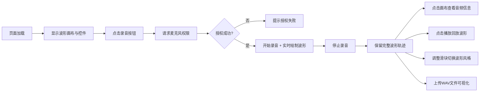

## 1. 产品概述
「影绘留声机」是一款实时音频可视化Web应用，将用户麦克风哼唱的旋律或环境音转化为画布上流动的彩色波形动画，支持录音回放与波形交互探索。
- 核心用途：音频可视化、创意声音记录、音乐灵感捕捉
- 目标用户：音乐爱好者、创意工作者、普通用户

## 2. 核心功能

### 2.1 功能模块
1. **主页面**：波形画布、控制按钮区、缩放滑块、页脚

### 2.2 页面详情
| 页面名称 | 模块名称 | 功能描述 |
|-----------|-------------|---------------------|
| 主页面 | 波形画布 | 780x420px 磨砂黑画布，金色发光描边，实时绘制流动波形与粒子效果 |
| 主页面 | 录音按钮 | 圆形红色按钮，录音时脉冲发光动画，控制麦克风录音启停 |
| 主页面 | 播放按钮 | 三角形播放按钮，回放录音并同步波形动画 |
| 主页面 | 清除按钮 | 圆形灰色按钮，重置画布清空所有波形数据 |
| 主页面 | 文件上传 | 导入WAV音频文件，格式校验为音频类型 |
| 主页面 | 缩放滑块 | 1x-3x倍率，切换波形显示风格（平滑/锯齿/柱状），0.3s过渡动画 |
| 主页面 | 浮动标签 | 点击画布任意位置，显示该点音频强度百分比与近似频率 |
| 主页面 | 页脚 | 波形图标与版本号展示 |

## 3. 核心流程
用户打开页面 → 点击录音按钮授权麦克风 → 哼唱时实时生成彩色波形与粒子 → 停止录音保留完整波形 → 点击画布查看音频信息/点击播放回放/上传WAV文件/调整波形风格滑块

## 4. 用户界面设计

### 4.1 设计风格
- **主色调**：深炭灰色背景（径向渐变 #1E1E24 → #141418）
- **强调色**：淡金色 #C9A96E（描边）、红色 #E74C3C（录音）、翠绿 #A8D5BA（播放）
- **波形色**：低频蓝 #4A90D9、中频绿 #50C878、高频洋红 #E9407C；基线橙→紫渐变 #FF8C42→#7C3AED
- **按钮风格**：磨砂玻璃效果（背景 rgba(255,255,255,0.08)，边框 1px rgba(255,255,255,0.12)，圆角 12px）
- **字体**：现代无衬线字体，深色主题下浅色文字
- **整体基调**：黑暗奢华、精致磨砂、发光细节

### 4.2 页面设计概览
| 页面名称 | 模块名称 | UI 元素 |
|-----------|-------------|-------------|
| 主页面 | 画布容器 | 径向渐变背景，居中布局，780x420 半透明磨砂黑画布，2px 金色描边带4px发光模糊 |
| 主页面 | 控制按钮区 | 录音圆（56px红色，脉冲动画）、播放三角（悬停变色）、清除圆（灰色）、上传按钮，磨砂玻璃风格 |
| 主页面 | 缩放滑块 | 右侧滑块，1x-3x，磨砂玻璃容器，切换时 0.3s 淡入 |
| 主页面 | 浮动标签 | 半透明弹出，显示音频强度与频率 |
| 主页面 | 页脚 | 居中，波形图标 + "影绘留声机 v1.0"，浅灰 #A0A0A8 |

### 4.3 响应式
- 桌面端：画布居中，按钮区横向排列
- 移动端（<768px）：画布宽高缩小至 70%，按钮区纵向堆叠

### 4.4 性能指标
- 录音响应时间 < 200ms
- 波形绘制帧率 ≥ 30fps
- 最长录音时长 30 秒
