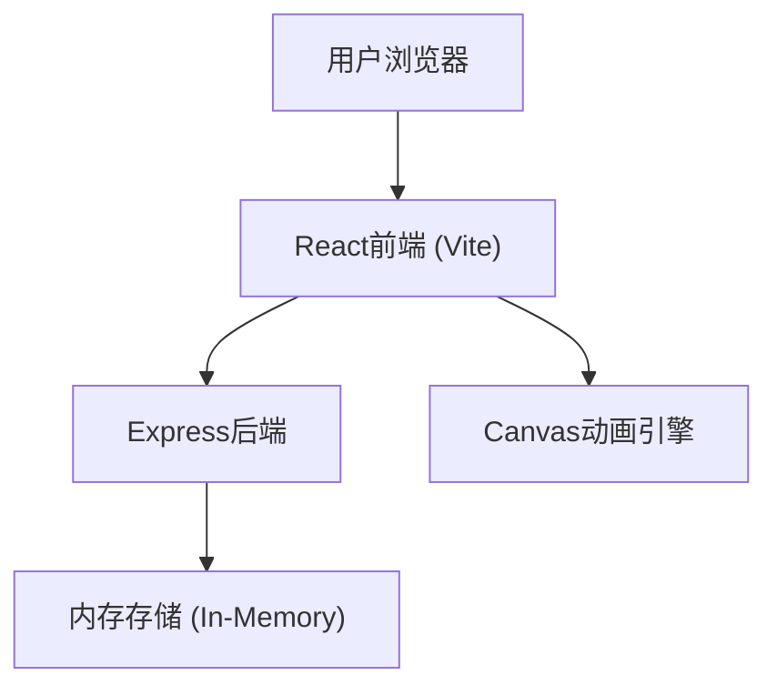
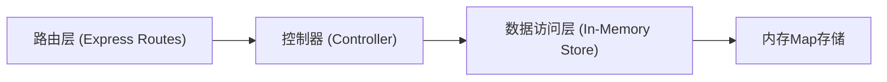

## 1. 架构设计



## 2. 技术说明

- **前端**: React 18 + TypeScript + Vite，使用内联CSS样式（styled-components风格的样式对象）
- **后端**: Express 4 + TypeScript + CORS + UUID
- **存储**: 内存存储(开发演示用)，使用Map数据结构
- **构建工具**: Vite，配置React插件和HMR热更新
- **图标**: lucide-react

## 3. 项目文件结构

| 文件路径 | 用途 |
|---------|------|
| /package.json | 项目依赖和脚本配置 |
| /index.html | Vite入口HTML |
| /vite.config.js | Vite构建配置 |
| /tsconfig.json | TypeScript严格模式配置 |
| /src/main.tsx | React应用入口 |
| /src/App.tsx | 主应用组件，全局状态管理 |
| /src/components/CodingCard.tsx | 编码卡组件 + 详情面板 |
| /src/components/Shelf.tsx | 瀑布流布局 + 标签筛选 |
| /src/utils/canvasAnim.ts | Canvas粒子扩散动画 |
| /server/index.ts | Express后端CRUD API |

## 4. API定义

### 4.1 数据类型

```typescript
interface ScentCode {
  id: string;
  name: string;
  symbol: string;
  symbolType: 'rain' | 'book' | 'coffee' | 'flower' | 'wood' | 'sea' | 'fire' | 'custom';
  colors: string[];
  season: '春季' | '夏季' | '秋季' | '冬季';
  mood: '平静' | '愉悦' | '忧郁' | '怀念';
  description: string;
  createdAt: string;
}
```

### 4.2 REST API端点

| 方法 | 路径 | 用途 |
|------|------|------|
| GET | /api/codes | 获取所有编码卡，支持?season=&mood=&search=查询参数 |
| GET | /api/codes/:id | 获取单个编码卡详情 |
| POST | /api/codes | 创建新编码卡 |
| PUT | /api/codes/:id | 更新编码卡 |
| DELETE | /api/codes/:id | 删除编码卡 |

### 4.3 请求/响应示例

**创建编码卡**
```
POST /api/codes
Request: { name, symbol, symbolType, colors, season, mood, description }
Response: { id, ...fields, createdAt }
```

**筛选查询**
```
GET /api/codes?season=春季&mood=平静&search=雨
Response: ScentCode[]
```

## 5. 服务端架构



## 6. 前端状态管理

使用React useState + useContext进行轻量状态管理：
- codes: 编码卡列表
- selectedCode: 当前展开的编码卡
- activeFilters: { season, mood }
- searchQuery: 搜索关键词
- creating: 是否处于新建模式

## 7. 性能优化策略

1. **瀑布流布局**: CSS多列布局(column-count)而非JS计算，保证滚动流畅
2. **Canvas动画**: requestAnimationFrame驱动，离屏canvas预渲染，粒子池复用
3. **搜索防抖**: useDebounce Hook，500ms延迟触发
4. **卡片动画**: CSS transform/opacity，触发GPU合成层
5. **筛选过渡**: 使用key切换触发React动画，淡入淡出组合
