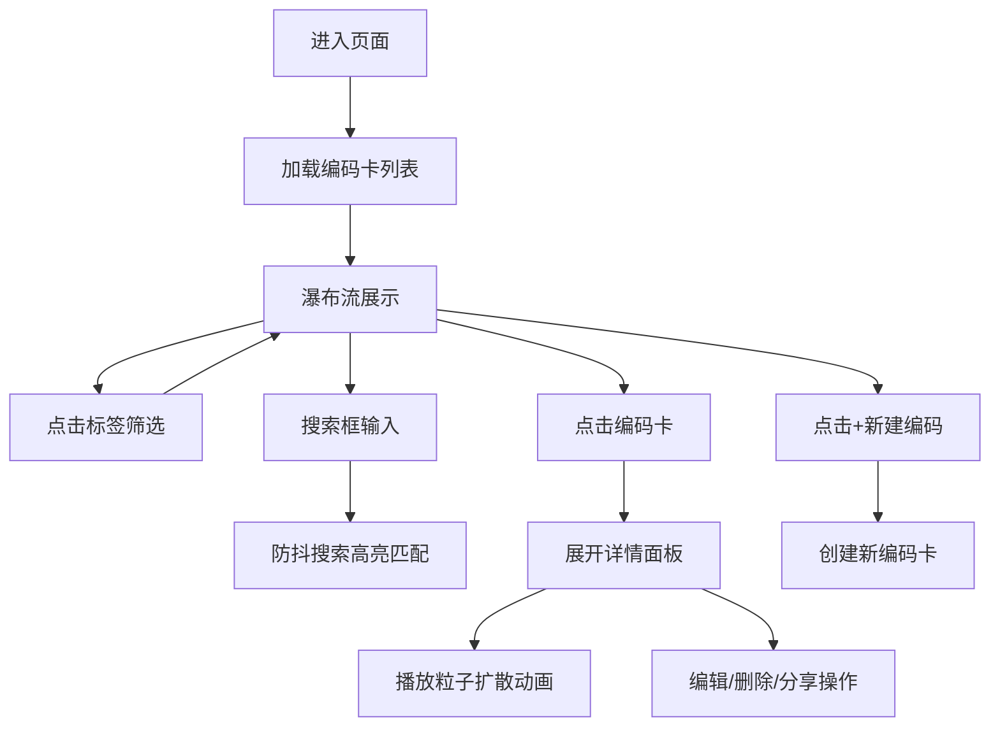

## 1. 产品概述

「气味编码簿」是一款让用户通过视觉符号、颜色和文字组合对抽象日常气味进行编码存储的全栈Web应用。用户可以创建气味编码卡，按季节和情绪标签进行分类浏览，通过Canvas粒子动画直观感受气味的弥散过程。

- 核心目标：将无形的嗅觉体验转化为可记录、可检索、可分享的视觉编码
- 目标用户：对气味敏感、喜欢记录生活细节的创意人群

## 2. 核心功能

### 2.1 功能模块

1. **主界面**：磨砂玻璃主容器、用户头像、标题、新建编码按钮
2. **编码卡瀑布流**：卡片展示、悬停动效、淡入动画
3. **标签筛选栏**：季节/情绪标签筛选、搜索框、高亮匹配
4. **详情面板**：文本描述、Canvas粒子扩散动画、编辑/删除/分享操作
5. **CRUD API**：编码卡的增删改查、标签搜索、名称搜索

### 2.3 页面详情

| 页面名称 | 模块名称 | 功能描述 |
|---------|---------|---------|
| 主页面 | 顶部区域 | 用户头像(圆形, 直径60px, 边框2px #C9A96E)、标题"我的气味编码簿"、"+新建编码"按钮(圆角8px, 背景#3A4B5C, 悬停#506E8A, 点击缩放动画0.1s) |
| 主页面 | 左侧筛选栏 | 宽120px, 背景#232A35, 季节标签(春/夏/秋/冬)、情绪标签(平静/愉悦/忧郁/怀念)、搜索框(圆角6px, 背景#1B212A, 防抖500ms) |
| 主页面 | 瀑布流区域 | 编码卡宽220px高280px, 圆角12px, 背景#2C3540, 0.3s淡入动画, 悬停上升5px, 阴影rgba(0,0,0,0.3) |
| 主页面 | 编码卡内容 | 符号图标、中文名称、四色色块条(20x20px渐变排列)、创建日期、季节标签 |
| 详情面板 | 内容区域 | 背景#1E262F, 圆角12px, 左半部分文本描述(500字以内, #D0D5DB), 右半部分Canvas(320x340px)粒子动画 |
| 详情面板 | Canvas动画 | 粒子60-120个, 大小3-8px, 颜色取自色块条, 中心扩散消散, 4秒循环 |
| 详情面板 | 操作按钮 | 编辑(铅笔)、删除(垃圾桶)、分享(箭头) - 分享复制ID到剪贴板, 3秒提示"已复制分享链接" |

## 3. 核心流程

用户进入页面 → 浏览编码卡瀑布流 → 点击标签筛选或搜索 → 点击卡片展开详情 → 查看粒子动画和描述 → 编辑/删除/分享 → 或点击新建编码创建新卡片

## 4. 用户界面设计

### 4.1 设计风格
- **主色调**：深蓝灰渐变背景(#1E2229 → #252D36径向渐变)，磨砂玻璃质感
- **强调色**：金色#C9A96E(边框/高亮)、蓝灰#3A4B5C(按钮)、悬停#506E8A
- **卡片风格**：圆角设计，磨砂玻璃效果，1px rgba(255,255,255,0.1)边框
- **字体**：优雅的衬线+无衬线组合，标题精致，正文易读
- **动效**：卡片淡入0.3s、悬停上升5px、筛选过渡0.4s(旧卡上淡出，新卡下淡入)、按钮缩放0.1s

### 4.2 页面设计概述

| 页面名称 | 模块名称 | UI元素 |
|---------|---------|--------|
| 主页面 | 背景层 | 径向渐变#1E2229→#252D36，全屏深色 |
| 主页面 | 主容器 | 880x640px，圆角16px，边框1px rgba(255,255,255,0.1)，背景rgba(30,35,45,0.7)磨砂玻璃 |
| 主页面 | 编码卡 | 220x280px，圆角12px，背景#2C3540，符号图标+名称+色块条+日期+标签 |
| 详情面板 | 布局 | 左右分栏，左文右图(Canvas)，底部三按钮 |
| 详情面板 | Canvas | 320x340px，粒子从中心向四周扩散消散，循环4秒 |
| 筛选栏 | 标签 | 季节(春/夏/秋/冬)、情绪(平静/愉悦/忧郁/怀念)，点击切换高亮 |

### 4.3 响应式
- 桌面优先设计，主容器固定880x640px居中展示
- 移动端可考虑自适应缩放，但核心布局以桌面端体验为主

### 4.4 性能要求
- 40张编码卡瀑布流滚动帧率 ≥ 50fps
- Canvas粒子动画帧率 ≥ 30fps
