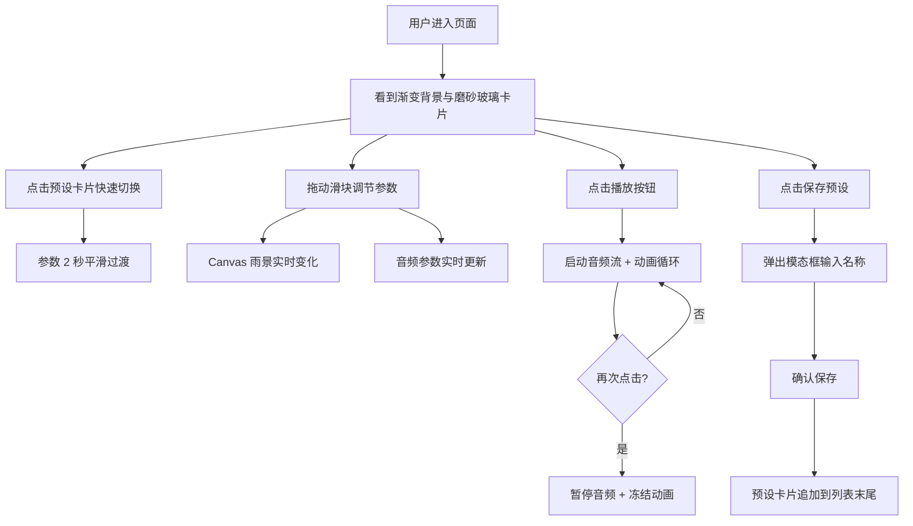

## 1. 产品概述

雨声光影机是一款沉浸式视听氛围应用，通过动态雨景可视化与合成白噪音，为用户在缺乏自然雨景的环境中提供可自定义的放松体验。

- 目标用户：需要专注工作、冥想放松或睡眠辅助的都市人群
- 产品价值：通过视觉与听觉的双重沉浸，帮助用户快速进入心流或放松状态

## 2. 核心功能

### 2.1 功能模块

1. **主控制面板**：雨量、风速、雷声强度、色温四个参数滑块
2. **Canvas 雨景渲染**：实时动态雨丝粒子系统，支持雷光闪烁特效
3. **Web Audio 音频引擎**：程序化生成白噪音与低频振荡，参数实时联动
4. **氛围预设系统**：6 个内置预设卡片 + 自定义保存功能
5. **播放控制**：一键播放/暂停，暂停时画面冻结

### 2.2 页面详情

| 页面名称 | 模块名称 | 功能描述 |
|----------|----------|----------|
| 主页面 | 顶部滑块控件 | 雨量(0-100)、风速(0-100)、雷声强度(0-100)、色温(冷蓝-暖橙)，实时联动画面与音效 |
| 主页面 | Canvas 雨景画布 | 720x400 动态雨丝渲染，支持雷光脉冲、雨丝倾斜、拖影效果 |
| 主页面 | 底部预设卡片 | 6 个预置氛围：细雨、暴雨、雷雨、暴风雪、黄昏雨、森林雨，点击平滑过渡参数 |
| 主页面 | 播放/暂停按钮 | 控制音频播放与动画冻结 |
| 主页面 | 保存预设按钮 | 打开模态框输入名称，保存自定义预设到卡片列表 |
| 模态框 | 保存预设弹窗 | 文本输入 + 确认按钮，保存后追加到预设卡片末尾 |

## 3. 核心流程

## 4. 用户界面设计

### 4.1 设计风格

- **整体风格**：日式侘寂风，柔和低对比度，注重留白与平衡
- **主色调渐变**：深驼色 #3A2E28 → 灰蓝色 #2B3A42
- **卡片背景**：半透明磨砂玻璃 #2F3636 (opacity 0.6)，边框 1px #A0B0B0 带微弱发光
- **强调色**：暖金棕 #D4A373（滑块头、选中下划线）、暖棕 #C0A080（悬停描边）
- **文本色**：浅灰 #D0D0C8
- **字体**：'Segoe UI', 'Noto Sans SC', sans-serif
- **圆角规范**：卡片 24px，预设卡片 12px，按钮圆形

### 4.2 页面设计概览

| 页面名称 | 模块名称 | UI 元素 |
|----------|----------|---------|
| 主页面 | 整体布局 | 全屏渐变背景，中央 800x580 磨砂卡片，内部柔和阴影 0 4px 24px rgba(0,0,0,0.4) |
| 主页面 | 滑块控件 | 轨道 4px 半透明 #7A8A8A，拖拽头直径 16px 圆形 #D4A373，悬停 3px 描边 #C0A080 |
| 主页面 | Canvas 画布 | 720x400，与背景融合渐变，雨丝浅蓝灰 #C8D8E0 到银白 #E8F0F8 |
| 主页面 | 预设卡片 | 56x40，圆角 12px，背景 #404A4A 半透明，选中时底部发光下划线 #D4A373 |
| 主页面 | 播放按钮 | 直径 44px 圆形，背景 #3D4F4F，悬停 #5A7A7A |
| 主页面 | 保存按钮 | 直径 32px 圆形，背景半透明 #2F3636 |
| 模态框 | 保存弹窗 | 300x200，圆角 16px，背景 #E8E0D8，浅色风格 |

### 4.3 响应式设计

- 桌面优先设计，适配宽度 320px ~ 1600px
- 窄屏时卡片宽度按比例缩小
- 滑块标签在窄屏改为图标提示
- 触控优化：按钮最小触控区域 44x44px

### 4.4 交互动效

- 所有可交互元素悬停：3px 描边 #C0A080 + 0.15s ease-out 过渡
- 预设切换：参数 2 秒平滑过渡动画
- 雷光脉冲：雷声 > 50 时每 8-12 秒触发一次，全屏白色闪光 0.15s 透明度 0.4
- 闪光瞬间：雨丝短暂变粗且数量翻倍

## 5. 性能指标

| 指标 | 目标值 |
|------|--------|
| 渲染帧率 | 稳定 60fps |
| 最大雨丝数量（雨量 100） | 3000 根 |
| 单次重绘耗时 | ≤ 12ms |
| 滑块响应延迟 | < 50ms |
| 音频素材 | 纯 Web Audio API 合成，零外部依赖 |
