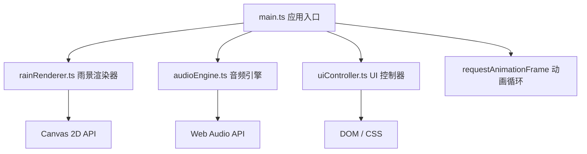

## 1. 架构设计



## 2. 技术选型说明

| 层次 | 技术选择 | 说明 |
|------|----------|------|
| 构建工具 | Vite@5 | 原生 HMR 支持，TypeScript 开箱即用，开发启动快 |
| 语言 | TypeScript@5 | strict 严格模式，目标 ES2020，提供类型安全 |
| 渲染层 | Canvas 2D API | 高性能粒子系统渲染，支持 3000+ 雨丝 60fps |
| 音频层 | Web Audio API | AudioContext + ScriptProcessorNode + OscillatorNode，纯程序化合成白噪音与低频振荡 |
| UI 层 | 原生 DOM + CSS | 无需框架，轻量高效，滑块/按钮/模态框用原生控件配合 CSS 美化 |
| 状态管理 | 模块内私有状态 | 各模块独立维护内部状态，通过 main.ts 作为中介协调 |

## 3. 模块职责与接口定义

### 3.1 rainRenderer.ts — 雨景渲染器

**职责**：
- 管理雨丝粒子池（对象池模式，避免频繁 GC）
- 根据雨量参数动态生成/回收雨丝
- 根据风速计算雨丝倾斜角度
- 绘制雨丝（含拖影效果）
- 雷光脉冲特效触发与渲染

**接口**：
```typescript
export interface RenderParams {
  rainAmount: number;    // 0-100
  windSpeed: number;     // 0-100
  thunderIntensity: number; // 0-100
  colorTemp: number;     // 0-100 (0=冷蓝, 100=暖橙)
}

export class RainRenderer {
  constructor(canvas: HTMLCanvasElement);
  setParams(params: RenderParams): void;
  render(deltaTime: number): void;
  setPlaying(playing: boolean): void;
  resize(): void;
}
```

### 3.2 audioEngine.ts — 音频引擎

**职责**：
- 创建 AudioContext 与白噪音生成节点
- 创建低频振荡器模拟雷声
- 根据雨量调整白噪音滤波频率与增益
- 根据雷声强度调整低频振荡幅度
- 播放/暂停控制

**接口**：
```typescript
export interface AudioParams {
  rainAmount: number;
  windSpeed: number;
  thunderIntensity: number;
}

export class AudioEngine {
  constructor();
  setParams(params: AudioParams): void;
  start(): Promise<void>;   // 需用户交互后启动
  stop(): void;
  isPlaying(): boolean;
}
```

### 3.3 uiController.ts — UI 控制器

**职责**：
- 绑定滑块事件（input 事件实时回调）
- 绑定播放按钮事件
- 绑定保存预设按钮与模态框交互
- 渲染预设卡片列表，管理选中状态
- 参数平滑过渡动画（2 秒 ease-out）

**接口**：
```typescript
export interface Preset {
  name: string;
  rainAmount: number;
  windSpeed: number;
  thunderIntensity: number;
  colorTemp: number;
}

export type ParamsCallback = (params: RenderParams) => void;

export class UIController {
  constructor(container: HTMLElement);
  onParamsChange(callback: ParamsCallback): void;
  onPlayToggle(callback: (playing: boolean) => void): void;
  onPresetSaved(callback: (preset: Preset) => void): void;
  setParams(params: RenderParams): void;   // 外部反向同步（用于平滑过渡）
  addPreset(preset: Preset): void;
  selectPreset(index: number): void;
}
```

### 3.4 main.ts — 应用入口

**职责**：
- 初始化三个模块实例
- 串联 UI 事件 → 渲染器 / 音频引擎
- 启动 requestAnimationFrame 主循环
- 处理窗口 resize 事件

## 4. 文件结构

```
auto311/
├── package.json
├── vite.config.js
├── tsconfig.json
├── index.html
└── src/
    ├── main.ts
    ├── rainRenderer.ts
    ├── audioEngine.ts
    └── uiController.ts
```

## 5. 关键性能优化

| 优化点 | 方案 |
|--------|------|
| 粒子系统 | 对象池预分配 3000 根雨丝，启用/禁用标志位控制，避免创建销毁开销 |
| Canvas 渲染 | 关闭抗锯齿，雨丝使用同色渐变 Stroke，批量绘制减少状态切换 |
| 音频合成 | ScriptProcessorNode bufferSize 设为 4096，白噪音预生成缓冲区循环播放 |
| 滑块事件 | requestAnimationFrame 节流，确保参数更新与渲染帧同步 |
| 平滑过渡 | 使用独立参数插值状态机，避免逐帧 DOM 操作，仅在插值完成后同步 |
