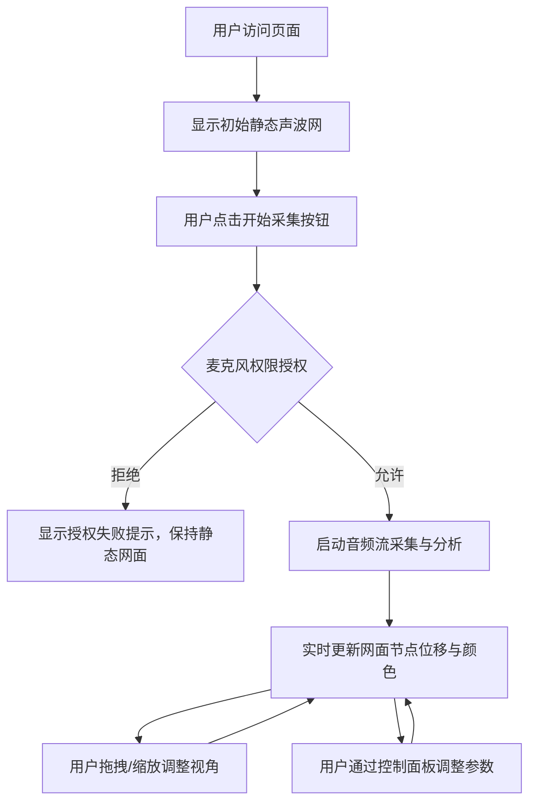

## 1. 产品概述

「声光织网」是一个基于Web Audio API和Three.js的实时音频可视化交互应用，将环境声音转化为三维空间中动态变化的彩色声波网，为用户提供沉浸式的声-视觉转换体验。

- 核心功能：通过麦克风采集实时环境声音，在三维空间中渲染出随声音动态变化的声波网格
- 目标用户：音频爱好者、视觉艺术家、科技体验者
- 产品价值：将不可见的声音转化为可触摸、可旋转、可观察的三维视觉艺术

## 2. 核心功能

### 2.1 用户角色

| 角色 | 注册方式 | 核心权限 |
|------|----------|----------|
| 普通用户 | 无需注册，直接使用 | 使用全部可视化功能，调整控制面板参数 |

### 2.2 功能模块

1. **三维声波网场景**：球形经纬网格、节点动态位移、弹性物理模拟、颜色渐变映射
2. **实时音频采集分析**：麦克风权限请求、音量/频率检测、频谱能量分布分析
3. **波纹干涉系统**：多频率波纹扩散、颜色混合干涉、波纹轨迹残留效果
4. **交互控制面板**：波形可视化开关、波纹痕迹滑块、网格颜色主题选择器
5. **视角交互**：鼠标拖拽旋转、滚轮缩放、响应式画布适配

### 2.3 页面详情

| 页面名称 | 模块名称 | 功能描述 |
|----------|----------|----------|
| 主页面 | 3D场景区域 | 全屏深空蓝黑渐变背景，中央悬浮球形声波网，支持鼠标拖拽旋转和滚轮缩放 |
| 主页面 | 开始采集按钮 | 画布右下角圆角渐变按钮，点击请求麦克风权限并启动音频采集 |
| 主页面 | 控制面板 | 右上角磨砂玻璃面板，包含波形开关、痕迹滑块、主题选择器 |
| 主页面 | 二维波形截面图 | 可选显示的俯视波形图，展示声音映射位置 |

## 3. 核心流程

用户打开页面 → 看到初始静态声波网 → 点击"开始采集"按钮 → 浏览器请求麦克风权限 → 授权后网面开始随声音波动 → 用户可拖拽旋转/缩放视角 → 通过控制面板调整可视化效果

## 4. 用户界面设计

### 4.1 设计风格
- **主色调**：深空蓝黑渐变背景（#0A0E14 → #121828）
- **强调色**：按钮渐变 #4A6FFF → #6B8FC4，发光效果 #4A6FFF
- **颜色映射**：低频深紫#6A2BFF→蓝#4A6FFF，高频亮黄#FFD700→橙#FF6B35，混合色翠绿#00D4AA
- **按钮样式**：圆角12px，线性渐变背景，悬停外发光半径10px
- **字体**：白色16px无衬线字体
- **面板样式**：半透明磨砂玻璃 rgba(10,14,20,0.7)，圆角12px
- **网格样式**：线宽1.5px，节点直径3px，节点色#6B8FC4，整体透明度0.7

### 4.2 页面设计概览

| 页面名称 | 模块名称 | UI元素 |
|----------|----------|--------|
| 主页面 | 3D场景 | 全屏Canvas、深空渐变背景、经纬网格球、动态节点与线段 |
| 主页面 | 开始按钮 | 右下位置、渐变背景、白色文字、悬停发光 |
| 主页面 | 控制面板 | 右上固定、磨砂玻璃、开关控件、滑块控件、下拉选择器 |
| 主页面 | 波形图 | 可选显示、俯视二维截面、半透明叠加 |

### 4.3 响应式
- 桌面端优先设计
- Canvas自适应窗口尺寸变化
- 控制面板固定定位，不受窗口大小影响
- 触控设备支持触摸拖拽旋转和双指缩放

### 4.4 3D场景指导
- **环境**：纯深空渐变背景，无HDRI，营造宇宙空间感
- **光照**：环境光 + 柔和点光源，突出网格线条和节点
- **相机**：PerspectiveCamera，初始距离约500px，视场角60°
- **构图**：声波网位于场景中心，占据视觉焦点
- **交互**：OrbitControls实现拖拽旋转和滚轮缩放，禁用平移
- **后处理**：轻微抗锯齿，保持线条锐利
- **性能**：帧率目标50fps+，600节点时流畅交互，响应延迟<120ms
