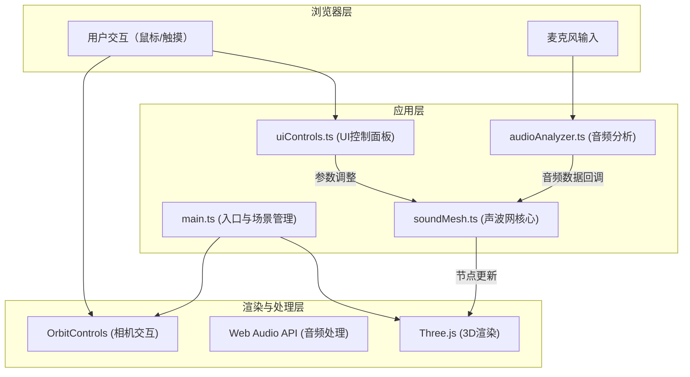

## 1. 架构设计



## 2. 技术描述

- **前端框架**：纯TypeScript + Vite构建，无UI框架（原生DOM操作）
- **3D渲染**：Three.js r160+，使用OrbitControls进行相机控制
- **音频处理**：Web Audio API（AudioContext, AnalyserNode, MediaStreamSource）
- **构建工具**：Vite 5.x，支持HMR热更新
- **语言**：TypeScript 5.x，严格模式，目标ES2020

## 3. 模块划分与文件结构

| 文件 | 职责 |
|------|------|
| `index.html` | 入口页面，全屏容器，加载主脚本 |
| `src/main.ts` | 应用入口：初始化Three.js场景/相机/渲染器/OrbitControls，请求麦克风权限，串联各模块 |
| `src/audioAnalyzer.ts` | 封装Web Audio API：麦克风流、FFT频谱分析、音量/频率提取、数据回调 |
| `src/soundMesh.ts` | 核心模块：创建经纬网格球、节点物理模拟、波纹扩散干涉、颜色映射混合 |
| `src/uiControls.ts` | UI控件：开始按钮、控制面板、波形开关、痕迹滑块、主题选择器、响应式适配 |

## 4. 核心数据结构

### 4.1 音频数据接口

```typescript
interface AudioData {
  volume: number;          // 0-1 归一化音量
  db: number;              // 分贝值（估算 0-100）
  frequency: number;       // 主频率 Hz
  lowFrequencyEnergy: number;  // 低频段能量 0-1
  highFrequencyEnergy: number; // 高频段能量 0-1
  spectrum: Float32Array;  // 完整频谱数据
  waveform: Float32Array;  // 时域波形数据
}
```

### 4.2 声波网节点

```typescript
interface MeshNode {
  index: number;
  basePosition: THREE.Vector3;  // 初始球面坐标
  currentPosition: THREE.Vector3;
  velocity: THREE.Vector3;
  restRadius: number;           // 球面半径
  theta: number;                // 经度角
  phi: number;                  // 纬度角
  color: THREE.Color;
}
```

### 4.3 波纹对象

```typescript
interface Ripple {
  id: number;
  type: 'low' | 'high';         // 低频扩散 / 高频汇聚
  originTheta: number;
  originPhi: number;
  radius: number;               // 当前波纹半径（弧度）
  maxRadius: number;
  speed: number;                // 扩散/汇聚速度 rad/s
  amplitude: number;            // 波纹强度
  startTime: number;
  lifetime: number;             // 生命周期 ms
}
```

### 4.4 颜色主题

```typescript
interface ColorTheme {
  name: string;
  lowStart: THREE.Color;    // 低频起始色
  lowEnd: THREE.Color;      // 低频结束色
  highStart: THREE.Color;   // 高频起始色
  highEnd: THREE.Color;     // 高频结束色
  mixColor: THREE.Color;    // 干涉混合色
  nodeBase: THREE.Color;    // 节点基础色
}
```

## 5. 物理与算法设计

### 5.1 弹性恢复模拟
每个节点应用弹簧阻尼公式：
- 加速度 = -弹性系数 * 位移 - 阻尼系数 * 速度
- 使用半隐式欧拉积分更新速度和位置
- 目标：0.3秒内弹性恢复到平衡位置

### 5.2 波纹传播
- 低频波纹：从中心向边缘扩散，速度0.5m/s，深紫→蓝渐变
- 高频波纹：从边缘向中心汇聚，速度0.8m/s，亮黄→橙渐变
- 波纹强度随传播距离衰减（高斯函数）
- 两套波纹在网面中部相遇时颜色混合（RGB加权平均或预设混合色）

### 5.3 音量-振幅映射
- 30-50dB：节点微幅振动（≤2px），颜色深蓝#2A4FFF
- 70-90dB：节点大幅振动（8-12px），颜色亮橙#FF884D，触发局部形变
- 分段线性插值，平滑过渡

### 5.4 颜色混合算法
- 单波纹：沿传播方向在主题色起止色间线性插值
- 双波纹干涉：加权RGB混合 + 混合色#00D4AA注入
- 基础状态：节点色#6B8FC4，整体透明度0.7

## 6. 性能优化策略

1. **几何体复用**：使用单个BufferGeometry存储所有节点和线段，避免多次draw call
2. **GPU友好更新**：通过BufferAttribute.setArray()批量更新位置和颜色数据
3. **物理降频**：节点物理更新与渲染循环解耦，必要时降至30Hz物理更新
4. **波纹对象池**：复用Ripple对象，避免频繁GC
5. **频谱数据降采样**：FFT大小适中（1024或2048），只提取关键频段
6. **OrbitControls优化**：启用damping，禁用pan，减少不必要的矩阵更新

## 7. 构建配置

### package.json 核心依赖
- `three`：^0.160.0
- `@types/three`：^0.160.0
- `typescript`：^5.3.0
- `vite`：^5.0.0

### tsconfig.json
- 严格模式（strict: true）
- 目标ES2020
- 模块ESNext
- 模块解析bundler
- 输出目录dist

### vite.config.js
- 基本Vite配置
- 启用HMR
- 服务器端口默认5173
