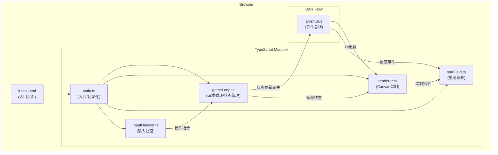

## 1. 架构设计



**调用关系说明：**
- `main.ts` 作为应用入口，实例化所有模块并建立它们之间的引用关系
- `inputHandler.ts` 监听键盘/触摸事件，将用户操作转换为游戏指令调用 `gameLoop.ts` 的方法
- `gameLoop.ts` 管理游戏核心逻辑（下落、碰撞、消除），通过 EventBus 发布事件通知其他模块
- `renderer.ts` 接收 `gameLoop.ts` 的状态数据进行 Canvas 绘制，同时调用 `starField.ts` 绘制背景
- `starField.ts` 负责星点状态管理和星座绘制，监听消除事件更新星点

**数据流向：**
1. 用户输入 → `inputHandler.ts` → `gameLoop.ts`（操作指令）
2. `gameLoop.ts` 计算新状态 → EventBus → `renderer.ts` / `starField.ts`
3. `renderer.ts` 聚合棋盘状态 + 星座数据 → Canvas 渲染
4. 胜利判定 → EventBus → 触发胜利特效

## 2. 技术描述
- 前端框架：原生 TypeScript（无 React/Vue，直接操作 Canvas）
- 构建工具：Vite（支持 HMR）
- 渲染方式：HTML5 Canvas 2D API
- 语言标准：ES2020，TypeScript 严格模式
- 状态管理：自定义 EventBus + 模块内局部状态
- 样式方案：内联 CSS（因单页面 Canvas 游戏，无需额外 CSS 框架）

## 3. 文件结构定义
| 文件路径 | 职责 |
|----------|------|
| `package.json` | 依赖声明（typescript、vite），启动脚本 |
| `vite.config.js` | Vite 基础配置，启用 HMR |
| `tsconfig.json` | TypeScript 配置（严格模式，target ES2020） |
| `index.html` | 入口页面，全屏星空渐变背景容器 |
| `src/main.ts` | 应用入口，初始化各模块并启动游戏循环 |
| `src/gameLoop.ts` | 游戏主循环、下落计时、碰撞检测、行消除、事件发布 |
| `src/starField.ts` | 32颗星点管理、消除行→星点映射、星座连线、12种星座模板 |
| `src/renderer.ts` | Canvas 绘制：棋盘、方块、幽灵方块、星点粒子、特效 |
| `src/inputHandler.ts` | 键盘事件监听（方向键+空格），按钮事件绑定 |

## 4. 核心数据模型

### 4.1 方块定义
```typescript
type TetrominoType = 'I' | 'O' | 'T' | 'S' | 'Z' | 'J' | 'L';

interface Tetromino {
    type: TetrominoType;
    shape: number[][];
    color: string;
    x: number;
    y: number;
}
```

### 4.2 游戏状态
```typescript
interface GameState {
    board: (string | null)[][]; // 10列 × 20行
    currentPiece: Tetromino | null;
    nextPiece: TetrominoType;
    score: number;
    gameOver: boolean;
    victory: boolean;
    linesClearing: number[];     // 正在消除动画的行号
    clearAnimationProgress: number; // 0-1 消除动画进度
}
```

### 4.3 星点数据
```typescript
interface Star {
    x: number;           // 画布坐标
    y: number;
    row: number;         // 映射的棋盘行号 (0-19)
    lit: boolean;
    neighbors: number[]; // 相邻星点索引
}

interface StarFieldState {
    stars: Star[];               // 32颗
    litCount: number;
    constellationAnimation: {
        active: boolean;
        templateIndex: number;
        progress: number;  // 0-1
    } | null;
    meteor: {
        active: boolean;
        x: number;
        y: number;
        trail: { x: number; y: number }[];
        extraStarsToLight: number[];
    } | null;
    victoryParticles: Particle[] | null;
}
```

### 4.4 粒子
```typescript
interface Particle {
    x: number;
    y: number;
    vx: number;
    vy: number;
    color: string;
    life: number;     // 0-1
}
```

## 5. 核心算法

### 5.1 碰撞检测
- 遍历当前方块的每个格子，检查是否超出棋盘边界或与已固定方块重叠

### 5.2 行消除与星点映射
- 扫描所有20行，标记完整行
- 消除行号 (0-19) 映射到星点：`starIndex = row % 32`，确保每行对应一颗星
- 若该星已点亮则轮询下一颗未点亮星

### 5.3 游戏循环
- 使用 `requestAnimationFrame` 驱动
- 累积时间达到下落间隔时执行自动下落
- 每帧调用 renderer 绘制

### 5.4 12种星座模板
- 预定义仙后座(W形)、猎户座(腰带+肩部)、大熊座(北斗七星)等星座的坐标点集
- 每点亮7颗星随机选择一个模板，绘制半透明闪烁轮廓

## 6. 性能优化策略
- 离屏 Canvas 预渲染静态星空背景
- 消除动画仅重绘受影响的行
- 粒子对象池复用，避免频繁 GC
- 使用整数坐标绘制，减少抗锯齿开销
- 限制流星轨迹长度，避免数组无限增长
