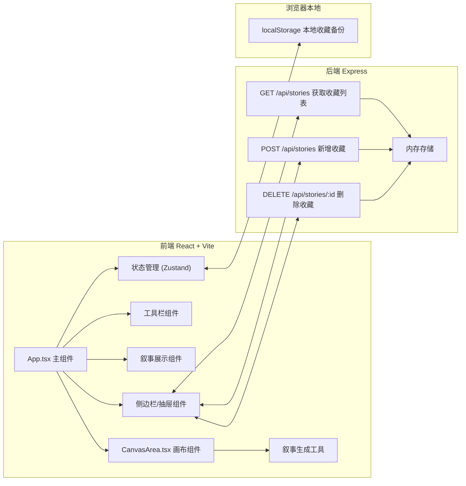
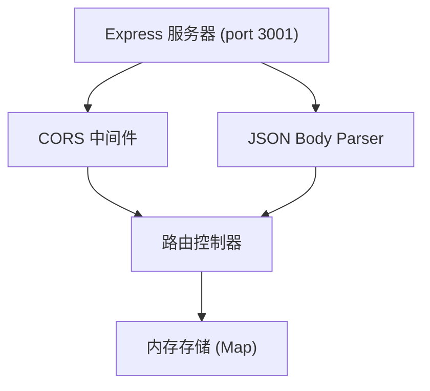
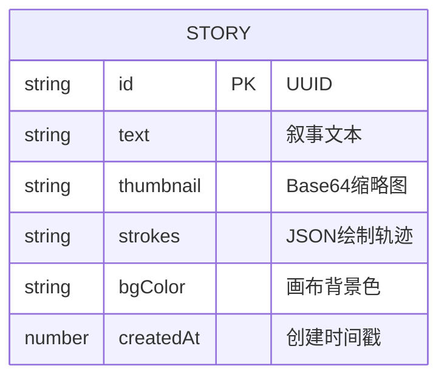

## 1. 架构设计



## 2. 技术描述

- **前端**：React@18 + TypeScript + Vite + Zustand
- **构建工具**：Vite，配置 React 插件和 HMR，代理 /api 到后端 3001 端口
- **后端**：Node.js + Express@4 + CORS + UUID
- **数据存储**：后端内存存储 + 浏览器 localStorage 双轨存储
- **样式方案**：原生 CSS（CSS Variables + 渐变 + 动画），不使用 Tailwind，采用莫兰迪色系定制化设计

## 3. 路由定义

| 路由 | 用途 |
|------|------|
| / | 主页（画布 + 工具栏 + 叙事展示 + 侧边栏） |

## 4. API 定义

### TypeScript 类型定义
```typescript
interface StoryItem {
  id: string;
  text: string;
  thumbnail: string;  // base64 data URL
  strokes: Stroke[];   // 绘制轨迹数据，用于回放
  bgColor: string;     // 画布背景色
  createdAt: number;   // 时间戳
}

interface Point {
  x: number;
  y: number;
  timestamp: number;
}

interface Stroke {
  points: Point[];
  color: string;
  size: number;
  startTime: number;
  endTime: number;
}

interface CanvasState {
  bgColor: string;
  brushColor: string;
  brushSize: number;
  currentStory: string | null;
}
```

### API 请求/响应
| API | 方法 | 请求体 | 响应 |
|-----|------|--------|------|
| /api/stories | GET | - | `{ stories: StoryItem[] }` |
| /api/stories | POST | `{ text, thumbnail, strokes, bgColor }` | `{ id, ...StoryItem }` |
| /api/stories/:id | DELETE | - | `{ success: true }` |

## 5. 服务器架构图



## 6. 数据模型

### 6.1 数据模型定义



### 6.2 内存数据结构

后端使用 `Map<string, StoryItem>` 存储收藏数据，键为 story id。前端 localStorage 使用 `palette-theater-stories` 作为存储键，存储 JSON 序列化的 StoryItem 数组。

## 7. 关键技术实现要点

### 7.1 画布绘制性能
- 使用 Canvas 2D API + requestAnimationFrame 确保 60FPS
- 离屏 Canvas 处理笔触羽化效果（shadowBlur = 3px）
- 半透明叠加：globalAlpha + globalCompositeOperation

### 7.2 叙事生成算法
- 获取 Canvas ImageData，按颜色通道统计主色调
- 轮廓分析：边缘检测（Sobel算子简化版）+ 形状分类（圆/方/角/线/波浪）
- 规则库匹配：颜色语义 + 形状语义 → 叙事模板 → 随机组合生成文本

### 7.3 绘制回放
- 记录每个 Stroke 的时间戳和坐标点序列
- 回放时基于真实时间差重绘，使用 requestAnimationFrame 驱动
- 按原始绘制速度逐笔再现

### 7.4 响应式适配
- CSS Media Queries + ResizeObserver
- 等比缩放：保持 800×400 的宽高比（2:1）
- 侧边栏 < 1024px 转为底部抽屉，使用 transform 过渡动画
