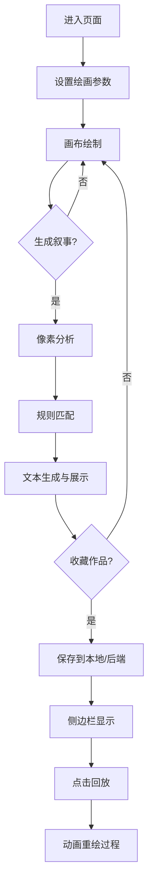

## 1. 产品概述

「调色盘剧场」是一个在线叙事绘画平台，用户通过在画布上绘制图形并选择颜色，系统自动根据图形轮廓和色彩分布生成诗意的文字叙事片段，实现绘画与文学的艺术融合。

- 面向热爱艺术创作、喜欢探索新表达形式的年轻用户群体
- 核心价值在于将视觉绘画转化为文学叙事，为用户提供独特的创作体验和灵感来源

## 2. 核心功能

### 2.1 用户角色
| 角色 | 注册方式 | 核心权限 |
|------|----------|----------|
| 普通用户 | 无需注册，本地存储 | 绘制画布、生成叙事、收藏作品、回放作品 |

### 2.2 功能模块
1. **主画布区**：工具栏、画布绘制区域、叙事展示区域
2. **收藏侧边栏**：收藏列表展示、缩略图预览、作品回放
3. **叙事生成系统**：颜色识别、图形轮廓分析、规则库匹配、文本生成
4. **作品回放系统**：绘制过程记录、时间戳驱动的动画回放

### 2.3 页面详情
| 页面名称 | 模块名称 | 功能描述 |
|----------|----------|----------|
| 主页 | 工具栏 | 背景色拾取、笔刷颜色选择、笔刷大小调节、清空画布、生成叙事 |
| 主页 | 画布区域 | 自由绘制、笔触效果、涟漪动画、实时底色更新 |
| 主页 | 叙事展示区 | 逐字打印动画、收藏按钮 |
| 主页 | 侧边栏/底部抽屉 | 收藏列表、缩略图、回放功能 |

## 3. 核心流程

用户进入页面 → 设置画布背景色和笔刷颜色/大小 → 在画布上自由绘制（每次落笔产生涟漪效果） → 点击「生成叙事」按钮 → 系统分析像素数据匹配规则库 → 生成叙事文本以逐字打印动画展示 → 用户可点击收藏按钮保存作品 → 收藏的作品按时间倒序显示在侧边栏 → 点击收藏卡片可回放绘制过程

## 4. 用户界面设计

### 4.1 设计风格
- **主色调**：莫兰迪色系，暗灰蓝(#282C35)到深紫(#1E1B2E)的渐变背景
- **辅助色**：亮蓝色(#4A9EFF)、渐变紫色、半透明磨砂玻璃效果
- **按钮风格**：圆角设计，微妙渐变和阴影，悬停时平滑缩放(scale 1.03)和阴影加深
- **字体**：优雅的无衬线字体，行距1.8em，叙事文字白色
- **布局风格**：卡片式布局，主容器居中，侧边栏右侧悬浮
- **动效**：涟漪扩散、逐字打印、悬停过渡(0.3s ease-out)

### 4.2 页面设计概览
| 页面名称 | 模块名称 | UI元素 |
|----------|----------|--------|
| 主页 | 主容器 | 宽860px高580px，圆角24px，磨砂玻璃 rgba(25,25,40,0.65) |
| 主页 | 工具栏 | 高50px，背景 rgba(255,255,255,0.08)，左到右排列控件 |
| 主页 | 画布区 | 宽800px高400px，圆角，半透明笔触带羽化光晕 |
| 主页 | 叙事展示区 | 宽800px高60px，半透明黑色背景，圆角12px |
| 主页 | 侧边栏 | 宽220px，背景 rgba(35,35,50,0.8)，左边缘圆角12px |

### 4.3 响应式设计
- 桌面优先设计
- 屏幕宽度 < 1024px：侧边栏折叠为底部抽屉（高度180px，可上拉展开）
- 画布和工具栏按比例缩小，保持宽高比，最大不超过视口的80%

### 4.4 性能指标
- 画布绘制响应延迟 ≤ 16ms (60FPS)
- 像素分析总耗时 ≤ 500ms
- 收藏列表滚动帧率 ≥ 55FPS
- 缩略图生成耗时 ≤ 50ms
