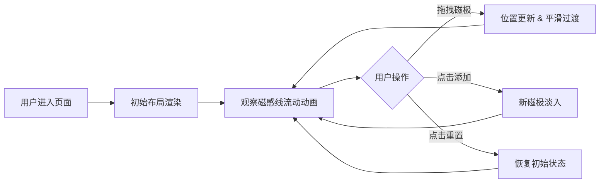

## 1. 产品概述

磁感浮线交互式物理场可视化应用，通过浏览器Canvas技术模拟磁场磁感线的动态可视化效果，解决用户在没有直观交互界面的情况下，无法探索不同磁极分布和电荷运动对虚拟磁感线形态影响的问题。

- 主要用途：教育演示、物理可视化探索、交互体验
- 目标用户：物理学习者、教育工作者、科技爱好者
- 产品价值：提供直观、流畅、沉浸式的磁场可视化交互体验

## 2. 核心功能

### 2.1 功能模块

1. **主画布区域**：磁场可视化核心展示区，包含磁极、磁感线、流动光点
2. **磁极交互系统**：支持拖拽移动磁极，实时更新磁感线形态
3. **磁感线渲染系统**：基于贝塞尔曲线动态绘制磁感线，带发光效果和流动光点
4. **控制面板**：添加新磁极、重置布局的交互控件
5. **性能监控**：实时FPS计数器，自适应性能优化

### 2.2 页面详情

| 页面名称 | 模块名称 | 功能描述 |
|---------|---------|---------|
| 主页面 | 背景区域 | 深空蓝黑渐变背景（#0E131F → #192231） |
| 主页面 | Canvas画布 | 800×600px（4:3比例），纯黑0.05透明底，支持等比缩放 |
| 主页面 | 磁极渲染 | N极红色（#FF4B5C）、S极蓝色（#4B9CFF）实心圆点，半径16px，内发光效果 |
| 主页面 | 磁感线系统 | 从N极发出20条彩色渐变（#FF6B35 → #FFD700）贝塞尔曲线，流向S极，线宽2px |
| 主页面 | 流动光点 | 每条磁感线上40个流动光点，半径1.5px，恒定速度从N极流向S极 |
| 主页面 | 拖拽交互 | 鼠标拖拽磁极，磁感线0.5秒平滑过渡，光点速度提升至1.5倍 |
| 主页面 | 控制面板 | 左下角毛玻璃面板，含"添加新磁极"（蓝色圆形）和"重置"（红色圆形）按钮 |
| 主页面 | 性能监控 | 右上角FPS计数器（12px monospace白字），超过8磁极时自动降低磁感线数量至12条 |

## 3. 核心流程

用户进入页面 → 看到初始3磁极布局（2N+1S）及磁感线 → 拖拽任意磁极观察磁感线变化 → 点击添加按钮增加磁极 → 点击重置按钮恢复初始状态 → 全程实时观察FPS和流畅动画

## 4. 用户界面设计

### 4.1 设计风格

- **主色调**：深空蓝黑渐变背景（#0E131F → #192231）
- **强调色**：N极红色#FF4B5C、S极蓝色#4B9CFF、磁感线渐变#FF6B35→#FFD700
- **按钮样式**：圆形半径24px，蓝色/红色填充，点击缩放动画
- **字体**：monospace等宽字体用于性能数据
- **布局风格**：极简深色科技风，居中布局，毛玻璃半透明材质
- **动画风格**：0.15秒缓动动画，平滑过渡，流畅光点流动

### 4.2 页面设计概述

| 页面名称 | 模块名称 | UI元素 |
|---------|---------|--------|
| 主页面 | 背景 | 全屏径向渐变，营造深空氛围 |
| 主页面 | 画布容器 | 居中显示，4:3比例，自适应缩放 |
| 主页面 | 磁极 | 实心圆点+内发光+拖拽阴影（偏移5px，模糊10px，透明度0.3） |
| 主页面 | 磁感线 | 贝塞尔曲线+发光效果（rgba(255,200,100,0.3)） |
| 主页面 | 控制面板 | 宽180px高80px，圆角12px，毛玻璃背景rgba(20,28,45,0.8)，1px边框rgba(255,255,255,0.08) |
| 主页面 | FPS计数器 | 右上角固定位置，12px monospace白字 |

### 4.3 响应式

- Desktop-first设计，画布保持4:3比例
- 支持宽度360px到1920px的自动等比缩放
- 控制面板始终固定在画布左下角
- 触控设备优化（支持触摸拖拽）

## 5. 性能要求

- 6磁极以下稳定60FPS
- 8磁极时不低于45FPS
- 磁感线数量自适应：≤8磁极时20条，>8磁极时12条
- 动画无闪烁、无断裂
