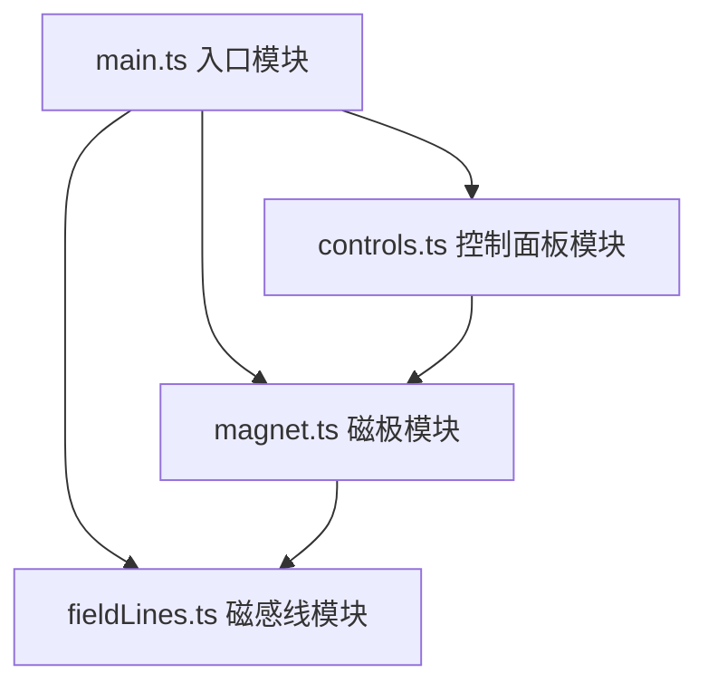

## 1. 架构设计

纯前端Canvas 2D应用，采用模块化分层架构，无后端依赖。



## 2. 技术描述

- **前端框架**：原生 TypeScript + Canvas 2D API
- **构建工具**：Vite 5.x（支持HMR热更新）
- **语言标准**：TypeScript 严格模式，目标 ES2020
- **无后端、无数据库**：纯客户端应用
- **状态管理**：模块内变量维护，无需额外状态库

## 3. 项目结构

| 路径 | 描述 |
|-----|------|
| `/package.json` | 项目配置，依赖：typescript、vite |
| `/vite.config.js` | Vite基础配置，支持HMR |
| `/tsconfig.json` | TS严格模式，ES2020目标 |
| `/index.html` | 入口页面，深色渐变背景容器 |
| `/src/main.ts` | 应用入口：Canvas初始化、动画循环、事件绑定 |
| `/src/magnet.ts` | 磁极类：位置、极性、渲染、拖拽检测、碰撞响应 |
| `/src/fieldLines.ts` | 磁感线模块：贝塞尔曲线计算、流动光点、动画帧更新 |
| `/src/controls.ts` | 控制面板：按钮绘制、点击检测、缩放动画、回调函数 |

## 4. 核心数据模型

### 4.1 磁极（Magnet）

```typescript
interface Magnet {
  id: string;
  x: number;           // 画布坐标X
  y: number;           // 画布坐标Y
  polarity: 'N' | 'S'; // 极性
  radius: number;      // 半径（默认16px）
  isDragging: boolean; // 是否正在拖拽
  scale: number;       // 动画缩放（新增时淡入放大）
  prevX: number;       // 上一帧位置（用于平滑过渡）
  prevY: number;
}
```

### 4.2 磁感线（FieldLine）

```typescript
interface FieldLine {
  sourceMagnetId: string;    // 来源N极ID
  targetMagnetId: string;    // 目标S极ID
  controlPoints: { x: number; y: number }[]; // 贝塞尔曲线控制点
  particles: Particle[];     // 流动光点数组
  color: { r: number; g: number; b: number }; // 当前颜色
  targetColor: { r: number; g: number; b: number }; // 目标颜色
}
```

### 4.3 流动光点（Particle）

```typescript
interface Particle {
  t: number;       // 贝塞尔曲线参数位置 [0,1]
  speed: number;   // 速度
  x: number;       // 当前X
  y: number;       // 当前Y
}
```

## 5. 性能优化策略

1. **自适应磁感线数量**：磁极数量>8时，磁感线从20条降至12条
2. **requestAnimationFrame**：统一动画循环，避免冗余渲染
3. **离屏计算**：贝塞尔曲线控制点仅在磁极位置变化时重新计算
4. **增量过渡**：磁极移动时使用0.5秒插值平滑过渡，避免突变
5. **Canvas分层**：可考虑双层Canvas（静态背景层 + 动态渲染层）
6. **发光优化**：使用shadowBlur而非多次叠加绘制实现发光效果

## 6. 交互事件映射

| 事件类型 | 目标 | 处理逻辑 |
|---------|------|---------|
| mousedown / touchstart | 磁极 | 开始拖拽，记录偏移量 |
| mousemove / touchmove | 全局 | 更新拖拽中磁极的位置 |
| mouseup / touchend | 全局 | 结束拖拽，触发平滑过渡 |
| mousedown | 按钮区域 | 触发按压缩放动画（0.1秒） |
| mouseup | 添加按钮 | 随机生成N/S极，淡入动画 |
| mouseup | 重置按钮 | 恢复初始3磁极布局 |
| resize | window | 重新计算Canvas尺寸和缩放比例 |
