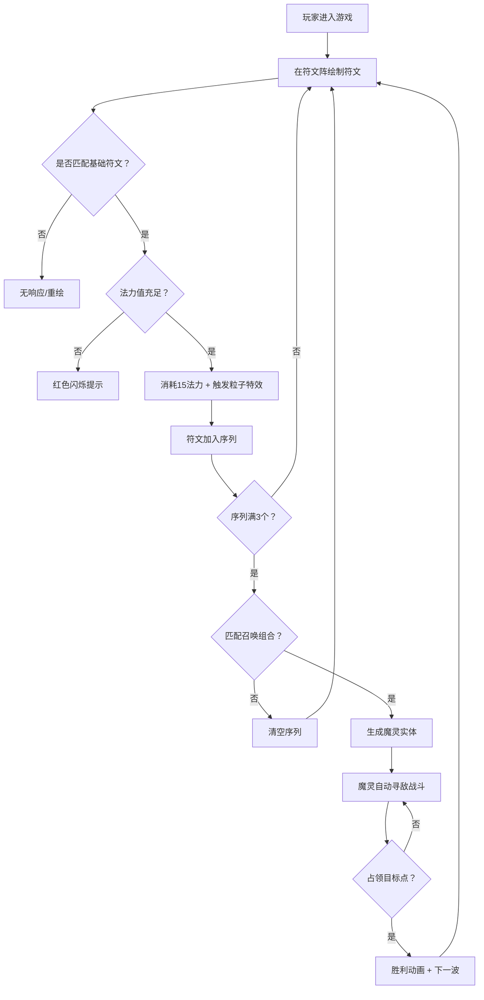

## 1. 产品概述

「符文召唤阵」是一款暗黑奇幻风格的浏览器实时策略游戏，玩家通过在Canvas上绘制魔法符文召唤魔灵进行战斗。

- 核心玩法：绘制符文 → 识别匹配 → 组合召唤 → 自动战斗 → 占领目标点
- 目标用户：喜欢策略类、即时操作类浏览器游戏的玩家

## 2. 核心功能

### 2.1 用户角色
本游戏为单人游戏，无需多角色区分。

### 2.2 功能模块
1. **符文绘制系统**：鼠标拖动绘制、形状识别、法力消耗、特效反馈
2. **符文组合召唤系统**：序列管理、组合匹配、魔灵实体生成
3. **战场渲染系统**：魔灵AI移动、攻击动画、受击反馈、粒子特效
4. **法力值管理系统**：法力条显示、自动回复、不足提示
5. **目标占领系统**：占领进度、胜利条件、波次刷新

### 2.3 页面详情
| 页面名称 | 模块名称 | 功能描述 |
|---------|---------|---------|
| 游戏主界面 | 符文阵区域 | 半径160px圆形绘制区域，半透明边框，内发光效果 |
| 游戏主界面 | 法力值条 | 左上角渐变填充条，脉动呼吸动画 |
| 游戏主界面 | 符文序列显示 | 右上角三个六边形图标位，显示已绘制符文 |
| 游戏主界面 | 波次进度条 | 底部窄条，显示下一波敌人倒计时 |
| 游戏主界面 | 战场区域 | 魔灵战斗渲染、目标点、敌方单位 |

## 3. 核心流程

玩家进入游戏 → 在符文阵区域按住鼠标绘制符文 → 系统识别匹配基础符文（火焰/冰霜/闪电）→ 消耗法力值并触发对应粒子特效 → 符文加入序列（最多3个）→ 序列满3个时检测组合召唤 → 生成对应魔灵实体 → 魔灵自动寻敌攻击 → 占领目标点 → 胜利/进入下一波

## 4. 用户界面设计

### 4.1 设计风格
- **主色调**：深紫黑(#130F1E) → 暗蓝(#1B1D35)径向渐变背景
- **元素强调色**：
  - 火焰符文/魔灵：#FF6B35 橙红光
  - 冰霜符文/魔灵：#4BC0FF 蓝白光
  - 闪电符文/魔灵：#FFE135 亮黄光
  - 法力条渐变：#6A4EFF → #A284FF
- **敌人标记**：红紫色
- **目标点**：灰色→蓝色渐变
- **胜利粒子**：金色
- **字体**：Cinzel Decorative（符文标题）
- **视觉风格**：暗黑奇幻、半透明辉光、粒子特效、呼吸脉动动画

### 4.2 页面设计概述
| 页面名称 | 模块名称 | UI元素 |
|---------|---------|--------|
| 游戏主界面 | 符文阵区域 | 半透明圆形边框(2px rgba(180,140,255,0.3))，底部内发光，半径160px |
| 游戏主界面 | 法力值条 | 渐变填充，1.5秒亮度脉动循环，初始100/上限100 |
| 游戏主界面 | 符文序列 | 3个40×40px六边形灰底，匹配后彩色弹入动画(0.3s ease-out) |
| 游戏主界面 | 波次进度条 | 全宽，3px高4px，15秒倒计时填充 |
| 游戏主界面 | 魔灵渲染 | 像素风格+现代辉光，元素色外发光轮廓 |
| 游戏主界面 | 攻击特效 | 对应色半透明圆形扩散(半径10→30px, 0.3s淡出) |
| 游戏主界面 | 胜利动画 | 金色粒子瀑布从顶部倾泻，持续2秒 |

### 4.3 响应式
- Desktop-first 设计
- 视口宽度 < 768px 时整体缩放至 0.8 倍
- 所有触摸交互热区放大至至少 44px
- Canvas 自适应视口尺寸

### 4.4 性能约束
- 主循环稳定 60FPS
- 单帧 Canvas 绘制开销 ≤ 12ms
- 粒子数量峰值 ≤ 300，超出自动淘汰最旧粒子
