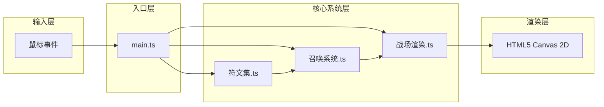

## 1. 架构设计

本项目为纯前端 Canvas 2D 游戏，采用模块化架构，各模块职责清晰分离。



**数据流向**：
1. 鼠标输入 → main.ts 分发事件
2. 绘制路径数据 → 符文集.ts 识别匹配
3. 匹配结果 + 法力消耗 → 召唤系统.ts 管理序列
4. 序列组合匹配 → 召唤系统.ts 生成魔灵实体
5. 魔灵实体 + 战斗状态 → 战场渲染.ts 渲染动画
6. 战场渲染.ts → Canvas 2D API 绘制

## 2. 技术描述

- **前端**：TypeScript + Vite（无UI框架，纯Canvas 2D）
- **初始化工具**：Vite vanilla-ts 模板
- **后端**：无（纯前端游戏）
- **数据库**：无（内存状态管理）
- **字体**：Google Fonts Cinzel Decorative

## 3. 目录结构

```
auto319/
├── package.json           # 依赖与脚本
├── vite.config.js         # Vite构建配置
├── tsconfig.json          # TypeScript配置(严格模式, ES2020)
├── index.html             # 入口HTML
└── src/
    ├── main.ts            # 应用入口：Canvas初始化、主循环、输入分发
    ├── 符文集.ts          # 符文定义、识别、绘制
    ├── 召唤系统.ts        # 符文序列管理、组合匹配、魔灵生成
    └── 战场渲染.ts        # 魔灵渲染、AI战斗、粒子系统、UI绘制
```

## 4. 核心数据类型定义

```typescript
// 符文类型
type RuneType = 'fire' | 'ice' | 'lightning';

// 符文定义
interface Rune {
  name: string;
  type: RuneType;
  manaCost: number;
  pathPoints: { x: number; y: number }[];
  color: string;
  glowColor: string;
}

// 魔灵类型
type SummonType = 'fire_ice' | 'fire_lightning' | 'ice_lightning' | /*...*/;

// 魔灵实体
interface Spirit {
  id: number;
  type: SummonType;
  x: number;
  y: number;
  hp: number;
  maxHp: number;
  attack: number;
  element: RuneType;
  attackCooldown: number;
  target: Enemy | null;
  hitShakeTimer: number;
  hitFlashTimer: number;
}

// 敌方单位
interface Enemy {
  id: number;
  x: number;
  y: number;
  hp: number;
  maxHp: number;
  attack: number;
}

// 粒子
interface Particle {
  x: number;
  y: number;
  vx: number;
  vy: number;
  life: number;
  maxLife: number;
  color: string;
  size: number;
}

// 攻击特效
interface AttackEffect {
  x: number;
  y: number;
  radius: number;
  maxRadius: number;
  life: number;
  color: string;
}

// 游戏状态
interface GameState {
  mana: number;
  maxMana: number;
  runeSequence: RuneType[];
  spirits: Spirit[];
  enemies: Enemy[];
  particles: Particle[];
  attackEffects: AttackEffect[];
  wave: number;
  waveTimer: number;
  captureProgress: number;
  isVictory: boolean;
  victoryTimer: number;
  manaLowFlash: number;
}
```

## 5. 核心模块接口

### 5.1 符文集.ts
```typescript
export class RuneSystem {
  static readonly RUNES: Record<RuneType, Rune>;
  static recognize(points: { x: number; y: number }[], centerX: number, centerY: number): RuneType | null;
  static drawEffect(ctx: CanvasRenderingContext2D, type: RuneType, x: number, y: number, particles: Particle[]): void;
}
```

### 5.2 召唤系统.ts
```typescript
export class SummonSystem {
  private sequence: RuneType[] = [];
  addRune(rune: RuneType): Spirit | null;  // 返回新召唤的魔灵或null
  clearSequence(): void;
  getSequence(): RuneType[];
  private matchCombination(): SummonType | null;
}
```

### 5.3 战场渲染.ts
```typescript
export class BattlefieldRenderer {
  update(dt: number, state: GameState): void;
  render(ctx: CanvasRenderingContext2D, state: GameState, width: number, height: number): void;
  addSpirit(spirit: Spirit): void;
  spawnWave(waveNum: number): void;
}
```

## 6. 性能优化策略

1. **粒子池管理**：限制最大300个粒子，FIFO淘汰策略
2. **脏矩形渲染**：仅重绘变化区域（如必要）
3. **离屏Canvas缓存**：静态背景预渲染
4. **requestAnimationFrame**：使用浏览器原生帧率控制
5. **对象池**：魔灵、敌人、粒子对象复用减少GC
6. **数学计算缓存**：向量距离计算复用
