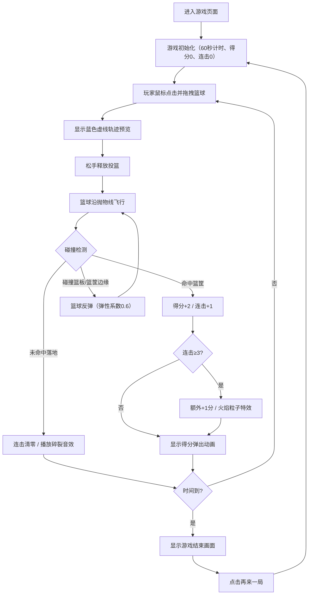

## 1. 产品概述
街头篮球投篮机是一款基于物理引擎的2D浏览器游戏，玩家通过鼠标拖拽调整投篮角度和力度，在60秒限时内尽可能多地投中篮球获得高分。
- 面向休闲游戏玩家，提供真实的物理投篮体验和即时得分反馈
- 通过连击奖励机制增强游戏挑战性和趣味性

## 2. 核心功能

### 2.1 用户角色
| 角色 | 注册方式 | 核心权限 |
|------|----------|----------|
| 玩家 | 无需注册，直接游玩 | 进行投篮操作、查看得分和连击、重开游戏 |

### 2.2 功能模块
1. **游戏主界面**：Canvas画布、得分面板、计时器、连击显示
2. **投篮物理系统**：抛物线轨迹计算、重力模拟、碰撞检测与反弹
3. **得分与连击系统**：命中判定、得分累加、连击计数与奖励、连击中断反馈
4. **倒计时系统**：60秒计时、最后10秒闪烁与心跳音效、游戏结束画面
5. **视觉特效系统**：旋转篮球、篮筐网袋摆动、得分弹出动画、火焰粒子特效

### 2.3 页面详情
| 页面名称 | 模块名称 | 功能描述 |
|----------|----------|----------|
| 游戏主界面 | Canvas画布容器 | 800x600像素（桌面端），展示游戏场景和所有交互元素 |
| 游戏主界面 | 得分面板 | 左侧大号白色字体显示当前得分，带蓝色发光阴影 |
| 游戏主界面 | 连击显示 | 右侧橙色字体显示连击数，≥3时变红并跳动 |
| 游戏主界面 | 计时器 | 右上角红色数字倒计时，最后10秒闪烁 |
| 游戏结束界面 | 结果面板 | 半透明黑色遮罩，展示最终总分和最高连击数 |
| 游戏结束界面 | 再来一局按钮 | 圆角矩形按钮，点击重置游戏状态 |

## 3. 核心流程
玩家进入游戏页面 → 看到篮球位于底部初始位置 → 鼠标点击篮球并拖拽（显示蓝色虚线轨迹）→ 松手后篮球沿抛物线飞出 → 篮球在空中飞行，可能碰撞篮板/篮筐边缘反弹或穿过篮筐命中 → 命中得分+2（连击≥3时额外+1）并显示得分弹出动画 → 连续命中3次触发火焰特效 → 60秒倒计时结束 → 显示最终得分和最高连击 → 点击"再来一局"重新开始

## 4. 用户界面设计

### 4.1 设计风格
- **主色调**：深蓝背景（#0B0B2B）渐变紫色（#2B1B4B）
- **强调色**：篮球橙色、篮筐红色、得分金黄色、连击橙色/红色
- **按钮样式**：圆角矩形（圆角8px），背景蓝色（#1E3A5F），悬停亮蓝（#3B6FA0），过渡0.2秒
- **字体**：街机风格大号字体，得分带蓝色发光阴影效果
- **布局**：游戏主面板居中，左侧得分、右侧连击、右上计时器
- **视觉元素**：蓝天渐变背景、城市天际线剪影、白色半透明篮板、红色篮筐

### 4.2 页面设计概述
| 页面名称 | 模块名称 | UI元素 |
|----------|----------|--------|
| 游戏主界面 | 背景 | 蓝天渐变 + 城市天际线剪影，深蓝色街机外框 |
| 游戏主界面 | 篮球 | 橙色带棕色条纹，旋转动画，连击时带火焰粒子 |
| 游戏主界面 | 篮筐篮板 | 白色半透明篮板，红色粗线篮筐，贝塞尔曲线网袋 |
| 游戏主界面 | 得分面板 | 大号白色字体，蓝色发光阴影，+2分金黄弹跳弹出 |
| 游戏主界面 | 连击显示 | 橙色字体，≥3时变红并跳动动画 |
| 游戏主界面 | 计时器 | 右上角红色数字，最后10秒0.5秒/次闪烁 |
| 游戏主界面 | 轨迹线 | 拖拽时蓝色虚线，投出后0.5秒淡出 |
| 游戏结束界面 | 遮罩 | 半透明黑色遮罩覆盖整个画布 |
| 游戏结束界面 | 结果显示 | 中央大号字体展示最终总分和最高连击数 |
| 游戏结束界面 | 重开按钮 | 圆角矩形蓝色按钮，悬停亮蓝 |

### 4.3 响应式
- 桌面端：固定800x600像素画布
- 移动端：画布宽度自适应为屏幕宽度的90%，高度等比缩放
- 触摸优化：支持触摸拖拽操作
- 鼠标光标：拖拽时十字准星，释放后恢复默认

### 4.4 音效设计
- **心跳声效**：最后10秒低频脉冲，1秒间隔
- **连击中断音效**：Web Audio API生成短促碎裂音，0.2秒
- **得分音效**：隐含在视觉动画中
