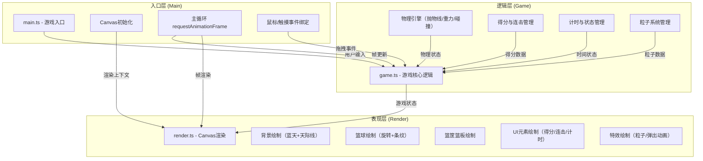

## 1. 架构设计



## 2. 技术描述
- **前端框架**：无框架，原生 TypeScript + HTML Canvas 2D
- **构建工具**：Vite
- **语言**：TypeScript（严格模式，目标ES2020，模块ESNext）
- **物理引擎**：自定义实现（抛物线计算、圆形-矩形碰撞、弹性碰撞）
- **音效**：Web Audio API（原生实现）
- **渲染**：HTML5 Canvas 2D API
- **动画驱动**：requestAnimationFrame（60FPS）

## 3. 文件结构与调用关系

```
项目根目录
├── index.html              # 入口页面
├── package.json            # 依赖与脚本
├── tsconfig.json           # TypeScript配置
├── vite.config.js          # Vite配置
└── src/
    ├── main.ts             # 入口：初始化Canvas、主循环、事件绑定
    ├── game.ts             # 核心逻辑：物理模拟、得分、状态管理
    └── render.ts           # 渲染：Canvas绘制所有视觉元素
```

**调用关系与数据流向：**
- `main.ts` → `game.ts`：传递用户输入（拖拽起点、终点、释放事件）
- `game.ts` → `render.ts`：输出游戏状态（篮球位置/旋转、得分、连击、计时、粒子、动画状态）
- `main.ts` → `render.ts`：传递Canvas渲染上下文
- `main.ts` 驱动主循环：每帧先调用 `game.ts` 更新状态，再调用 `render.ts` 绘制画面

## 4. 核心数据模型

### 4.1 游戏状态 (GameState)
```typescript
interface GameState {
  phase: 'ready' | 'playing' | 'ended';
  score: number;
  combo: number;
  maxCombo: number;
  timeRemaining: number; // 秒
  ball: Ball;
  hoop: Hoop;
  particles: Particle[];
  scorePopups: ScorePopup[];
  isDragging: boolean;
  dragStart: Point;
  dragEnd: Point;
  trailFadeTimer: number; // 轨迹淡出计时器
  netSwingTimer: number;  // 网袋摆动计时器
  lastHitTime: number;    // 上次命中时间
}
```

### 4.2 篮球 (Ball)
```typescript
interface Ball {
  x: number;
  y: number;
  vx: number;
  vy: number;
  radius: number;
  rotation: number;       // 旋转角度
  rotationSpeed: number;
  isFlying: boolean;
  isOnFire: boolean;      // 连击火焰
}
```

### 4.3 篮筐 (Hoop)
```typescript
interface Hoop {
  x: number;          // 篮筐中心X
  y: number;          // 篮筐高度Y
  width: number;      // 篮筐直径
  rimThickness: number;
  backboardX: number; // 篮板X
  backboardY: number; // 篮板顶部Y
  backboardW: number;
  backboardH: number;
}
```

### 4.4 粒子 (Particle)
```typescript
interface Particle {
  x: number;
  y: number;
  vx: number;
  vy: number;
  life: number;
  maxLife: number;
  color: string;
  size: number;
  angle?: number;     // 火焰粒子旋转角度
}
```

### 4.5 得分弹出 (ScorePopup)
```typescript
interface ScorePopup {
  x: number;
  y: number;
  text: string;
  life: number;
  maxLife: number;
}
```

## 5. 物理算法说明

### 5.1 抛物线轨迹计算
- 初始速度由拖拽距离决定（映射到力度0-100）
- 初始角度由拖拽方向决定（0-90度）
- 每帧更新：`vx` 恒定，`vy += gravity * dt`（重力加速度9.8m/s²，需像素转换）
- 位置更新：`x += vx * dt`，`y += vy * dt`

### 5.2 碰撞检测
- **圆形（篮球）与矩形（篮板）**：检测圆心到矩形最近点的距离 ≤ 半径
- **圆形与线段（篮筐边缘）**：检测圆心到线段两端点的距离和位置关系
- **命中判定**：篮球中心穿过篮筐开口区域（y坐标在篮筐上下范围内，x坐标在篮筐左右范围内）且向下运动

### 5.3 弹性碰撞
- 反弹时法向速度取反并乘以弹性系数0.6
- 切向速度保持不变（简化为无摩擦）

## 6. 性能约束实现
- **主循环**：requestAnimationFrame，每帧 ≤ 16ms
- **碰撞检测**：每帧检测，优化为仅对飞行中的篮球检测
- **粒子系统**：上限30个，超出后回收旧粒子
- **渲染优化**：仅重绘变化区域，静态背景可缓存为离屏Canvas
