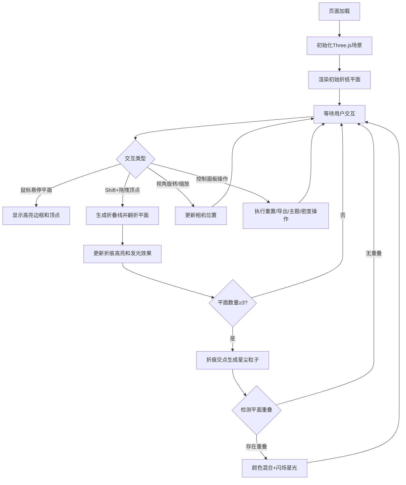

## 1. 产品概述

「折纸星云」是一个基于WebGL的交互式3D创意应用，用户可以在三维空间中通过折叠虚拟折纸平面来生成独特的动态星云艺术作品。

- 核心用途：让用户通过直观的折叠交互创作独一无二的星云视觉艺术
- 目标用户：数字艺术爱好者、创意设计师、普通用户
- 产品价值：将传统折纸艺术与数字星云视觉结合，提供沉浸式的创作体验

## 2. 核心功能

### 2.1 功能模块

1. **3D折纸交互模块**：初始正方形平面、顶点拖拽折叠、折痕线生成、平面翻折动画
2. **星云视觉系统**：折痕发光效果、星尘粒子扩散、颜色混合渐变、闪烁星光
3. **控制面板模块**：重置、导出截图、主题切换、密度调节

### 2.2 功能详情

| 模块名称 | 子功能 | 功能描述 |
|---------|--------|---------|
| 3D折纸交互 | 初始平面 | 240px边长正方形，半透明深蓝底色，银丝网格纹理，淡蓝辉光边缘 |
| 3D折纸交互 | 悬停反馈 | 鼠标悬停时边框变白，顶点显示可拖拽发光小球 |
| 3D折纸交互 | 折叠交互 | Shift+拖拽顶点生成折叠线，平面沿折线翻折，背面显示星云渐变色 |
| 3D折纸交互 | 折痕效果 | 折叠线高亮1.5倍发光，1秒后衰减至0.5倍，带0.3秒发光尾迹 |
| 星云视觉系统 | 星尘粒子 | 三个以上平面时，折痕交点生成粒子，60px球形扩散，上限50个 |
| 星云视觉系统 | 颜色混合 | 不同平面重叠区域显示加权混合渐变（暖色0.55/冷色0.45） |
| 星云视觉系统 | 闪烁星光 | 重叠区域生成随机星光，大小4px，0.5-1秒闪烁周期 |
| 控制面板 | 重置按钮 | 清除所有折叠和粒子，恢复初始正方形 |
| 控制面板 | 导出截图 | 保存当前星云为800x800 PNG |
| 控制面板 | 主题切换 | 梦境紫/极光绿/熔岩橙/星空蓝四种预设，1秒过渡动画 |
| 控制面板 | 密度滑块 | 10-100范围，控制粒子生成速率倍数，默认50 |

## 3. 核心流程

## 4. 用户界面设计

### 4.1 设计风格

- **主色调**：深空紫黑渐变背景（#0C0818 → #1A112D）
- **辅助色**：半透明深蓝（#2B2D5E 0.4透明度）、淡蓝辉光（#7A8CFF）、银丝网格（#A0B0FF 0.2透明度）
- **星云色系**：粉紫#C77DFF → 橙黄#FFC857渐变
- **粒子色**：#FF7B9C / #6AC5FE / #FED976
- **交互风格**：发光反馈、柔和过渡、粒子动画
- **布局**：全屏3D场景，左下角半透明控制面板

### 4.2 页面设计概述

| 区域 | 元素 | 设计说明 |
|------|------|---------|
| 全屏背景 | 深空渐变 | CSS radial-gradient，从#0C0818到#1A112D |
| 中央场景 | 折纸平面 | Three.js渲染，初始240px正方形 |
| 左下角 | 控制面板 | 180x220px，圆角12px，rgba(15,10,30,0.7)背景，1px rgba(200,180,255,0.1)边框 |
| 控制面板 | 重置按钮 | 深色按钮，悬停发光效果 |
| 控制面板 | 导出按钮 | 深色按钮，悬停发光效果 |
| 控制面板 | 主题下拉 | 自定义下拉菜单，选项带颜色预览 |
| 控制面板 | 密度滑块 | 自定义滑块，发光轨道样式 |

### 4.3 响应性

- 桌面端优先，全屏Canvas自适应窗口大小
- 控制面板固定左下角，不随窗口缩放
- 支持鼠标滚轮缩放、拖拽旋转视角

### 4.4 3D场景设计

- **环境**：纯深空背景，无外部HDRI，营造宇宙空间感
- **光照**：多盏点光源模拟星云发光，主光源冷白色，辅助光源带主题色
- **相机**：PerspectiveCamera，OrbitControls控制旋转缩放，初始距离使平面居中
- **构图**：平面居中悬浮，控制面板左下角，整体对称平衡
- **交互**：TransformControls实现顶点拖拽，自定义射线检测实现折叠逻辑
- **后处理**：发光效果（Bloom）增强星云和折痕视觉表现
