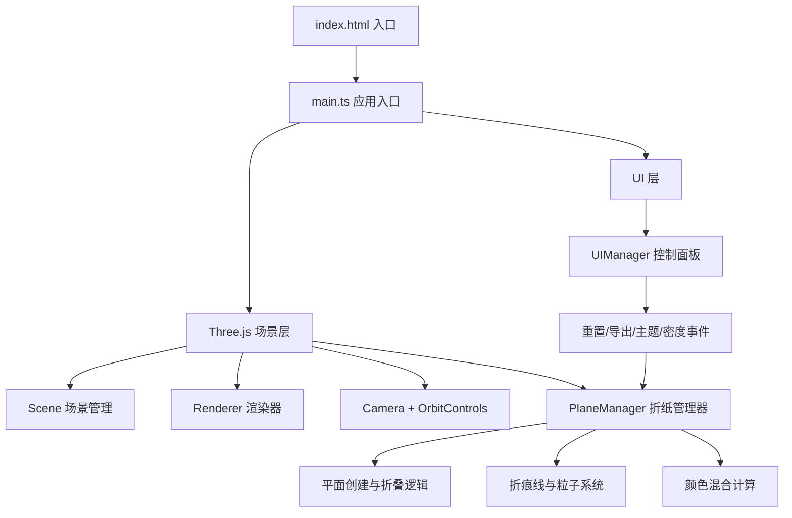

## 1. 架构设计



## 2. 技术说明

- **前端框架**：原生 TypeScript（无React/Vue），ESM模块语法
- **3D引擎**：Three.js r160+，通过 three/addons 引入 OrbitControls、TransformControls
- **构建工具**：Vite 5.x，支持HMR，配置resolve.alias
- **开发语言**：TypeScript 5.x，严格模式，目标ES2020
- **无后端**：纯前端应用，所有逻辑在浏览器端执行

## 3. 文件结构

```
project-root/
├── index.html              # 入口页面
├── package.json            # 项目依赖和脚本
├── vite.config.js          # Vite构建配置
├── tsconfig.json           # TypeScript配置
└── src/
    ├── main.ts             # 应用入口
    ├── PlaneManager.ts     # 折纸平面管理
    └── UIManager.ts        # 控制面板UI管理
```

### 3.1 文件职责说明

| 文件 | 职责 |
|------|------|
| index.html | 页面结构，全屏Canvas容器，加载main.ts |
| package.json | three、@types/three、typescript、vite依赖；dev/build脚本 |
| vite.config.js | 设置resolve.alias，three指向node_modules，入口index.html |
| tsconfig.json | strict: true, target: ES2020, moduleResolution: bundler |
| src/main.ts | 初始化Three.js场景/渲染器/相机/控制器，加载PlaneManager和UIManager，启动动画循环 |
| src/PlaneManager.ts | 创建初始平面，处理顶点拖拽、折叠逻辑（射线检测），折痕线生成，粒子系统，颜色混合，星云纹理更新 |
| src/UIManager.ts | DOM创建控制面板，事件绑定：重置、导出PNG、主题切换下拉、密度滑块，事件通知PlaneManager |

## 4. 关键数据模型

```typescript
// 折纸平面数据
interface FoldPlane {
  id: string;
  mesh: THREE.Mesh;
  geometry: THREE.PlaneGeometry;
  foldLines: FoldLine[];
  colorTheme: NebulaTheme;
  vertices: THREE.Vector3[];
}

// 折痕线
interface FoldLine {
  start: THREE.Vector3;
  end: THREE.Vector3;
  lineMesh: THREE.Line;
  glowIntensity: number;
  createdAt: number;
}

// 星尘粒子
interface StarDust {
  id: string;
  mesh: THREE.Mesh;
  velocity: THREE.Vector3;
  color: THREE.Color;
  opacity: number;
  maxRadius: number;
  birthTime: number;
}

// 星云主题
interface NebulaTheme {
  name: string;
  color1: string; // 起始色（粉紫等）
  color2: string; // 结束色（橙黄等）
  warmWeight: number; // 混合权重
}
```

## 5. 核心算法

### 5.1 折叠算法
1. 射线检测获取拖拽顶点和平面
2. 根据拖拽方向计算折叠线（垂直于拖拽方向，经过平面中心或对边中点）
3. 将PlaneGeometry顶点分为两组，沿折叠线执行旋转变换
4. 更新顶点法线，确保背面正确渲染星云渐变色

### 5.2 颜色混合
1. 使用离屏RenderTarget检测不同平面的像素重叠
2. 对重叠区域按权重（暖色0.55 / 冷色0.45）计算混合颜色
3. 更新对应区域的材质颜色或使用shader实时混合

### 5.3 粒子系统
1. 检测折痕线之间的空间交点（阈值内判定为相交）
2. 粒子以交点为中心，随机方向向外扩散，速度20px/s
3. 上限50个，超出时最早粒子透明度以0.1/s速率衰减
