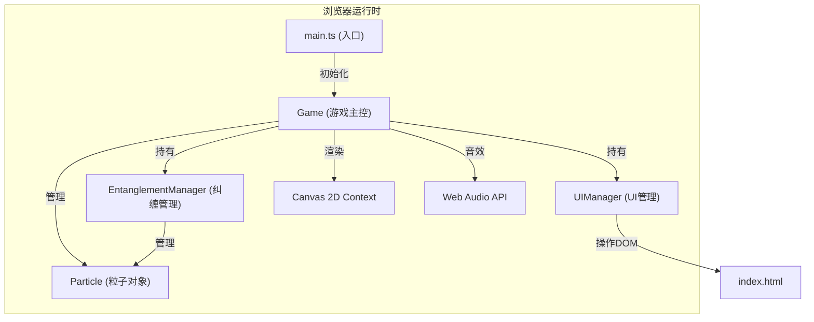

## 1. 架构设计



## 2. 技术描述

- **构建工具**：Vite (vite@5)
- **语言**：TypeScript@5 (严格模式, target ES2020)
- **渲染**：HTML5 Canvas 2D Context
- **音效**：Web Audio API (OscillatorNode)
- **样式**：原生 CSS (内联于 index.html)
- **无框架**：纯 TypeScript + Canvas，不使用 React/Vue

## 3. 文件结构

```
auto321/
├── package.json          # 项目依赖与脚本
├── vite.config.js        # Vite构建配置
├── tsconfig.json         # TypeScript配置
├── index.html            # 入口HTML页面
└── src/
    ├── main.ts           # 应用入口
    ├── game.ts           # Game类: 游戏主控
    ├── particle.ts       # Particle类: 粒子对象
    ├── entanglement.ts   # EntanglementManager: 纠缠管理
    └── ui.ts             # UIManager: 状态面板UI
```

## 4. 核心类与接口定义

### 4.1 Particle (src/particle.ts)

```typescript
interface ParticleState {
  x: number;
  y: number;
  radius: number;
  color: string;           // #7B2D8E | #2D8E8E | #D4A017
  colorIndex: number;      // 0 | 1 | 2
  entanglements: Particle[];
  isCollapsed: boolean;
  isSelected: boolean;
  vx: number;
  vy: number;
  scale: number;           // 交互动画缩放
  scaleTarget: number;
}

class Particle {
  constructor(x: number, y: number, colorIndex: number);
  update(dt: number, canvasW: number, canvasH: number): void;
  render(ctx: CanvasRenderingContext2D): void;
  collapse(shards: Shard[], shocks: Shockwave[]): void;
  addEntanglement(other: Particle): void;
  removeEntanglement(other: Particle): void;
  hasEntanglementWith(other: Particle): boolean;
  isEntangled(): boolean;
  pulseScale(): void;
  distanceTo(other: Particle): number;
}
```

### 4.2 EntanglementManager (src/entanglement.ts)

```typescript
interface EntanglementPair {
  a: Particle;
  b: Particle;
  isNew: boolean;          // 新建纠缠用于脉冲动画
  pulseTime: number;
  createdAt: number;
}

class EntanglementManager {
  pairs: EntanglementPair[];
  
  constructor();
  addPair(a: Particle, b: Particle): boolean;
  removePair(a: Particle, b: Particle): void;
  hasPair(a: Particle, b: Particle): boolean;
  getPairsOf(p: Particle): EntanglementPair[];
  getPairCount(): number;
  update(dt: number): void;
  renderConnections(ctx: CanvasRenderingContext2D, time: number): void;
  triggerCollapse(startParticle: Particle, particles: Particle[], shards: Shard[], shocks: Shockwave[], chainCallback: (count: number) => void): number;
  detectChainCollapse(center: Particle, particles: Particle[], collapsed: Set<Particle>, radius: number, probability: number): Particle[];
}
```

### 4.3 UIManager (src/ui.ts)

```typescript
interface GameStats {
  totalParticles: number;
  entanglementPairs: number;
  collapseCount: number;
  chainCount: number;
  timeRemaining: number;
}

class UIManager {
  container: HTMLElement;
  panel: HTMLElement;
  isCollapsed: boolean;
  
  constructor(parent: HTMLElement);
  update(stats: GameStats): void;
  showResult(grade: string, eliminatedCount: number): void;
  hideResult(): void;
  togglePanel(): void;
  handleResponsive(width: number): void;
  private animateValue(el: HTMLElement, newValue: number): void;
}
```

### 4.4 Game (src/game.ts)

```typescript
type GameState = 'idle' | 'playing' | 'ended';

interface Shard {
  x: number; y: number;
  vx: number; vy: number;
  color: string;
  size: number;
  life: number;    // 0~1
  maxLife: number;
}

interface Shockwave {
  x: number; y: number;
  radius: number;
  maxRadius: number;
  life: number;
  width: number;
}

interface GoldParticle {
  x: number; y: number;
  vy: number; vx: number;
  size: number;
  life: number;
  rotation: number;
  rotationSpeed: number;
}

class Game {
  canvas: HTMLCanvasElement;
  ctx: CanvasRenderingContext2D;
  particles: Particle[];
  entanglementMgr: EntanglementManager;
  ui: UIManager;
  
  state: GameState;
  selectedParticle: Particle | null;
  shards: Shard[];
  shocks: Shockwave[];
  goldParticles: GoldParticle[];
  
  startTime: number;
  timeRemaining: number;
  collapseCount: number;
  chainCount: number;
  initialParticleCount: number;
  
  audioCtx: AudioContext;
  
  constructor(canvas: HTMLCanvasElement, uiContainer: HTMLElement);
  init(): void;
  start(): void;
  reset(): void;
  loop(timestamp: number): void;
  update(dt: number): void;
  render(): void;
  handleClick(clientX: number, clientY: number): void;
  private getCanvasCoords(clientX: number, clientY: number): { x: number; y: number };
  private findParticleAt(x: number, y: number): Particle | null;
  private spawnShards(x: number, y: number, color: string, count: number): void;
  private spawnShockwave(x: number, y: number): void;
  private spawnGoldRain(): void;
  private playTone(freq: number, duration: number, type?: OscillatorType): void;
  private calcGrade(eliminated: number): string;
  private endGame(): void;
}
```

## 5. 关键算法

### 5.1 贝塞尔曲线冲击波
使用二次贝塞尔曲线控制点偏移实现不规则圆形冲击波：
- 半径插值：`radius = maxRadius * (1 - life)`
- 透明度插值：`alpha = 0.8 * life`
- 在圆周上取16个采样点，每个点施加基于sin(life*π)的随机偏移

### 5.2 连锁坍缩检测
1. 将起始粒子加入已坍缩集合
2. BFS遍历每个已坍缩粒子的80px范围内的其他粒子
3. 每个未坍缩粒子独立判断 30% 概率
4. 新坍缩粒子继续触发其范围检测，直至无新粒子坍缩

### 5.3 弹性连线抖动
使用正弦波叠加两粒子中点偏移：
- `offset = sin(time * 2π * 2 + pairIndex) * 3`
- 绘制二次贝塞尔曲线，控制点在连线中点法向量方向偏移

### 5.4 彩虹渐变纠缠连线
使用HSL色彩空间随时间变化色相：
- `hue = (time * 120 + pairIndex * 30) % 360`
- 饱和度100%，亮度60%
- 脉冲时亮度提升至85%，0.5秒内回落

## 6. 性能优化策略

1. **Canvas分层渲染**：静态背景一次绘制，动态元素每帧渲染
2. **对象池模式**：碎片和冲击波对象复用，避免频繁GC
3. **距离检测优化**：使用平方距离比较避免开方运算
4. **requestAnimationFrame**：使用浏览器原生动画循环，同步刷新率
5. **边界裁剪**：只渲染画布可见区域内的元素
6. **音频复用**：共享单个AudioContext，按需创建OscillatorNode
