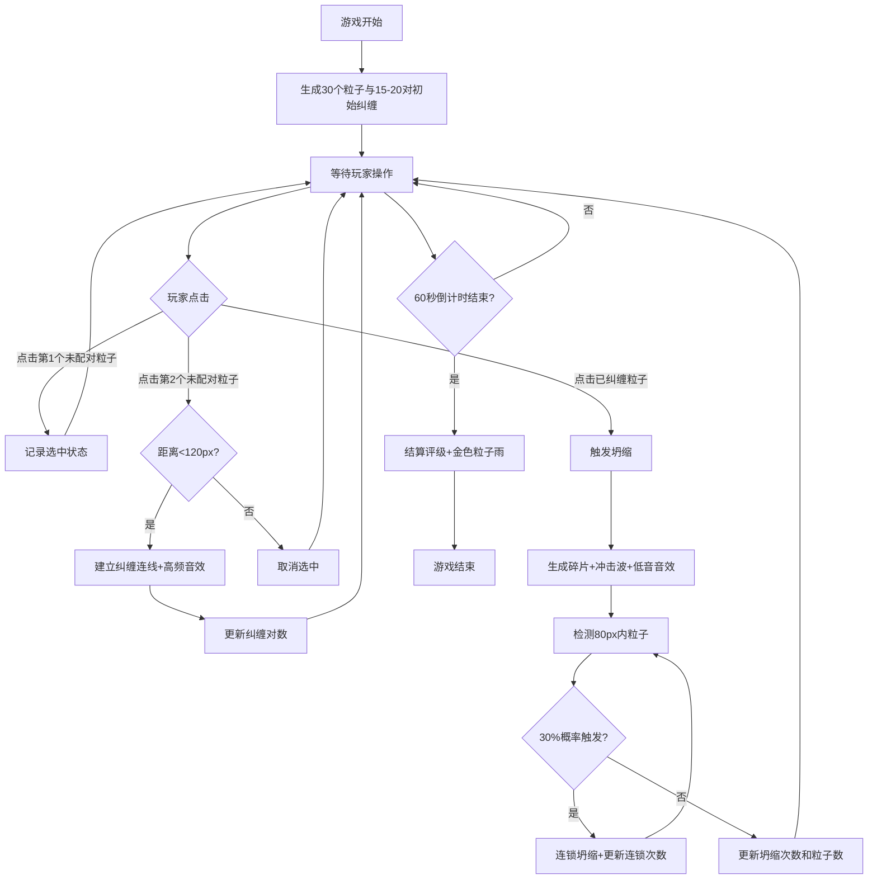

## 1. 产品概述

「量子纠缠幻境」是一款基于浏览器的轻量级策略游戏，通过可视化方式模拟量子粒子的叠加态与纠缠交互。玩家通过建立粒子纠缠、触发坍缩及利用连锁反应消灭粒子，在一分钟内达成最优成绩。

- 解决问题：缺乏直观的量子态叠加和纠缠交互反馈体验
- 目标用户：对量子物理概念感兴趣的普通玩家、教育场景学习者

## 2. 核心功能

### 2.1 功能模块

1. **粒子场生成模块**：自动生成30个随机分布的彩色粒子，初始建立15-20对纠缠连接
2. **纠缠建立模块**：玩家点击两个未配对粒子，在距离阈值内建立发光纠缠连线
3. **坍缩与连锁反应模块**：点击已纠缠粒子触发坍缩，爆发碎片和冲击波，概率触发周围粒子连锁坍缩
4. **状态面板模块**：实时显示粒子数、纠缠对数、坍缩次数、连锁次数、倒计时
5. **评分结算模块**：60秒倒计时结束后根据消灭粒子数评级并展示特效

### 2.2 功能详情

| 模块名称 | 子功能 | 功能描述 |
|----------|--------|----------|
| 粒子场生成 | 粒子初始化 | 30个半径5-8px半透明圆形，随机分配深紫/青蓝/琥珀三色 |
| 粒子场生成 | 初始纠缠连接 | 15-20对随机纠缠连接，细线半透明白色(0.3透明度) |
| 纠缠建立 | 距离检测 | 两粒子距离<120px时可建立纠缠 |
| 纠缠建立 | 视觉反馈 | 彩虹渐变发光连线，0.5秒亮度脉冲动画 |
| 纠缠建立 | 音效反馈 | 880Hz高频电子音效 |
| 坍缩与连锁 | 粒子坍缩 | 粒子及所有直接纠缠粒子爆发20个飞散碎片(2-4px) |
| 坍缩与连锁 | 冲击波效果 | 贝塞尔曲线扩散冲击波(半径120px, 透明度0.8→0) |
| 坍缩与连锁 | 音效反馈 | 220Hz低音轰鸣音效 |
| 坍缩与连锁 | 连锁反应 | 坍缩点周围80px内粒子30%概率连带坍缩 |
| 状态面板 | 数据展示 | 粒子总数、纠缠对数、坍缩次数、连锁次数、倒计时 |
| 状态面板 | 动画反馈 | 数值更新时0.3秒字体放大1.1倍的跳动动画 |
| 状态面板 | 响应式折叠 | 页面宽度<900px时折叠为汉堡菜单 |
| 评分结算 | 评级系统 | S>25/A20-25/B15-20/C10-15/D<10 |
| 评分结算 | 金色粒子雨 | 结算时顶部洒落金色粒子雨特效(2秒) |

## 3. 核心流程

玩家进入游戏后，首先看到随机生成的粒子场。玩家依次点击两个粒子尝试建立纠缠连接，或点击已纠缠的粒子触发坍缩。坍缩会产生碎片、冲击波，并可能触发周围粒子的连锁反应。状态面板实时更新数据和倒计时。60秒结束后，游戏停止并展示最终评级和金色粒子雨特效。

## 4. 用户界面设计

### 4.1 设计风格
- **主色调**：深紫黑 (#0D0A1A → #1A142E 径向渐变背景)
- **强调色**：深紫 #7B2D8E、青蓝 #2D8E8E、琥珀 #D4A017
- **画布**：820×580px，rgba(10,10,25,0.9) 背景，16px圆角，1px rgba(180,180,220,0.15) 边框
- **状态面板**：180px宽，rgba(20,20,40,0.85) 背景，12px圆角
- **整体风格**：深色科幻风格，粒子带辉光效果(box-shadow模糊6px)

### 4.2 页面设计详情

| 区域 | UI元素 | 样式与交互 |
|------|--------|------------|
| 游戏画布 | 粒子 | 半透明圆形，5-8px半径，随机三色，辉光效果，微浮动 |
| 游戏画布 | 纠缠连线 | 初始: 1px半透明白色(0.3)，正弦波弹性抖动(幅度3px, 2Hz) |
| 游戏画布 | 新建纠缠 | 2px彩虹渐变发光，0.5秒脉冲动画 |
| 游戏画布 | 坍缩碎片 | 2-4px粒子，原色系，1.2秒飞散消散 |
| 游戏画布 | 冲击波 | 贝塞尔曲线扩散，半径120px，宽度3px，透明度0.8→0 |
| 状态面板 | 统计数据 | 粒子数/纠缠数/坍缩数/连锁数，数值跳动动画 |
| 状态面板 | 倒计时 | 大号字体显示剩余秒数 |
| 状态面板 | 折叠按钮 | 页面宽度<900px时显示汉堡菜单 |
| 结算界面 | 评级显示 | S/A/B/C/D评级大字展示 |
| 结算界面 | 粒子雨 | 金色粒子从顶部洒落，2秒 |

### 4.3 交互动画
- 所有交互动作（点击粒子、建立纠缠、触发坍缩）伴随0.2秒缩放反馈（放大1.05倍后恢复）
- 纠缠连线随粒子移动弹性抖动
- 数值更新时0.3秒字体放大1.1倍跳动动画

### 4.4 响应式
- 桌面端优先（Desktop-first）
- 页面宽度<900px时状态面板折叠为汉堡菜单，点击展开
- 画布保持固定尺寸居中显示

### 4.5 性能要求
- Canvas FPS稳定在50帧以上
- 粒子数>40时不出现卡顿拖影
- 使用 requestAnimationFrame 驱动游戏循环
