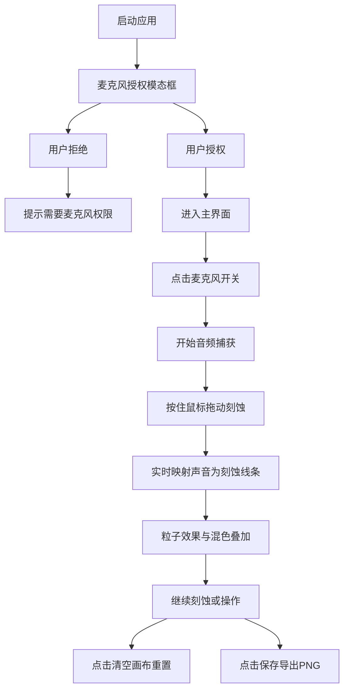

## 1. 产品概述
声纹蚀刻（Voiceprint Etching）是一款在浏览器中运行的交互式声音可视化与雕刻应用。用户通过麦克风输入声音（说话或播放音乐），结合鼠标拖动操作，在虚拟材质板上实时刻蚀出带有声音特征的永久性痕迹。
- 主要目的：解决用户无法在缺乏实时视觉反馈的情况下，通过声音输入在虚拟材质上刻蚀并留下永久性痕迹的问题
- 目标用户：数字艺术爱好者、声音可视化探索者、交互设计从业人员

## 2. 核心功能

### 2.1 功能模块
1. **声纹蚀刻主画布**：700x500px虚拟材质板，支持鼠标拖动刻蚀，实时声音能量映射
2. **音频捕获系统**：麦克风权限管理、实时频率/音量分析
3. **波形监视器**：实时音频波形显示与能量条
4. **作品管理**：清空画布、导出PNG图片

### 2.2 功能详情

| 功能模块 | 子功能 | 功能描述 |
|---------|-------|---------|
| 声纹蚀刻主画布 | 声音映射 | 频率决定刻蚀线条疏密与颜色（低频深蓝#1E3A5F到紫#6A0DAD渐变，高频橙#FF8C00到红#FF3333渐变）；音量决定刻蚀深度与线条粗细（0-100映射1-15px宽度和0.2-0.9透明度） |
| 声纹蚀刻主画布 | 材质板 | 700x500px磨砂银灰色渐变背景，叠加亚麻纹理噪点（透明度0.2） |
| 声纹蚀刻主画布 | 刻蚀交互 | 按住鼠标左键拖动生成刻蚀线条，末端粒子散落效果（5-15粒子，1-3px，0.5秒消散） |
| 声纹蚀刻主画布 | 混色叠加 | 后绘制线条以0.7透明度叠加在先绘制线条上，产生蚀刻层次感 |
| 声纹蚀刻主画布 | 自定义光标 | 圆形光标半径随音量变化8-20px，颜色#FFFFFF透明度0.3，边缘发光扩散 |
| 音频捕获系统 | 麦克风授权 | 首次启动模态框提示授权，支持开关控制（录音中图标变红） |
| 波形监视器 | 波形显示 | 高80px区域，实时显示音频波形，颜色随频率动态变化 |
| 波形监视器 | 能量条 | 顶部6px能量条，#00D4AA到#FF6B9D渐变，随音量动态显示0-100% |
| 作品管理 | 清空画布 | 左上角按钮，重置材质板为初始状态（100ms内完成） |
| 作品管理 | 保存作品 | 右上角按钮，导出1920x1280分辨率PNG（背景#2A2A35，500ms内完成） |

## 3. 核心流程
用户打开应用 → 弹出麦克风授权模态框 → 授权后进入主界面 → 开启麦克风（默认关闭）→ 按住鼠标左键在材质板上拖动 → 系统实时将声音频率/音量映射为刻蚀效果 → 可随时清空或导出作品

## 4. 用户界面设计

### 4.1 设计风格
- 主色调：深炭黑#1A1A24到午夜蓝#1F2937径向渐变背景
- 强调色：蓝紫渐变(#1E3A5F→#6A0DAD)、橙红渐变(#FF8C00→#FF3333)、青绿到粉红渐变(#00D4AA→#FF6B9D)
- 中性色：磨砂银灰(#C0C0C0→#A9A9A9)、半透明蓝白(#E0E7FF)
- 按钮：圆角12px，半透明深色背景rgba(50,50,70,0.7)，hover变rgba(70,70,100,0.9)，0.2秒缩放+0.1秒颜色过渡
- 字体：无衬线字体，文字颜色#E0E7FF，24px字重500
- 材质板容器：半透明磨砂玻璃效果（背景rgba(40,45,60,0.6)，圆角20px，边框1px rgba(255,255,255,0.1)）
- 材质板光晕：外圈半径360px、内圈半径340px，颜色#E0E7FF透明度0.05

### 4.2 页面布局
| 区域 | 位置 | 尺寸与样式 |
|-----|-----|----------|
| 页面背景 | 全屏 | 深炭黑到午夜蓝径向渐变 |
| 主容器 | 垂直居中flex布局 | 1280x720及以上分辨率完美居中 |
| 清空画布按钮 | 左上角 | 圆角12px，半透明深色背景 |
| 保存作品按钮 | 右上角 | 圆角12px，半透明深色背景 |
| 麦克风开关 | 按钮形式 | 麦克风图标，录音中变红色 |
| 材质板容器 | 页面中央 | 半透明磨砂玻璃，圆角20px，双圈光晕 |
| 波形监视器 | 页面底部，与主画布间距24px | 高80px，背景rgba(20,20,30,0.8)，圆角8px |

### 4.3 响应式设计
- 桌面端优先设计（1280x720及以上）
- 主容器采用flex垂直居中布局
- 材质板固定700x500px尺寸
- 波形监视器宽度跟随主容器

## 5. 性能要求
| 指标 | 要求 |
|-----|-----|
| 音频延迟 | 麦克风输入到线条显示延迟<50ms |
| 帧率 | 画布绘制帧率稳定在30fps以上 |
| 清空画布 | 操作在100ms内完成 |
| 导出PNG | 生成时间<500ms |
