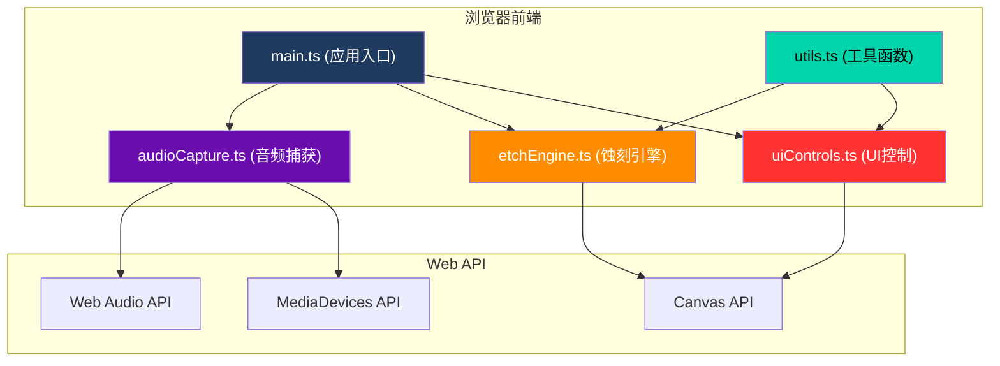

## 1. 架构设计



## 2. 技术栈说明
- **构建工具**：Vite（支持HMR热更新，目标ES2020）
- **编程语言**：TypeScript（严格模式，允许unusedLocals和unusedParameters宽松）
- **渲染技术**：HTML5 Canvas 2D API
- **音频处理**：Web Audio API（AnalyserNode、AudioContext）
- **媒体捕获**：MediaDevices.getUserMedia()
- **样式方案**：内联CSS + Canvas绘制

## 3. 项目文件结构
```
auto324/
├── package.json
├── vite.config.js
├── tsconfig.json
├── index.html
└── src/
    ├── main.ts            # 应用入口，初始化Canvas和模块，状态管理，动画循环
    ├── audioCapture.ts    # 音频捕获：麦克风权限、频率/音量数据获取
    ├── etchEngine.ts      # 蚀刻引擎：线条绘制、粒子效果、混色叠加
    ├── uiControls.ts      # UI控制：按钮交互、波形显示器
    └── utils.ts           # 工具函数：颜色映射、粒子生成、图像导出
```

## 4. 核心模块定义

### 4.1 类型定义
```typescript
// 音频数据接口
interface AudioData {
  volume: number;      // 0-100 音量等级
  frequency: number;   // 0-1 归一化频率值
  waveform: Float32Array; // 波形数据
}

// 粒子接口
interface Particle {
  x: number;
  y: number;
  vx: number;
  vy: number;
  size: number;
  color: string;
  life: number;     // 0-1 生命值
  maxLife: number;
}

// 刻蚀点接口
interface EtchPoint {
  x: number;
  y: number;
  timestamp: number;
  volume: number;
  frequency: number;
}

// 应用状态
interface AppState {
  isRecording: boolean;
  isDrawing: boolean;
  mouseX: number;
  mouseY: number;
  lastPoint: EtchPoint | null;
  particles: Particle[];
}
```

### 4.2 模块职责

| 模块 | 核心类/函数 | 职责 |
|-----|------------|-----|
| audioCapture.ts | AudioCapture类 | 麦克风权限请求、AudioContext管理、实时FFT分析、输出volume/frequency/waveform |
| etchEngine.ts | EtchEngine类 | 材质板初始化、刻蚀线条绘制（贝塞尔曲线）、粒子系统、混色叠加、清空画布 |
| uiControls.ts | UIController类 | 按钮事件绑定、自定义光标渲染、波形监视器绘制、能量条渲染、模态框管理 |
| utils.ts | 纯函数集合 | 频率到颜色映射、音量到线宽/透明度映射、粒子随机生成、Canvas导出PNG、噪点纹理生成 |

## 5. 性能优化策略

### 5.1 音频处理
- 使用AnalyserNode的fftSize=2048，smoothingTimeConstant=0.8
- 每帧仅做一次getByteFrequencyData调用
- 使用requestAnimationFrame同步音频数据与渲染

### 5.2 Canvas渲染
- 主蚀刻画布使用离屏Canvas缓存材质纹理，避免每帧重绘背景
- 粒子使用独立渲染层，生命周期结束立即回收
- 线条绘制采用线段连接而非逐点绘制，减少drawCall

### 5.3 数据传递
- 音频数据与渲染状态通过引用传递，避免频繁GC
- 粒子对象池复用，减少对象创建开销

## 6. 关键技术实现点

### 6.1 声音映射算法
- **频率→颜色**：归一化频率值freq(0-1)，freq<0.5时在深蓝#1E3A5F到紫#6A0DAD之间插值，freq≥0.5时在橙#FF8C00到红#FF3333之间插值
- **音量→线宽**：lineWidth = 1 + (volume / 100) * 14
- **音量→透明度**：alpha = 0.2 + (volume / 100) * 0.7

### 6.2 粒子系统
- 刻蚀时每帧在鼠标位置附近生成5-15个粒子
- 粒子初速度方向随机，大小1-3px随机
- 粒子生命值0.5秒，线性衰减透明度
- 颜色从当前频率颜色中随机偏移

### 6.3 导出PNG
- 创建1920x1280临时Canvas
- 填充背景色#2A2A35
- 将700x500蚀刻内容按比例缩放绘制到中心
- 使用toDataURL('image/png')导出
