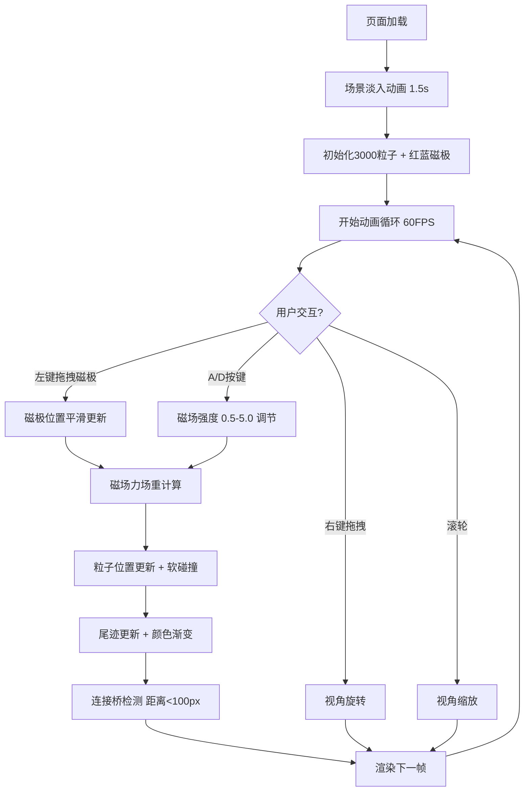

## 1. 产品概述

「磁场诗篇」是一个基于WebGL的三维动态铁磁流体可视化应用，通过实时物理模拟展示数千个磁性粒子在虚拟磁场中的动态行为。用户可以通过鼠标拖拽磁极、调节磁场强度，直观地观察粒子形成尖刺状结构、分支图案和连接桥等复杂流动形态。

- 主要用途：科学可视化、艺术展示、互动教学演示
- 目标用户：对物理模拟、计算艺术、WebGL视觉效果感兴趣的开发者、设计师、学生和爱好者
- 产品价值：以直观、美观的方式展示磁场与磁性粒子的相互作用，兼具教育意义和艺术欣赏价值

## 2. 核心功能

### 2.1 用户角色

| 角色 | 注册方式 | 核心权限 |
|------|----------|----------|
| 普通用户 | 无需注册，直接访问 | 全部交互功能：拖拽磁极、调节强度、旋转视角、缩放 |

### 2.2 功能模块

1. **主场景页**：3D粒子系统渲染、两个可拖拽磁极、磁场强度控制
2. **粒子物理模拟**：3000个球形粒子的位置更新、软碰撞、磁场力计算
3. **磁极交互系统**：鼠标拖拽移动磁极、平滑阻尼效果
4. **视觉效果层**：粒子尾迹、轮廓高光、动态辉光
5. **UI控制面板**：磁场强度显示、操作提示、数值变化动画

### 2.3 页面详情

| 页面名称 | 模块名称 | 功能描述 |
|----------|----------|----------|
| 主场景页 | 3D粒子系统 | 3000个半透明球形粒子，分布在半径200px的球形区域内，暗绿到草绿渐变颜色，软碰撞避免重叠 |
| 主场景页 | 红蓝磁极 | 红色磁极（#C0392B→#E74C3C渐变发光球体，直径30px）位于x=+150，蓝色磁极（#2980B9→#3498DB渐变）位于x=-150 |
| 主场景页 | 磁极拖拽 | 鼠标左键拖拽磁极，跟随鼠标并带平滑阻尼效果 |
| 主场景页 | 磁场强度调节 | A键增加强度，D键减少强度，范围0.5-5.0，默认1.0，左上角显示数值变化动画 |
| 主场景页 | 尖刺形成 | 粒子向磁极表面聚集形成尖刺，尖刺长度与距离成反比，数量与强度成正比 |
| 主场景页 | 连接桥效果 | 两磁极距离<100px时，粒子间形成红到蓝彩色过渡连接桥，宽度密度随接近程度增加 |
| 主场景页 | 粒子尾迹 | 每个粒子保持前20帧位置绘制尾迹，透明度1.0→0.0衰减，长度80px，颜色暗20% |
| 主场景页 | 视角控制 | 鼠标右键拖拽旋转视角，滚轮缩放，场景缓慢自转（周期约60秒） |
| 主场景页 | UI面板 | 左上角半透明面板显示磁场强度和操作提示，悬停时边框发光 |

## 3. 核心流程

用户打开页面后，场景自动淡入显示3000个粒子和两个磁极。用户可通过以下方式交互：
- 鼠标左键拖拽任一磁极移动位置，粒子实时响应磁场变化
- 按A/D键调节磁场强度，观察尖刺形态变化
- 鼠标右键拖拽旋转视角，滚轮缩放观察细节
- 当两磁极靠近时，自动形成彩色连接桥

## 4. 用户界面设计

### 4.1 设计风格

- **主色调**：深空黑灰背景（#0C0E14→#1A1D26径向渐变），突出粒子的绿色系和磁极的红蓝对比
- **粒子颜色**：暗绿#2D5A27到草绿#6B8E23渐变随机分布，连接桥红#C0392B到蓝#2980B9平滑过渡
- **磁极样式**：红色磁极#C0392B→#E74C3C渐变发光球体，蓝色磁极#2980B9→#3498DB渐变发光球体
- **边框**：场景四周1px淡蓝色边框#4A90D9，透明度0.3
- **字体**：无衬线现代字体，面板文字颜色#E0E0E0，字号14px
- **UI面板**：左上角半透明面板，背景rgba(10,12,20,0.7)，圆角8px，悬停时#4A90D9边框发光（模糊2px）
- **动画风格**：平滑流畅，磁极移动带阻尼，数值变化带过渡动画，场景淡入1.5秒

### 4.2 页面设计概述

| 页面名称 | 模块名称 | UI元素 |
|----------|----------|--------|
| 主场景页 | 背景层 | 深空黑灰径向渐变（#0C0E14→#1A1D26），四周淡蓝色边框 |
| 主场景页 | 3D场景 | 3000个绿色渐变粒子球，两个红蓝发光磁极球体 |
| 主场景页 | 尾迹层 | 每条尾迹20帧位置数据，透明度衰减，颜色变暗20% |
| 主场景页 | 连接桥 | 磁极靠近时出现红→蓝彩色粒子桥 |
| 主场景页 | UI面板 | 左上角半透明圆角面板，显示强度值（大号数字）+操作提示（小号文字），悬停发光边框 |
| 主场景页 | 过渡动画 | 页面加载1.5秒淡入，强度变化数值动画，磁极阻尼移动 |

### 4.3 响应式

- 桌面端优先设计，全屏画布自适应窗口大小
- 鼠标交互完整支持（左键拖拽、右键旋转、滚轮缩放、键盘A/D）
- 移动端可触摸拖拽磁极和双指缩放（基础适配）

### 4.4 3D场景指引

- **环境**：深空黑灰背景，无HDRI，纯暗色调突出粒子和磁极
- **光照**：多点光源配合磁极发光材质，粒子使用半透明Additive混合营造辉光感
- **相机**：PerspectiveCamera，初始距离适中可观察整个粒子球，支持OrbitControls右键旋转和滚轮缩放
- **构图**：粒子球居场景中心，磁极分居两侧，UI面板左上角不遮挡主体
- **交互**：磁极Raycaster拾取拖拽，粒子实时受力模拟，场景整体缓慢Y轴自转
- **后处理**：Bloom辉光效果增强磁极和粒子的发光感
- **性能**：粒子使用InstancedMesh或Points + BufferGeometry，尾迹使用批量LineSegments，目标60FPS单帧更新<8ms
