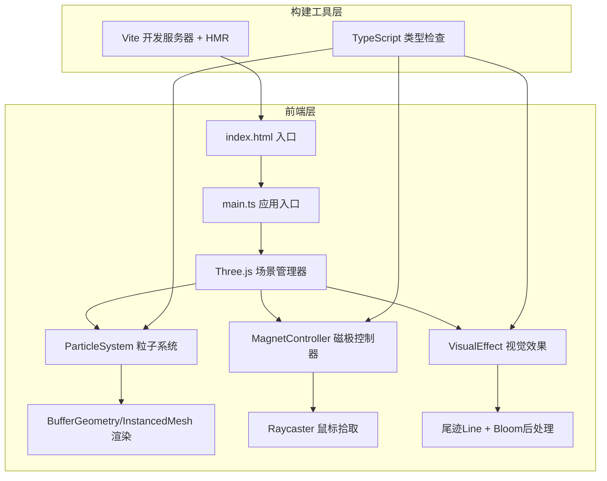

## 1. 架构设计



## 2. 技术描述

- **前端**：TypeScript + Three.js + Vite（用户明确指定，不使用React/Vue框架）
- **3D引擎**：three@^0.160.0，配合three/addons使用OrbitControls、EffectComposer、UnrealBloomPass等
- **类型定义**：@types/three
- **构建工具**：Vite@^5.0.0，支持HMR热更新
- **语言目标**：ES2020，strict严格模式
- **无后端**：纯前端静态应用，无数据库、无API服务

## 3. 文件结构

```
.
├── package.json              # 项目依赖和脚本（npm run dev）
├── vite.config.js            # Vite基础配置，支持HMR
├── tsconfig.json             # TypeScript strict模式，target ES2020
├── index.html                # 入口页面，全屏容器+黑灰渐变背景
└── src/
    ├── main.ts               # 应用入口：场景/相机/渲染器初始化，动画循环
    ├── particleSystem.ts     # 粒子系统类：3000粒子位置/颜色/运动/软碰撞
    ├── magnetController.ts   # 磁极控制器：红蓝磁极拖拽，力场计算
    └── visualEffect.ts       # 视觉效果：尾迹、辉光、轮廓高光
```

## 4. 核心类设计

### 4.1 ParticleSystem（粒子系统）
```typescript
class ParticleSystem {
  count: number = 3000
  positions: Float32Array      // 粒子当前位置 [x,y,z * count]
  velocities: Float32Array     // 粒子速度
  colors: Float32Array         // 粒子颜色（暗绿→草绿渐变）
  trailPositions: Float32Array // 尾迹位置（前20帧）
  trailAlphas: Float32Array    // 尾迹透明度衰减

  init(): void                 // 在半径200球内随机分布粒子
  update(dt: number, magnets: Magnet[], strength: number): void
                               // 磁场力计算 + 软碰撞 + 位置更新
  applyMagnetForce(): void     // 计算磁极吸引力，形成尖刺
  softCollision(): void        // 粒子间软碰撞避免重叠
  updateTrails(): void         // 更新尾迹位置历史
}
```

### 4.2 MagnetController（磁极控制器）
```typescript
class MagnetController {
  redMagnet: Object3D          // 红色磁极球体，渐变发光材质
  blueMagnet: Object3D         // 蓝色磁极球体
  draggingMagnet: Object3D | null
  targetPosition: Vector3      // 拖拽目标位置，用于阻尼平滑
  damping: number = 0.1        // 阻尼系数

  init(scene: Scene): void
  handlePointerDown(): void    // Raycaster检测拾取磁极
  handlePointerMove(): void    // 更新拖拽目标位置
  handlePointerUp(): void      // 结束拖拽
  update(): void               // 阻尼平滑移动到目标位置
  getMagnetPositions(): {red: Vector3, blue: Vector3}
  getDistance(): number        // 两磁极间距，用于连接桥判断
}
```

### 4.3 VisualEffect（视觉效果）
```typescript
class VisualEffect {
  trailGeometry: BufferGeometry  // 批量尾迹线段
  trailMaterial: LineBasicMaterial
  bloomPass: UnrealBloomPass     // 后处理辉光
  composer: EffectComposer

  init(renderer: WebGLRenderer, scene: Scene, camera: Camera): void
  updateTrailGeometry(particles: ParticleSystem): void
  render(): void                 // 使用composer渲染带辉光画面
  updateBridgeColors(): void     // 磁极靠近时红→蓝渐变连接桥
}
```

## 5. 性能优化策略

| 优化点 | 方案 |
|--------|------|
| 粒子渲染 | 使用Points + BufferGeometry或InstancedMesh，单次DrawCall |
| 尾迹渲染 | LineSegments + BufferGeometry批量绘制所有尾迹，不逐粒子创建Mesh |
| 物理计算 | Float32Array连续内存，向量化计算，单帧<8ms目标 |
| 软碰撞 | Spatial Grid空间网格划分，O(n)复杂度而非O(n²) |
| 后处理 | Bloom阈值控制，仅高亮物体发光，避免全屏幕模糊 |
| GC优化 | 复用Vector3等临时对象，避免每帧new分配 |

## 6. 交互设计

| 输入 | 行为 |
|------|------|
| 鼠标左键按下 | Raycaster检测是否命中磁极，命中则开始拖拽 |
| 鼠标左键移动 | 更新拖拽目标位置，磁极以阻尼系数平滑跟随 |
| 鼠标左键释放 | 结束拖拽 |
| 鼠标右键拖拽 | OrbitControls旋转相机视角 |
| 鼠标滚轮 | OrbitControls缩放相机距离 |
| A键按下 | 磁场强度 +0.1（上限5.0），触发UI数值动画 |
| D键按下 | 磁场强度 -0.1（下限0.5），触发UI数值动画 |
