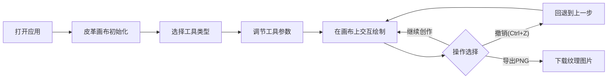

## 1. 产品概述

「革纹工坊」是一款面向手工皮具爱好者的浏览器端皮革工艺模拟应用，用户可通过虚拟工具（染色刷、压花滚轮、缝线针）在数字皮革表面上创作，实时预览工艺效果并导出高质量纹理图。

- 核心价值：降低皮革工艺学习门槛，提供零成本的创作实验平台，支持设计师快速预览纹理方案
- 目标用户：手工皮具爱好者、皮革工艺学习者、皮具设计师

## 2. 核心功能

### 2.1 用户角色
本应用为单用户工具型应用，无需登录注册。

### 2.2 功能模块
1. **主画布区域**：800x600像素仿皮革纹理画布，支持实时交互渲染
2. **工具控制面板**：三种工艺工具切换、参数调节（厚度/力度/颜色）
3. **操作功能区**：撤销操作、导出PNG图片

### 2.3 页面详情
| 页面名称 | 模块名称 | 功能描述 |
|---------|---------|---------|
| 工坊主页 | 皮革基底渲染 | Perlin噪声生成暖棕色颗粒感纹理、纤维纹理、随机毛孔凹点 |
| 工坊主页 | 染色刷工具 | 半透明颜色叠加，Alpha随力度0.1-0.8线性变化，边缘羽化，多次涂抹加深 |
| 工坊主页 | 压花滚轮工具 | 凹陷印记效果，亮度降低+阴影偏移，力度影响深度0-50px，0.3s高斯模糊过渡 |
| 工坊主页 | 缝线针工具 | 15px间距双排交叉缝线(X形)，0.5px针孔，Shift吸附20x20网格 |
| 工坊主页 | 撤销功能 | Ctrl+Z快捷键，最多20步撤销历史 |
| 工坊主页 | 导出功能 | 将当前画布导出为PNG格式图片 |

## 3. 核心流程

### 3.1 主操作流程
用户打开应用 → 选择工具类型 → 调节工具参数（厚度/力度/颜色）→ 在画布上绘制创作 → 可随时撤销或导出 → 继续创作或结束

### 3.2 数据流向
鼠标/触控事件 → ToolManager（轨迹插值+压力计算）→ LayerManager（图层栈管理+撤销重做）→ LeatherRenderer（像素级渲染+图层混合）→ Canvas显示

## 4. 用户界面设计

### 4.1 设计风格
- **整体风格**：工坊暖色调，复古手工质感
- **主色调**：背景径向渐变 #2C2416 → #3B2E1C
- **辅助色**：面板背景 #4A3828，焦糖色描边 #A0723D，缝线装饰 #8B6914
- **高亮色**：选中状态 #6B4C2A
- **按钮风格**：皮革缝线装饰边框（2px虚线），圆角设计，选中凸起阴影
- **字体**：使用衬线体提升工艺质感，标题粗体、正文常规
- **图标**：自定义SVG图标（染色刷=刷子轮廓、压花滚轮=齿轮状、缝线针=针线组合）

### 4.2 页面设计概览
| 页面名称 | 模块名称 | UI元素 |
|---------|---------|--------|
| 工坊主页 | 工具面板（左侧220px）| 三工具切换按钮、厚度滑块(1-20px默认8)、颜色选择器、参数标签 |
| 工坊主页 | 操作按钮（右上角）| 撤销按钮、导出按钮，悬停scale 1.05放大+工具提示 |
| 工坊主页 | 画布区域（居中）| 800x600画布，2px #A0723D描边，四周阴影 |
| 工坊主页 | 全局容器 | 全屏径向渐变背景，最小尺寸1024x768 |

### 4.3 响应式设计
- 桌面优先设计，最小支持视口 1024x768
- 画布居中缩放，保持 4:3 宽高比
- 触控设备支持手势绘制
- 工具面板在极小视口下可折叠

### 4.4 动效与交互
- 按钮悬停：scale 1.05 轻微放大，阴影加深
- 工具切换：平滑背景色过渡
- 画布绘制：实时渲染，压花带0.3s延迟模糊过渡
- 撤销操作：快速图层切换，响应时间≤15ms
