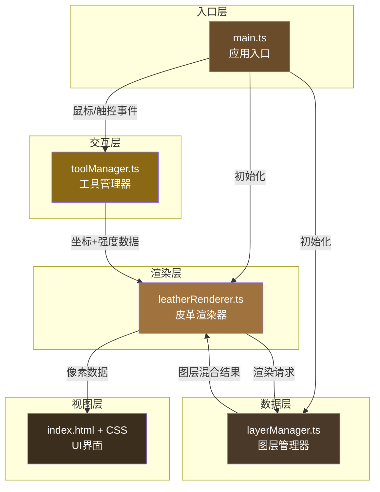

## 1. 架构设计

本应用为纯前端Canvas绘图应用，采用模块化分层架构。



## 2. 技术描述

- **前端框架**：原生 TypeScript + HTML5 Canvas（无额外UI框架，用户明确指定文件结构）
- **构建工具**：Vite 5.x（支持HMR热更新）
- **语言标准**：TypeScript 严格模式，目标 ES2020
- **渲染技术**：Canvas 2D Context + 离屏画布（OffscreenCanvas）
- **噪声算法**：Perlin Noise（皮革纹理生成）
- **图像处理**：像素级操作 + 高斯模糊 + Alpha混合

## 3. 文件结构与职责

| 文件路径 | 职责说明 | 依赖关系 |
|---------|---------|---------|
| package.json | 项目依赖与脚本配置 | 无 |
| vite.config.js | Vite构建配置（HMR、端口） | 无 |
| tsconfig.json | TypeScript编译配置（严格模式、ES2020） | 无 |
| index.html | 入口HTML页面，DOM结构与样式 | 无 |
| src/main.ts | 应用入口：Canvas初始化、事件绑定、模块协调 | toolManager, leatherRenderer, layerManager |
| src/toolManager.ts | 工具状态管理、压力感应、轨迹插值 | 无（纯数据处理） |
| src/leatherRenderer.ts | 皮革基底、染色层、压花痕迹渲染 | layerManager |
| src/layerManager.ts | 多层画布栈、撤销/重做、透明度混合 | 无（纯数据结构） |

## 4. 模块间调用关系与数据流向

### 4.1 初始化流程
```
main.ts
  ├─→ new LayerManager()         创建图层栈（20层撤销历史）
  ├─→ new ToolManager()          初始化工具状态（染色刷/8px）
  ├─→ new LeatherRenderer()      绑定Canvas上下文
  │     └─→ layerManager         注入图层管理器引用
  └─→ bindEvents()               绑定鼠标/触控/键盘事件
```

### 4.2 绘制数据流向
```
mousedown/mousemove 事件
  ↓
main.ts: handlePointer()
  ↓
toolManager.handleInput(rawX, rawY, pressure)
  ├─ 坐标转换（屏幕→画布像素坐标系）
  ├─ 轨迹插值（Catmull-Rom样条，保证平滑）
  ├─ 压力计算（映射到0.1-0.8 / 0-50px深度）
  └─ 输出 ToolPoint[] { x, y, intensity, toolType }
  ↓
leatherRenderer.renderStroke(points)
  ├─ 根据toolType分发到对应渲染方法
  │   ├─ renderDyeBrush()   染色刷：羽化圆形+Alpha叠加
  │   ├─ renderEmboss()     压花滚轮：亮度降低+阴影偏移+高斯模糊延迟
  │   └─ renderStitch()     缝线针：X形交叉+针孔+网格吸附
  └─ 每次绘制完成调用 layerManager.commitLayer() 提交快照
  ↓
layerManager
  ├─ 当前操作层（离屏Canvas）接收像素数据
  ├─ pushUndoStack()       保存当前状态到撤销栈（最多20步）
  └─ compositeLayers()     将基底+所有操作层混合输出到显示Canvas
  ↓
最终Canvas显示
```

### 4.3 撤销/重做流程
```
Ctrl+Z 键盘事件
  ↓
main.ts: handleKeydown()
  ↓
layerManager.undo()
  ├─ 从undoStack弹出最近一步
  ├─ 恢复对应离屏Canvas快照
  └─ 触发重绘 compositeLayers()
  ↓
leatherRenderer.redraw()  刷新显示Canvas
```

## 5. 核心数据结构

### 5.1 ToolManager 类型定义
```typescript
type ToolType = 'dye' | 'emboss' | 'stitch';

interface ToolState {
  type: ToolType;
  thickness: number;      // 1-20px, default 8
  color: string;          // hex color
  pressure: number;       // 0-1 触控压力
}

interface ToolPoint {
  x: number;
  y: number;
  intensity: number;      // 0-1 映射后的强度
  toolType: ToolType;
  timestamp: number;
}
```

### 5.2 LayerManager 类型定义
```typescript
interface Layer {
  canvas: HTMLCanvasElement | OffscreenCanvas;
  type: 'base' | 'dye' | 'emboss' | 'stitch';
  opacity: number;
}

interface LayerManagerState {
  baseLayer: Layer;               // 皮革底纹（不变）
  currentLayer: Layer;            // 当前操作层
  undoStack: ImageData[];         // 撤销栈（≤20）
  redoStack: ImageData[];         // 重做栈
}
```

### 5.3 LeatherRenderer 类型定义
```typescript
interface LeatherTexture {
  noiseSeed: number;
  fiberDensity: number;
  poreDensity: number;
  baseColor: [number, number, number];  // RGB
}
```

## 6. 性能优化策略

### 6.1 帧率保证（≥55FPS @1080p）
- **分层渲染**：皮革基底只渲染1次，存储为静态离屏Canvas
- **增量绘制**：操作层只绘制新增笔触区域（dirty rect）
- **离屏渲染**：使用 OffscreenCanvas 在非主线程处理像素
- **requestAnimationFrame**：所有绘制操作都在 RAF 中调度，避免掉帧
- **像素操作批处理**：getImageData/putImageData 按区域批量执行

### 6.2 撤销性能（≤15ms）
- **ImageData快照**：保存像素数据引用而非完整Canvas拷贝
- **栈大小限制**：最多20步历史，旧数据自动出栈
- **浅层拷贝**：仅复制变化的像素区域（如可能）

### 6.3 压花模糊优化
- **延迟队列**：将0.3s内的压花点收集后统一做一次高斯模糊
- **separable blur**：使用分离式高斯模糊（两次一维卷积代替二维）
- **降级策略**：半径>10px时使用CSS filter作为fallback

## 7. 关键算法实现

### 7.1 Perlin噪声皮革纹理
- 2D Perlin噪声多层叠加（FBM分形布朗运动）
- 频率1:2:4，振幅递减，生成颗粒感
- 叠加随机方向线条模拟纤维纹理
- 泊松圆盘采样生成均匀分布毛孔凹点

### 7.2 染色刷羽化
- 径向渐变圆形蒙版（中心Alpha=intensity，边缘=0）
- 使用 destination-over 混合模式叠加
- 多次涂抹通过累加Alpha实现加深效果

### 7.3 压花凹陷效果
- 亮度降低：RGB各通道乘 (1 - intensity * 0.6)
- 阴影偏移：右下方向2px偏移的半透明暗部叠加
- 高斯模糊：σ = thickness/3，卷积核大小=⌈6σ⌉

### 7.4 缝线生成
- 沿路径按15px间距采样点
- 每个点绘制两条交叉线（\ 和 /），长度=thickness
- 交叉点处绘制0.5px黑色圆点（针孔）
- Shift键按下时，起点和终点吸附到20x20网格

## 8. 构建与开发

| 脚本命令 | 说明 |
|---------|------|
| npm run dev | 启动Vite开发服务器（HMR热更新） |
| npm run build | 生产构建（输出到 dist/） |
| npm run preview | 预览生产构建结果 |
