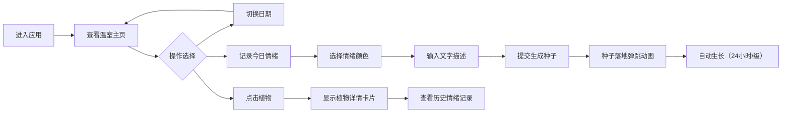

## 1. 产品概述

「情绪光谱暖房」是一款情绪记录与可视化Web应用，用户通过记录每日情绪（选择颜色、输入简短文字），在虚拟温室中种下对应颜色的发光种子，种子随时间生长成不同形态的植物，将抽象情绪转化为具象的视觉体验。

- 核心目的：帮助用户以视觉化、游戏化的方式记录和回顾情绪变化
- 目标用户：希望记录日常情绪、追踪心理状态变化的普通用户

## 2. 核心功能

### 2.1 功能模块

1. **温室主界面**：动态星空背景、植物展示、时间轴导航、情绪记录入口
2. **情绪记录模块**：12种情绪颜色选择器、50字文字输入、种子生成动画
3. **植物生长系统**：5级生长阶段、基于时间的自动生长、形态与颜色变化
4. **植物详情模块**：植物放大图、历史情绪记录时间线、磨砂玻璃卡片
5. **时间轴导航**：最近7天日期展示、日期切换、空状态占位

### 2.2 页面详情

| 页面名称 | 模块名称 | 功能描述 |
|---------|---------|---------|
| 温室主页 | 动态星空背景 | 深蓝到深紫渐变，400颗随机闪烁星星，requestAnimationFrame优化 |
| 温室主页 | 时间轴导航 | 横向展示最近7天，点击切换日期，未记录日期显示灰色虚线占位圆圈 |
| 温室主页 | 植物展示区 | 展示当天已种植的所有植物，支持点击查看详情 |
| 温室主页 | 情绪记录按钮 | 悬浮放大1.05倍、点击颜色反转的交互反馈 |
| 情绪记录弹窗 | 颜色选择器 | 12种预置情绪颜色（快乐#FFD700、忧伤#4B7BE5、平静#8FBC8F、惊喜#FF6B9D等） |
| 情绪记录弹窗 | 文字输入框 | 最多50字的情绪描述输入 |
| 情绪记录弹窗 | 提交按钮 | 生成发光种子，带脉动光晕动画（周期2秒） |
| 植物详情卡片 | 植物放大图 | 植物当前形态的放大展示 |
| 植物详情卡片 | 情绪历史记录 | 按时间倒序排列，包含颜色色块、文字内容、记录时间 |
| 植物详情卡片 | 磨砂玻璃效果 | 半透明背景、模糊滤镜 |

## 3. 核心流程

用户进入应用 → 查看当前日期的温室（动态星空背景） → 点击时间轴切换日期查看历史植物 → 点击「记录今日情绪」 → 选择情绪颜色 → 输入文字描述（≤50字） → 提交后种子落地（弹跳动画） → 种子随时间自动生长（24小时/级，共5级） → 点击植物查看详情和历史情绪记录

## 4. 用户界面设计

### 4.1 设计风格

- **主色调**：深色基底（#0B1026 深蓝、#1A1140 深紫），12种情绪颜色作为高亮
- **按钮风格**：圆角12px，悬浮放大1.05倍+背景色透明度变化，点击颜色反转
- **字体**：采用具有现代感的无衬线字体，标题加粗，正文常规
- **布局风格**：居中卡片式布局，所有元素圆角统一12px，统一阴影样式
- **动效风格**：平滑过渡（0.5秒 ease-out）、脉动光晕、弹跳落地、缩放旋转生长动画

### 4.2 页面设计概览

| 页面名称 | 模块名称 | UI元素 |
|---------|---------|---------|
| 温室主页 | 背景层 | 深蓝→深紫径向渐变、400颗随机闪烁星星（大小0.5-2px，透明度0.3-0.8，周期2-6秒） |
| 温室主页 | 温室容器 | 宽度80%（最大1200px），高度75vh，深色渐变边框，圆角12px |
| 温室主页 | 时间轴 | 横向排列7天日期圆圈，选中高亮，未记录灰色虚线，圆角样式 |
| 温室主页 | 植物区域 | 植物底部对齐，间距均匀分布，生长带缩放旋转动画 |
| 情绪记录弹窗 | 模态框 | 居中显示，深色半透明遮罩，圆角12px，统一阴影 |
| 情绪记录弹窗 | 颜色选择器 | 12个圆形色块网格排列，选中有外发光效果 |
| 情绪记录弹窗 | 文字输入 | 深色输入框，圆角12px，50字计数提示 |
| 植物详情卡片 | 放大图区域 | 上半部分展示植物SVG放大图 |
| 植物详情卡片 | 历史记录 | 下半部分时间倒序排列，每项含色块+文字+时间 |
| 植物详情卡片 | 磨砂效果 | backdrop-filter: blur，半透明背景，圆角12px |

### 4.3 响应式设计

- **桌面端（≥768px）**：温室主区域占页面宽度80%（最大1200px），时间轴横向布局
- **移动端（<768px）**：温室主区域占满宽度，时间轴改为垂直布局，触控友好的目标尺寸
- 所有交互元素最小触控尺寸44px，文字在移动端自适应缩放

### 4.4 视觉动效规范

- **种子脉动光晕**：周期2秒，颜色透明度0.3→0.8→0.3循环
- **种子落地弹跳**：落地时轻微压缩回弹动画（0.3秒）
- **植物生长**：缩放+轻微旋转，过渡0.5秒 ease-out
- **星星闪烁**：requestAnimationFrame驱动，透明度平滑变化
- **按钮交互**：hover时scale(1.05) + opacity变化，active时颜色反转

## 5. 性能要求

- 页面保持60FPS运行
- 植物生长动画计算不造成掉帧（使用CSS transform而非layout属性）
- 星星闪烁使用requestAnimationFrame优化，避免重排
- 植物渲染使用SVG，保证矢量清晰度和性能
