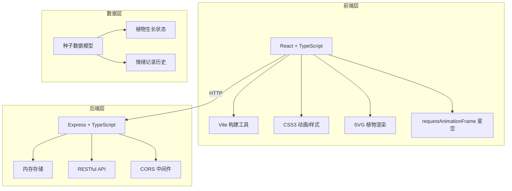
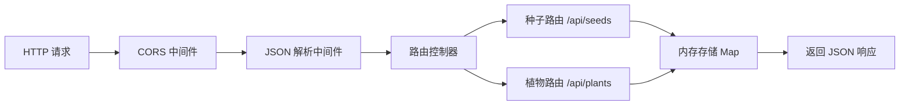

## 1. 架构设计



## 2. 技术选型说明

- **前端**：React 18 + TypeScript + Vite
- **构建工具**：Vite 5（HMR热更新、React插件支持）
- **后端**：Express 4 + TypeScript（内存存储，无数据库）
- **样式方案**：原生CSS3（CSS变量、动画、响应式媒体查询）
- **图标/图形**：内联SVG（植物形态、星星背景）
- **状态管理**：React useState/useEffect（轻量场景，无需额外状态库）

## 3. 项目目录结构

```
auto328/
├── package.json
├── vite.config.js
├── tsconfig.json
├── index.html
├── server/
│   └── src/
│       └── index.ts          # Express服务器（API路由、内存存储）
└── client/
    └── src/
        ├── App.tsx           # 主应用组件
        ├── components/       # UI组件
        │   ├── Timeline.tsx
        │   ├── MoodModal.tsx
        │   ├── Plant.tsx
        │   ├── PlantDetail.tsx
        │   └── StarryBackground.tsx
        ├── utils/            # 工具函数
        │   ├── growth.ts
        │   └── colors.ts
        ├── types/            # TypeScript类型定义
        │   └── index.ts
        └── api/              # API客户端
            └── client.ts
```

## 4. API 定义

### 4.1 数据类型

```typescript
interface MoodRecord {
  id: string;
  color: string;      // 情绪颜色HEX值
  text: string;       // 情绪描述文字（≤50字）
  timestamp: number;  // 记录时间戳
}

interface Seed {
  id: string;
  plantId: string;
  color: string;
  text: string;
  createdAt: number;  // 种子种植时间戳
  level: number;      // 当前生长等级 0-5（0=种子，1-5为各级植物）
}

interface Plant {
  id: string;
  moodRecords: MoodRecord[];
  createdAt: number;
  color: string;      // 主导情绪颜色（最新记录的颜色）
}
```

### 4.2 接口列表

| Method | Route | Purpose | Request | Response |
|--------|-------|---------|---------|----------|
| GET | /api/seeds?date=YYYY-MM-DD | 获取指定日期的所有种子 | Query: date | Seed[] |
| POST | /api/seeds | 创建新种子（记录情绪） | Body: { color, text, date } | Seed |
| GET | /api/plants/:id | 获取单株植物详情（含历史情绪） | Params: id | Plant |
| GET | /api/plants?date=YYYY-MM-DD | 获取指定日期的所有植物 | Query: date | Plant[] |
| DELETE | /api/seeds/:id | 删除种子记录 | Params: id | { success: true } |

## 5. 服务器架构



## 6. 生长算法

### 6.1 生长等级计算

```
level = min(5, floor((currentTime - createdAt) / 24h) + 1)
```
- level 0：种子状态（刚种下）
- level 1：发芽（2片小叶，高度20px）
- level 2：幼株（3片叶子，高度45px）
- level 3：成株（5片叶子+花苞，高度70px）
- level 4：开花（花朵为情绪互补色，高度95px）
- level 5：结果（果实与情绪同色，高度120px）

### 6.2 颜色计算

- 植物主体颜色：情绪颜色（如快乐#FFD700）
- 花朵颜色：情绪颜色的互补色（HSL色相+180°）
- 叶片形状：根据情绪类型映射（暖色系圆润叶、冷色系尖锐叶等）

## 7. 性能优化策略

1. **星空动画**：使用 requestAnimationFrame，仅更新 opacity，避免 layout/paint
2. **植物生长动画**：使用 CSS transform: scale() + rotate()，GPU加速
3. **种子脉动光晕**：CSS @keyframes 动画，transform: scale() + opacity
4. **响应式渲染**：移动端减少星星数量至200颗，降低渲染压力
5. **组件优化**：React.memo 包裹植物组件，避免不必要重渲染
