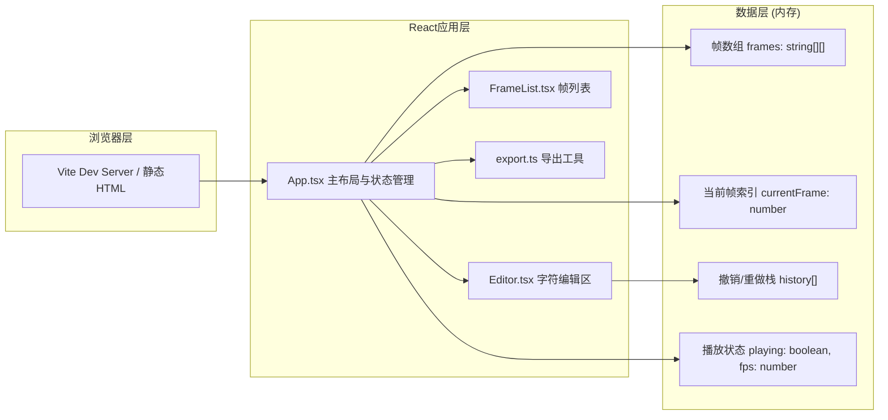

## 1. 架构设计

本项目为纯前端单页应用，无后端依赖。



## 2. 技术描述

- **前端框架**：React 18 + TypeScript 5
- **构建工具**：Vite 5
- **样式方案**：内联CSS + CSS变量，不使用Tailwind（保持极简依赖）
- **状态管理**：React useState/useReducer（应用规模较小，无需引入zustand）
- **图标库**：lucide-react
- **后端**：无
- **数据库**：无（所有数据存储在内存中，导出时生成HTML文件）

## 3. 项目文件结构

```
auto33/
├── package.json              # 项目依赖与脚本
├── index.html                # 入口HTML（含#root和#toast容器）
├── vite.config.js            # Vite配置（React插件 + base: './'）
├── tsconfig.json             # TypeScript配置（严格模式，ES2020，ESNext模块）
└── src/
    ├── main.tsx              # React入口，挂载App组件
    ├── App.tsx               # 主布局组件，全局状态管理
    ├── components/
    │   ├── Editor.tsx        # ASCII编辑区组件（30×20网格）
    │   └── FrameList.tsx     # 帧缩略图列表组件
    └── utils/
        └── export.ts         # 导出HTML工具函数
```

## 4. 数据模型

### 4.1 核心类型定义

```typescript
// 单个帧数据：二维字符数组 [row][col]
type Frame = string[][];

// 历史操作记录
interface HistoryEntry {
  type: 'edit';
  // 修改前的帧快照（用于撤销）
  before: Frame;
  // 修改后的帧快照（用于重做）
  after: Frame;
}

// 播放状态
interface PlaybackState {
  playing: boolean;
  fps: number;           // 1-10
  currentPlayFrame: number;
}

// 导出设置
interface ExportSettings {
  fps: number;           // 1-10
  loopCount: number;     // 1-999 或 -1 表示无限循环
}

// 编辑器状态
interface EditorState {
  frames: Frame[];
  currentFrameIndex: number;
  selectedChar: string;  // 当前画笔字符
  splitterPosition: number;  // 分隔条位置百分比
}
```

### 4.2 常量定义

```typescript
const GRID_COLS = 30;
const GRID_ROWS = 20;
const MAX_FRAMES = 30;
const MAX_HISTORY = 50;
const MIN_FPS = 1;
const MAX_FPS = 10;
const DEFAULT_FPS = 4;
```

## 5. 关键实现说明

### 5.1 Editor组件
- 使用`<div>`网格渲染600个单元格（30×20），每个单元格是一个contenteditable或响应点击的div
- 鼠标按下+移动时触发连续填充（画笔效果），每次完整拖拽记录为一个历史操作
- 监听keydown事件处理字符输入（可见字符和空格）、方向键移动光标
- 内部维护撤销/重做栈（useReducer实现），对外暴露onChange回调

### 5.2 FrameList组件
- 垂直滚动容器，渲染帧缩略图
- 缩略图使用CSS等比缩放渲染ASCII字符（font-size按比例缩小）
- 当前编辑帧：2px亮黄色`#ffdd00`边框
- 正在播放帧：绿色`#00ff88`指示边框
- 支持点击跳转、删除帧（长按或删除按钮）

### 5.3 播放控制
- 使用`setInterval`按`1000/fps`毫秒间隔切换帧
- 播放时编辑区锁定（isPlaying prop），忽略所有输入
- 播放帧列表自动scrollIntoView跟随高亮

### 5.4 导出HTML
- 将帧数据序列化为JSON嵌入HTML
- 生成的HTML包含内嵌CSS、JS播放器，不依赖任何外部资源
- 播放器内置播放控制按钮、速度滑块、循环逻辑
- 文件大小控制：使用压缩的字符串格式存储帧数据（空格压缩、行连接）

### 5.5 性能优化
- 编辑区使用CSS Grid而非绝对定位，减少重排
- 帧缩略图使用memo优化，仅在帧内容变化时重渲染
- 拖拽填充使用节流（requestAnimationFrame），保证30fps以上响应
- 导出HTML使用字符串拼接，避免DOM序列化开销

## 6. 路由定义

本项目为单页应用，无多路由。

| 路由 | 用途 |
|------|------|
| / | 编辑器主界面 |
