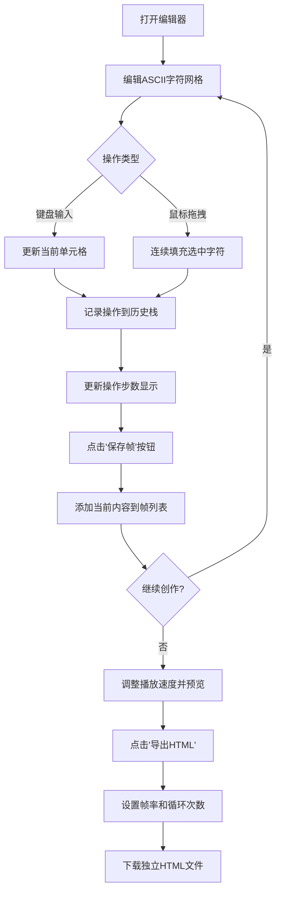

## 1. 产品概述

ASCII艺术动画编辑器是一款在线工具，用于创建、编辑和导出ASCII字符动画。它解决了艺术家和ASCII爱好者无法快速将静态ASCII字符转换为随时间变化的动态动画序列的问题。

- **目标用户**：ASCII艺术爱好者、创意设计师、动画创作者、教育工作者
- **核心价值**：提供零门槛、浏览器即开即用的ASCII动画创作体验，支持导出独立HTML文件分享

## 2. 核心功能

### 2.1 用户角色
本产品无需用户注册，所有功能对所有访客开放。

| 角色 | 注册方式 | 核心权限 |
|------|----------|----------|
| 普通访客 | 无需注册 | 使用全部编辑、播放、导出功能 |

### 2.2 功能模块
1. **ASCII编辑区**：30列×20行字符网格，支持键盘输入、鼠标点击/拖拽填充
2. **帧管理**：帧列表展示、帧切换、帧插入、帧删除（最多30帧）
3. **动画播放**：速度调节（1-10fps）、播放/暂停、循环播放、进度指示
4. **撤销/重做**：最多50步操作历史，快捷键支持
5. **动画导出**：导出为独立HTML文件，可自定义帧率和循环次数

### 2.3 页面详情

| 页面名称 | 模块名称 | 功能描述 |
|----------|----------|----------|
| 主编辑器 | 顶部工具栏 | 播放进度百分比显示、当前操作步数指示 |
| 主编辑器 | 字符选择器 | 选择当前画笔字符 |
| 主编辑器 | ASCII编辑区 | 30×20网格，键盘输入、鼠标拖拽填充、光标指示 |
| 主编辑器 | 帧控制区 | 保存帧、插入空白帧、删除帧按钮 |
| 主编辑器 | 帧列表 | 垂直滚动缩略图列表，点击切换帧，高亮当前帧和播放帧 |
| 主编辑器 | 播放控制 | 播放/暂停按钮、fps滑块 |
| 主编辑器 | 导出区 | 导出HTML按钮、帧率选择、循环次数选择 |
| 主编辑器 | 可拖拽分隔条 | 调整编辑区与帧列表宽度比例 |

## 3. 核心流程

### 3.1 创作流程
用户打开编辑器 → 在编辑区绘制ASCII图案 → 保存为帧 → 继续绘制下一帧 → 播放预览动画 → 调整帧和速度 → 导出HTML文件

### 3.2 Mermaid流程图

## 4. 用户界面设计

### 4.1 设计风格
- **设计基调**：深色赛博朋克/终端风格，科技感强烈
- **主色调**：背景 `#0f0f23`，面板 `#1a1a2e`，亮青色 `#00d4ff`，蓝色 `#0066ff`，亮黄色 `#ffdd00`（高亮），绿色 `#00ff88`（播放指示）
- **按钮样式**：亮青到蓝色线性渐变（`#00d4ff → #0066ff`），悬停0.2秒淡入阴影效果
- **字体**：等宽字体 `monospace`，所有ASCII字符使用等宽字体
- **布局风格**：三栏布局（左编辑区 + 中分隔条 + 右帧列表），顶部播放控制和进度，底部操作指示
- **图标风格**：简洁符号风格，使用lucide-react图标库

### 4.2 页面设计概览

| 页面名称 | 模块名称 | UI元素 |
|----------|----------|--------|
| 主编辑器 | 编辑区网格 | 30×20单元格，深灰背景`#1a1a2e`，亮青字符`#00d4ff`，1px浅灰边框 |
| 主编辑器 | 帧缩略图 | 80px宽，等比缩放，4px圆角，当前帧2px亮黄边框，播放帧绿框 |
| 主编辑器 | 播放按钮 | 渐变背景，播放时变为红色暂停按钮 |
| 主编辑器 | 分隔条 | 默认灰色，拖拽时变青色，鼠标变为resize光标 |
| 主编辑器 | 速度滑块 | 自定义样式，亮青色轨道和滑块 |

### 4.3 响应式设计
- **桌面端（≥768px）**：左右分栏布局，编辑区在左，帧列表在右
- **移动端（<768px）**：上下布局，编辑区在上，帧列表在下；播放控制按钮换行排列
- **触摸优化**：所有按钮和可点击元素最小尺寸44px×44px

### 4.4 动效与交互
- 按钮悬停：0.2秒淡入阴影（box-shadow: 0 0 15px rgba(0,212,255,0.5)）
- 分隔条拖拽：颜色从灰色平滑过渡到青色
- 帧切换：编辑区内容即时更新，无延迟
- 播放状态：帧列表滚动跟随高亮帧
