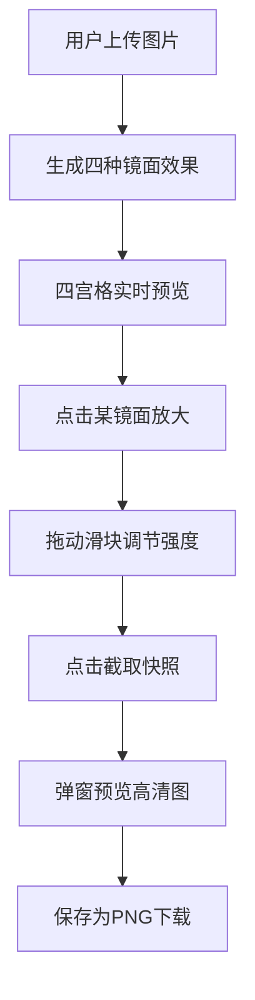

## 1. 产品概述

「镜像回廊」是一个基于 Canvas 的图像扭曲镜面效果生成器，用户可以上传图片并实时预览其在四种不同镜面（凸面镜、凹面镜、波浪镜、万花筒镜）中的反射效果，支持调节扭曲强度并截取高清快照保存。

- 核心价值：将枯燥的图像处理转化为交互式的视觉探索体验
- 目标用户：设计师、艺术爱好者、普通用户

## 2. 核心功能

### 2.1 功能模块

1. **主页面**：图片上传区、四宫格镜面预览区、放大调节区、快照弹窗

### 2.2 页面详情

| 页面名称 | 模块名称 | 功能描述 |
|---------|---------|---------|
| 主页面 | 图片上传区 | 支持拖拽/点击上传图片，实时预览原图 |
| 主页面 | 四宫格预览区 | 同时展示四种镜面效果，左上角标签标识类型 |
| 主页面 | 放大调节区 | 点击格子后放大显示，提供扭曲强度滑块 |
| 主页面 | 快照弹窗 | 截取当前镜面效果高清图，支持下载 PNG |

## 3. 核心流程

用户上传图片 → 系统实时生成四种镜面反射 → 用户点击某镜面放大 → 拖动滑块调节强度 → 点击截取快照 → 弹窗预览并下载 PNG

## 4. 用户界面设计

### 4.1 设计风格

- **主色调**：冷蓝 #00D4FF（主色）、亮青 #7FDBFF（悬停）
- **背景**：深灰蓝 #1A1A2E → 暗紫 #16213E 渐变
- **磨砂玻璃**：rgba(20,25,40,0.7)，边框 rgba(180,200,255,0.15)
- **圆角**：16px 主容器，控件圆角统一
- **按钮动画**：点击时 scale 0.95→1.0，150ms
- **过渡动画**：镜面切换 0.4s 淡入淡出，弹窗上升 translateY 20px→0，300ms
- **弹窗背景**：backdrop-filter: blur(4px)

### 4.2 页面设计概览

| 页面名称 | 模块名称 | UI 元素 |
|---------|---------|---------|
| 主页面 | 上传区 | 虚线边框、云朵图标、提示文字 |
| 主页面 | 四宫格 | Canvas 画布、左上角类型标签、悬停高亮 |
| 主页面 | 放大区 | Canvas 画布、强度滑块(0.1-2.0)、截取快照按钮 |
| 主页面 | 快照弹窗 | 高清图片、保存按钮、关闭按钮 |

### 4.3 响应式

- **桌面端**：左右布局（左400px上传区 + 右四宫格）
- **移动端 (<768px)**：上下布局，四宫格两行两列，触屏友好尺寸

### 4.4 性能要求

- 单帧处理 ≤100ms
- 滑块调节延迟 ≤50ms
- 帧率 ≥30fps
