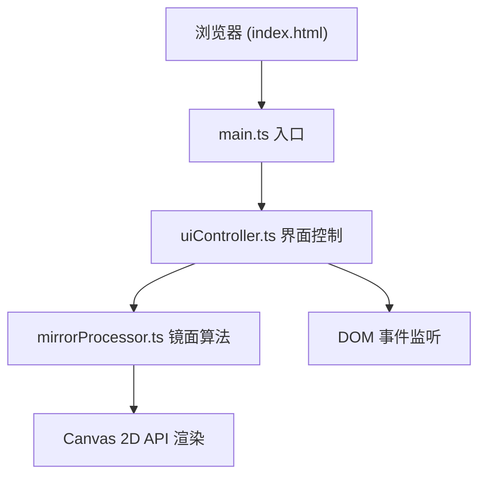

## 1. 架构设计



## 2. 技术说明

- **前端框架**：原生 TypeScript（无框架）
- **构建工具**：Vite（支持 HMR）
- **渲染技术**：Canvas 2D API（像素级处理）
- **样式**：内联 CSS（通过 TypeScript 动态创建）
- **目标标准**：ES2020

## 3. 文件结构

```
.
├── package.json
├── vite.config.js
├── tsconfig.json
├── index.html
└── src/
    ├── main.ts              # 应用入口
    ├── mirrorProcessor.ts   # 四种镜面反射算法
    └── uiController.ts      # UI 构建与事件绑定
```

## 4. 模块职责

### 4.1 mirrorProcessor.ts

导出核心函数：
- `convexMirror(imageData, strength)`：凸面镜（像素向中心挤压，鱼眼效果）
- `concaveMirror(imageData, strength)`：凹面镜（像素向外拉伸）
- `waveMirror(imageData, strength, frequency)`：波浪镜（正弦波偏移，频率2-10）
- `kaleidoscopeMirror(imageData, strength)`：万花筒（6片扇形对称复制旋转）

辅助函数：
- `createMirror(type, image, width, height, strength)`：工厂函数，返回处理后的 Canvas

### 4.2 uiController.ts

- `UIController` 类：负责所有 DOM 创建、布局、事件监听
- 方法：`initLayout()`、`bindUpload()`、`bindMirrorClick()`、`bindSlider()`、`bindSnapshot()`
- 维护状态：当前原图、当前选中镜面类型、各镜面强度参数

### 4.3 main.ts

- 创建 UIController 实例
- 页面加载完成后调用 `controller.init()`

## 5. 性能优化策略

- **离屏 Canvas 缓存**：原图缩放后缓存，避免重复读取
- **ImageData 直接操作**：使用 getImageData/putImageData 而非 drawImage 滤镜
- **节流滑块事件**：requestAnimationFrame 合并多次滑块更新
- **按需渲染**：仅在参数变化时重绘对应镜面
